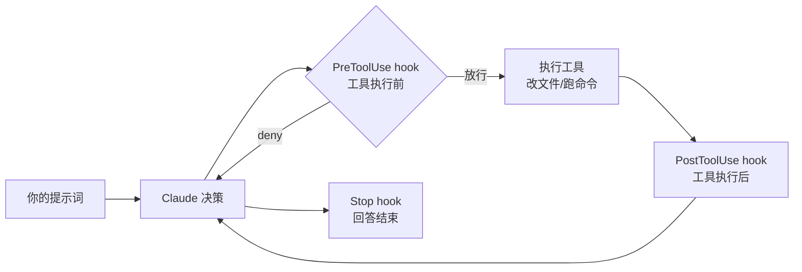
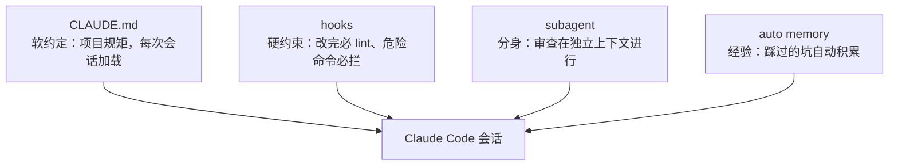

Claude Code 是 Anthropic 的编程 agent：在终端里对它说人话，它替你读代码、改文件、跑命令、提 PR。装好只要一分钟，但要让它真正"懂你的项目、按你的规矩干活"，靠的是一整套配置——主线是 CLAUDE.md 立规矩、hooks 上硬约束、subagent 分担脏活，外加 slash commands、Skills、MCP、权限这些配套机制。这篇按"装好 → 用起来 → 配成自己的"的顺序走完全程，最后教你怎么自己查任何配置项的可选值。所有命令和配置格式核对自[官方文档](https://code.claude.com/docs)，截至 2026 年 7 月 7 日有效。

如果你还不清楚 agent、上下文窗口这些基本概念，建议先读[Claude 全面教程](/Claude全面教程-模型概念与API实战)。

<!-- more -->

## 安装与首次启动

三种安装方式按推荐度排序：

```bash
# 方式一：原生安装器（官方推荐，装完自动在后台更新）
curl -fsSL https://claude.ai/install.sh | bash

# 方式二：Homebrew（不会自动更新，升级要手动 brew upgrade）
brew install --cask claude-code
#    claude-code：stable 渠道，比最新版晚约一周，跳过有严重回归的版本
#    想追新用 brew install --cask claude-code@latest

# 方式三：npm（需要 Node.js 22+，装的同样是原生二进制）
npm install -g @anthropic-ai/claude-code
#   不要加 sudo，权限问题参考官方 troubleshooting
```

Windows 用户在 PowerShell 里执行 `irm https://claude.ai/install.ps1 | iex`，或者用 WSL 走 Linux 安装方式。

装完验证：

```bash
claude --version
#   输出版本号即安装成功

claude doctor
#   更完整的自检：安装方式、更新状态、配置问题一次看全
```

**账号要求**：Claude Code 需要 Pro（$20/月）、Max、Team 订阅或 API（Console）账号，**免费版不能用**。订阅怎么选，[上一篇](/Claude全面教程-模型概念与API实战)的"订阅还是 API"一节有详细对比。

进入你的项目目录启动，首次运行会引导浏览器登录：

```bash
cd your-project
claude
```

## 五分钟摸清交互方式

进入会话后，你和 Claude Code 的交互就是聊天+确认。几个立刻会用到的东西：

**权限确认**：Claude 要执行命令、改文件时会先弹确认。这是默认的安全机制——你随时知道它在干什么。信任度上来之后，可以在确认框里选"本会话不再询问"，或用 `/permissions` 配置白名单。

**Plan mode（规划模式）**：按 `Shift+Tab` 切换。这个模式下 Claude 只读代码、出方案，**不动任何文件**——改动大、心里没底的任务，先在 plan mode 里让它把计划列出来，你审完再放行执行。

**常用斜杠命令**，先记这六个：

| 命令 | 作用 |
|---|---|
| `/init` | 分析代码库，自动生成 CLAUDE.md（下一节细讲） |
| `/memory` | 查看/编辑当前加载的所有规则文件和自动记忆 |
| `/permissions` | 配置哪些操作免确认 |
| `/agents` | 管理 subagent（后文细讲） |
| `/compact` | 手动压缩对话历史，上下文快满时用 |
| `/config` | 打开设置（模型、更新渠道等） |

**上下文思维**：一次会话就是一个上下文窗口，聊得越久越臃肿。一个任务干完就 `/clear` 开新会话，比在一个会话里从早聊到晚效果好得多。

## CLAUDE.md：给它立规矩

Claude Code 每次会话都从零开始——它不记得你上周说过"这个项目用 pnpm 别用 npm"。CLAUDE.md 就是解决这个问题的：一个普通 Markdown 文件，**每次会话自动读入**，你把项目约定写进去，就不用每次重复交代。

### 从 /init 开始

不用从零写，在项目里执行：

```text
/init
```

Claude 会分析你的代码库，自动生成一份包含构建命令、测试方式、项目结构的 CLAUDE.md。如果项目里已经有 AGENTS.md 或 `.cursorrules`（其他 AI 工具的规则文件），`/init` 会读取并把相关内容吸收进来。生成后再手动补充它发现不了的东西——团队约定、踩坑经验、部署流程。

### 写法标准：具体到能验证

CLAUDE.md 是"上下文"而不是"强制配置"，写得越具体，遵守得越稳定。官方给的对照很直观：

| 差的写法 | 好的写法 |
|---|---|
| 格式要规范 | 用 2 空格缩进 |
| 提交前要测试 | 提交前必须跑 `npm test` |
| 文件放整齐 | API handler 放 `src/api/handlers/` 下 |

另一条官方建议：**单个 CLAUDE.md 控制在 200 行以内**。超长的规则文件既费上下文又降低遵守率——内容多了就拆（见下文 rules 目录）。

### 多级文件与导入

CLAUDE.md 按作用域分层，全部会被加载、逐级叠加：

| 位置 | 作用域 | 进版本库？ |
|---|---|---|
| `~/.claude/CLAUDE.md` | 你的所有项目（个人偏好） | 否 |
| `./CLAUDE.md` 或 `./.claude/CLAUDE.md` | 当前项目（团队约定） | 是 |
| `./CLAUDE.local.md` | 当前项目（个人私有，如本地测试地址） | 否，加进 .gitignore |

支持用 `@路径` 导入其他文件，路径相对于 CLAUDE.md 自身，最多嵌套 4 层。团队混用多种 AI 工具时的标准做法——通用规则写 AGENTS.md，CLAUDE.md 一行导入：

```markdown
@AGENTS.md

## Claude Code 专属
改 src/billing/ 下的代码前先进 plan mode。
```

注意一个细节：写在反引号里的 `@README` 是普通文本，不会触发导入；只有裸写的 @ 路径才导入。

### 规则多了怎么办：.claude/rules/ 目录

CLAUDE.md 超过 200 行后，把规则按主题拆成多个文件。具体操作分三步：

**第一步**：在项目里建 `.claude/rules/` 目录，每个主题一个 `.md` 文件，文件名描述内容：

```text
your-project/
├── CLAUDE.md               # 主规则：只留最核心的约定
└── .claude/
    └── rules/
        ├── code-style.md   # 代码风格
        ├── testing.md      # 测试约定
        └── api-design.md   # API 设计规范
```

**第二步**：往文件里写规则。**不加任何头部**的文件和 CLAUDE.md 待遇一样——每次会话都加载：

```markdown
# 测试约定
- 单测文件和源文件同目录，命名 *.test.ts
- 提交前必须跑 npm test
```

**第三步（可选）**：只和某类文件相关的规则，在文件开头加一段 `paths` 头部（YAML frontmatter，两行 `---` 包起来）。加了之后这个文件**平时不加载**，只有 Claude 读到匹配的文件时才进入上下文，省 token：

```markdown
---
paths:
  - "src/api/**/*.ts"    # glob 模式：src/api 下所有 .ts 文件
---

# API 开发规则
- 所有接口必须做入参校验
- 错误响应用统一格式
```

这样配置后的效果：Claude 平时看不到 API 规则；一旦它打开 `src/api/user.ts`，这份规则自动出现在它的上下文里。

个人级规则放 `~/.claude/rules/`，写法相同，对你机器上所有项目生效。

### 自动记忆：它自己也会记笔记

CLAUDE.md 是你写给它的，**auto memory** 是它自己记的（需 v2.1.59+，默认开启）：工作中确认过的构建命令、调试结论、你纠正过它的偏好，会被存到 `~/.claude/projects/<项目>/memory/` 目录，下次会话自动带上。`MEMORY.md` 是索引（每次加载前 200 行），细节存独立主题文件、按需读取。用 `/memory` 可以随时翻看和删改——都是普通 Markdown。

## Hooks：CLAUDE.md 管不住的，用钩子硬管

CLAUDE.md 再具体也只是"叮嘱"，Claude 有小概率忘。**hooks 是硬约束**：在固定的生命周期节点自动执行你的 shell 脚本，不管 Claude 怎么想，到点必执行。官方文档的判断标准很干脆：希望"每次必然发生"的事，写 hook，别写 CLAUDE.md。



### 配置结构

Hooks 写在 settings 文件里，三个位置按需选：`~/.claude/settings.json`（全局）、`.claude/settings.json`（项目，进版本库）、`.claude/settings.local.json`（项目本地，不进版本库）。

基本结构：**事件 → matcher 筛选工具 → 要执行的命令**。常用事件：

| 事件 | 触发时机 | 典型用途 |
|---|---|---|
| `PreToolUse` | 工具执行前（可拦截） | 挡掉危险命令 |
| `PostToolUse` | 工具成功后 | 改完文件自动 lint |
| `UserPromptSubmit` | 你发出提示词时 | 注入动态上下文 |
| `SessionStart` | 会话开始 | 加载环境信息 |
| `Stop` | Claude 回答完毕 | 桌面通知、后处理 |

### 实战一：改完文件自动跑 lint

`.claude/settings.json`：

```json
{
  "hooks": {
    "PostToolUse": [
      {
        "matcher": "Edit|Write",
        "hooks": [
          {
            "type": "command",
            "command": "${CLAUDE_PROJECT_DIR}/.claude/hooks/lint-check.sh",
            "timeout": 30
          }
        ]
      }
    ]
  }
}
```

- `matcher`：筛选触发的工具，`Edit|Write` 表示编辑或写文件都触发；支持正则和 MCP 工具名（如 `mcp__github__.*`）
- `command`：要执行的脚本；`${CLAUDE_PROJECT_DIR}` 是项目根目录变量
- `timeout`：秒数，超时取消（默认 600）

`.claude/hooks/lint-check.sh`（hook 通过 stdin 收到 JSON 输入，用 `jq` 取字段）：

```bash
#!/bin/bash
FILE=$(jq -r '.tool_input.file_path')
#   stdin 的 JSON 里带着本次工具调用的完整参数

if [[ -f "$FILE" ]]; then
  npx eslint "$FILE" --fix || exit 2
  #   退出码 2 = 阻断错误：stderr 会喂回给 Claude，它会看到 lint 报错并去修
fi
exit 0
#   退出码 0 = 正常放行
```

配好之后：Claude 每改一个文件，eslint 自动跑一遍；有问题它当场看到报错、当场修——不用你盯。

### 实战二：拦截危险命令

`PreToolUse` hook 可以在命令执行前说"不"：

```json
{
  "hooks": {
    "PreToolUse": [
      {
        "matcher": "Bash",
        "hooks": [
          {
            "type": "command",
            "command": "${CLAUDE_PROJECT_DIR}/.claude/hooks/block-danger.sh"
          }
        ]
      }
    ]
  }
}
```

```bash
#!/bin/bash
COMMAND=$(jq -r '.tool_input.command')

if echo "$COMMAND" | grep -qE 'rm -rf|git push --force'; then
  # 输出 JSON 决策：拒绝执行，并告诉 Claude 原因
  jq -n '{
    hookSpecificOutput: {
      hookEventName: "PreToolUse",
      permissionDecision: "deny",
      permissionDecisionReason: "危险命令被 hook 拦截，请改用更安全的方式"
    }
  }'
else
  exit 0   # 不做决策，走正常的权限确认流程
fi
```

## Subagent：给它配几个分身

主对话的上下文窗口是稀缺资源。让 Claude 在主对话里全库搜索、读几十个文件，搜索过程的中间结果会把上下文塞满——而那些内容你之后根本用不到。**Subagent 的价值就在这**：把这类任务派给一个拥有独立上下文的"分身"，它在自己的窗口里干完脏活，只把结论带回主对话。

顺带还有三个好处：可以限制分身的工具权限（只读不写）、可以换更便宜的模型（搜索用 Haiku 就够）、配置一次到处复用。

### 文件格式

Subagent 是一个带 YAML frontmatter 的 Markdown 文件，放两个位置之一：

- `.claude/agents/`——当前项目可用，进版本库和团队共享
- `~/.claude/agents/`——你的所有项目可用

一个完整的代码审查分身，`.claude/agents/code-reviewer.md`：

```markdown
---
name: code-reviewer
description: 代码审查专家。写完或修改代码后主动使用，检查质量、安全和可维护性。
tools: Read, Grep, Glob, Bash
model: sonnet
---

你是一名严格的代码审查员。被调用时：

1. 运行 git diff 查看最近改动
2. 只聚焦改动的文件，逐条检查：
   - 有没有暴露的密钥或敏感信息
   - 错误处理是否完整
   - 命名是否清晰、有没有重复代码
3. 按"必须修 / 建议修 / 可以更好"三档输出结论，每条给出具体行号
```

frontmatter 字段里 `name` 和 `description` 必填，其余常用的：

| 字段 | 作用 |
|---|---|
| `description` | Claude 靠它判断什么时候派活给这个分身——写清触发时机，比如"写完代码后主动使用" |
| `tools` | 工具白名单，省略则继承全部。审查类分身只给 `Read, Grep, Glob` 就动不了你的文件 |
| `model` | `sonnet` / `opus` / `haiku` / `fable` / `inherit`（默认继承主会话） |
| `memory` | 设为 `project` 等值后，分身可跨会话积累自己的经验 |
| `isolation` | 设为 `worktree`，分身在独立的 git worktree 里干活，不碰你的工作区 |

正文部分就是分身的系统提示——它看不到主对话的历史，只带着你的任务描述和这份提示上岗。

### 怎么用

保存文件即生效（首次在新目录创建需要重启会话）。两种触发方式：

- **自动**：Claude 根据 `description` 判断——上面例子写了"写完代码后主动使用"，它改完代码就会自动派 code-reviewer 出场
- **手动**：直接说"用 code-reviewer 检查一下刚才的改动"

也可以完全不写文件，用 `/agents` 命令交互式创建和管理。

## 四大件之外：slash commands、Skills、MCP、权限

CLAUDE.md、hooks、subagent 是本文主线，但 Claude Code 的自定义机制不止这些。下面四个同样高频，每个给出最小可用的配置方式。

### 自定义 slash commands：把重复提示词变成命令

同一段提示词打第三遍的时候，就该把它做成命令。在 `.claude/commands/` 下建一个 Markdown 文件，文件名就是命令名：

```markdown
<!-- .claude/commands/fix-issue.md -->
分析并修复 GitHub issue #$ARGUMENTS：
1. 用 gh issue view 查看详情
2. 定位相关代码，实现修复
3. 跑测试确认，写一条符合规范的 commit
```

保存后输入 `/fix-issue 123`，`$ARGUMENTS` 会被替换成 `123`。个人通用命令放 `~/.claude/commands/`。

### Skills：可复用的"操作手册"

Skill 和 slash command 的区别：command 是**你主动触发**的提示词模板，skill 是**Claude 自己判断**何时使用的知识包（也可以手动 `/名字` 触发）。每个 skill 是一个文件夹，核心是 `SKILL.md`：

```markdown
<!-- .claude/skills/deploy-check/SKILL.md -->
---
name: deploy-check
description: 部署前检查清单。当用户要求部署或发布时使用。
---

部署前依次确认：
1. npm test 全绿
2. CHANGELOG.md 已更新
3. 版本号已按 semver 递增
```

`description` 决定它何时被自动启用——平时只有这一行占上下文，触发时才加载全文（和上一篇讲的渐进式加载是同一机制）。

### MCP：接入外部系统

想让 Claude Code 查你的数据库、操作 GitHub、读 Figma 设计稿，用 `claude mcp add` 接入对应的 MCP server：

```bash
claude mcp add --transport http github https://api.githubcopilot.com/mcp/
#          add：添加一个 MCP server
#          --transport http：连接方式（另有 stdio、sse）
#          github：你给这个 server 起的名字
#          最后是 server 地址
```

项目级配置存 `.mcp.json`（进版本库，团队共享）。`/mcp` 命令可以查看已接入的 server 和它们提供的工具。哪些服务有现成的 MCP server，去 [MCP servers 仓库](https://github.com/modelcontextprotocol/servers)翻。

### 权限：settings.json 里的 allow / deny

每次都手动确认太烦，全部放行又不放心——权限规则让你精确划线，写在 `.claude/settings.json`：

```json
{
  "permissions": {
    "allow": [
      "Bash(npm run *)",
      "Bash(git diff *)",
      "Read(**)"
    ],
    "deny": [
      "Bash(rm -rf *)",
      "Read(.env*)"
    ]
  }
}
```

- 规则格式是 `工具名(参数模式)`：`Bash(npm run *)` 表示所有 npm run 开头的命令免确认
- `deny` 优先级高于 `allow`；`Read(.env*)` 可以防止 Claude 读到你的密钥文件
- 不想写 JSON 就用 `/permissions` 交互式配置，效果一样

## 配置项的可选值去哪查

本文的表格都只列了常用值——`tools` 能填哪些工具名、settings.json 有哪些键、hook 有哪些事件，全量清单会随版本更新。比背清单更重要的是知道去哪查，四个方法按顺手程度排序：

**方法一：直接问 Claude Code 自己。** 它了解自身的配置体系，这是最快的路径：

```text
> 你有哪些内置工具？我想给 subagent 配 tools 白名单
> 帮我写一个 PostToolUse hook，改完 .go 文件自动跑 gofmt
```

第二种问法更实用——让它直接替你生成配置，你审查后保存即可。

**方法二：交互式命令自带枚举。** `/permissions`、`/agents`、`/config`、`/hooks` 这些命令的界面本身就列出了全部可选项，选就行，不用记。

**方法三：官方文档对照表。** 每类配置有一个权威页面：

| 想查什么 | 去哪查 |
|---|---|
| settings.json 全部配置键 | [Settings 参考](https://code.claude.com/docs/en/settings) |
| 内置工具完整列表（tools 字段可填的值） | [Tools 参考](https://code.claude.com/docs/en/tools-reference) |
| hooks 全部事件和输入输出格式 | [Hooks 参考](https://code.claude.com/docs/en/hooks) |
| subagent 全部 frontmatter 字段 | [Subagents 文档](https://code.claude.com/docs/en/sub-agents) |
| CLI 启动参数 | [CLI 参考](https://code.claude.com/docs/en/cli-reference) |

**方法四：全文档索引。** [code.claude.com/docs/llms.txt](https://code.claude.com/docs/llms.txt) 是官方文档的完整页面清单（专为 AI 阅读设计，人看也很清晰），不确定某个功能在哪个页面时，从这里搜关键词。

## 日常实用技巧速查

不属于"配置"，但每天都用得上：

| 操作 | 效果 |
|---|---|
| `claude -p "解释这个报错：..."` | 非交互模式：执行一次、输出结果就退出，适合管道和脚本 |
| `claude --continue` | 恢复最近一次会话，接着上次聊 |
| `claude --resume` | 列出历史会话，挑一个恢复 |
| 输入框粘贴图片 | 直接发截图给它看（报错截图、设计稿都行） |
| `@src/utils.ts` | 消息里 @ 文件路径，把文件内容带进对话 |
| `!npm test` | 感叹号开头直接执行 bash，输出进入上下文 |
| `Esc` | 打断 Claude 当前动作 |
| `Esc` 连按两下 | 打开回退菜单，恢复到之前的检查点（改坏了能撤） |

## 把四样组合起来：一个仓库的完整配置

以一个 Node.js 项目为例，四样东西各司其职后，`.claude/` 目录长这样：

```text
your-project/
├── CLAUDE.md                    # 规矩：构建命令、代码约定（@AGENTS.md 导入通用部分）
├── .mcp.json                    # 团队共享的 MCP server 配置
├── .claude/
│   ├── settings.json            # 权限白名单 + hooks 配置
│   ├── hooks/
│   │   └── lint-check.sh        # 改完文件自动 lint
│   ├── rules/
│   │   └── api-design.md        # 只在改 API 文件时加载的规则
│   ├── commands/
│   │   └── fix-issue.md         # 自定义 /fix-issue 命令
│   ├── skills/
│   │   └── deploy-check/        # 部署检查 skill
│   └── agents/
│       └── code-reviewer.md     # 代码审查分身
```

工作起来的分工：



一个典型回合：你说"加一个用户导出接口"→ Claude 按 CLAUDE.md 的约定写代码 → 每保存一个文件 lint hook 自动跑 → 写完自动派 code-reviewer 分身审一遍 → 有问题当场修。你只在关键节点做确认。

配置不用一步到位。官方推荐的节奏是：先裸用，发现自己**第二次**纠正同一个问题时，把它写进 CLAUDE.md；发现某件事"必须每次发生"时，升级成 hook；发现某类任务反复出现时，抽成 subagent。让配置跟着实际使用一点点长出来，比一开始就设计一套完整的更贴合你的工作方式。

## 下一步

- 概念补课：[Claude 全面教程：模型家族、核心概念与 API 实战](/Claude全面教程-模型概念与API实战)
- 官方文档：[code.claude.com/docs](https://code.claude.com/docs)——本文没展开的沙箱、IDE 集成、agent teams 多会话协作都在里面
- 进阶方向：给 CI 写 headless 脚本（`claude -p`）；用 agent teams 让多个会话协作干一个大活
