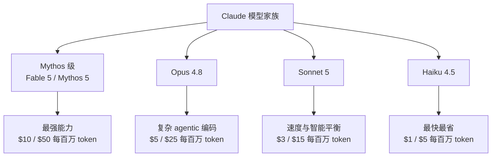
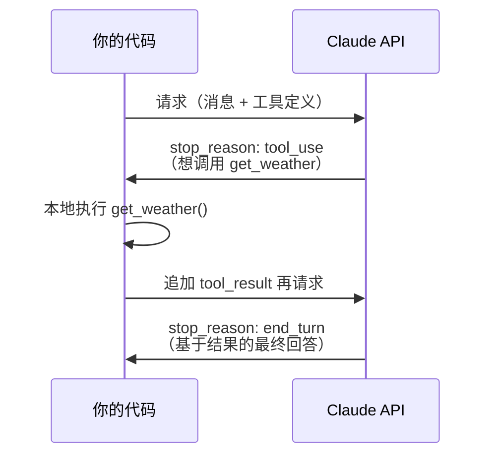
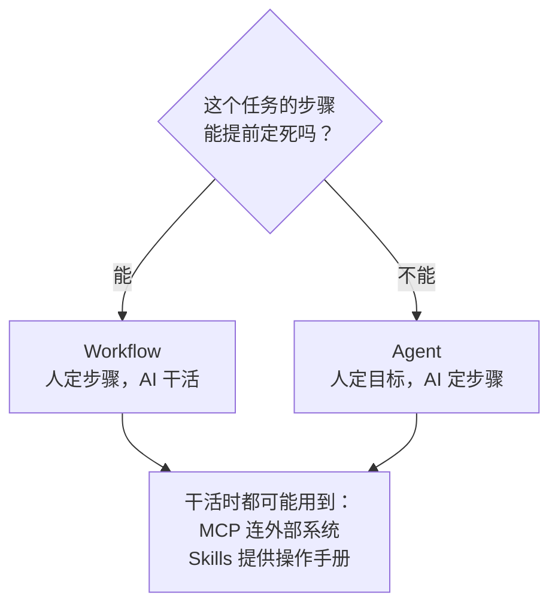
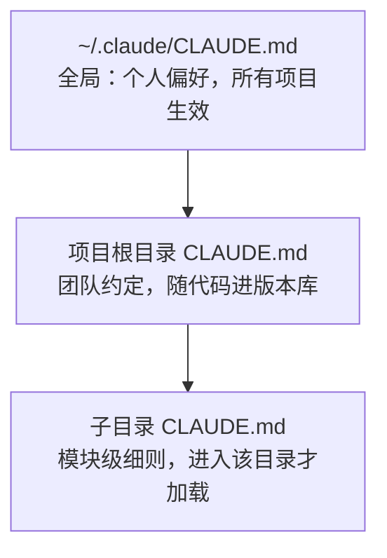

Claude 是 Anthropic 开发的大语言模型家族。2026 年上半年这个家族变化很大：6 月 9 日 Anthropic 发布了全新档位的 Claude Fable 5，6 月 30 日又推出了 Claude Sonnet 5。如果你手里的资料还停留在"Opus / Sonnet / Haiku 三档"的认知，这篇教程可以帮你一次性补齐——从模型命名逻辑、API 核心参数，到 CLAUDE.md / 记忆 / Harness Engineering 这些 2026 年的新概念，最后是一个可以直接运行的工具调用例子。

文中所有模型信息、价格、参数均核对自 Anthropic 官方文档，截至 2026 年 7 月 7 日有效。

<!-- more -->

## 大模型是怎么工作的：五个必懂常识

不管你用哪家的模型，下面五件事决定了你对它的所有预期。搞懂它们，后文的每个机制（规则文件、记忆、工具调用）都会变得顺理成章——因为那些全是针对这五个特性的工程补丁。

**1. 模型的本质是"预测下一个 token"。** 大语言模型（LLM）在海量文本上训练，学到的能力是：给定前文，预测下一个词最可能是什么。它没有数据库查询，也没有"知道/不知道"的开关——回答是逐 token 生成出来的。这解释了它为什么强（语言、推理、代码都是文本规律），也解释了它为什么会**幻觉（hallucination）**：当训练数据里没有答案时，它依然会生成"看起来最像答案"的文本，一本正经地编造。对策：重要的事实让它引用来源、用工具查证，或者你自己核实。

**2. 模型的知识有截止日期。** 训练完成后权重就固定了，之后发生的事它一概不知。Fable 5 / Opus 4.8 / Sonnet 5 的可靠知识截止是 2026 年 1 月——问它上周的新闻，它要么明说不知道，要么开始幻觉。要获取新信息，得靠联网搜索、工具调用这类外挂（后文会讲）。

**3. 模型不会记住你。** 这是新手最大的误解。你和模型的每一次对话都**不会改变模型本身**——权重是只读的，全球用户共享同一个模型。它在对话中"记得"你前面说了什么，只是因为聊天软件把历史消息重新发给了它（见后文"无状态 API"）。所以"让 AI 记住我的偏好"从来不是模型功能，而是外部工程：把你的偏好存成文件，每次对话时重新喂给它——这正是 CLAUDE.md 和记忆功能的原理。

**4. 上下文窗口是唯一的"工作内存"，而且是稀缺资源。** 模型单次能处理的内容有上限（Claude 当前主力模型是 100 万 token）。塞得越多，成本越高、速度越慢，而且信息淹没在噪音里反而影响质量。整个"上下文工程"学科（后文讲）都在解决一个问题：这一窗有限的空间里，到底该放什么。

**5. 模型能看的不只是文字。** Claude 支持多模态输入：图片、截图、PDF 都能直接发给它分析。输出目前是文本（含代码、表格、Mermaid 图）。

## 模型家族：四个档位怎么选

Claude 的模型按能力和成本分档，名字本身就是档位标识：

- **Fable / Mythos（Mythos 级）**：2026 年 6 月新增的最高档位。Fable 5 是目前公开可用的最强模型；Mythos 5 与 Fable 5 同规格同价格，但仅通过邀请制的 Project Glasswing 向获批组织开放，定位防御性网络安全工作流。
- **Opus**：面向复杂 agentic 编码和企业级任务的旗舰档，当前版本 Opus 4.8。
- **Sonnet**：速度与智能的平衡档，当前版本 Sonnet 5（发布于 2026-06-30），官方称其在部分 agentic 任务上已接近 Opus 4.8 的水平。
- **Haiku**：最快、最便宜的档位，当前版本 Haiku 4.5，适合分类、摘要等简单高频任务。



当前各模型的关键参数（截至 2026-07-06，来自[官方模型总览](https://platform.claude.com/docs/en/about-claude/models/overview)）：

| 模型 | API 模型 ID | 上下文窗口 | 最大输出 | 定价（输入/输出，每百万 token） |
|---|---|---|---|---|
| Claude Fable 5 | `claude-fable-5` | 1M | 128K | $10 / $50 |
| Claude Opus 4.8 | `claude-opus-4-8` | 1M | 128K | $5 / $25 |
| Claude Sonnet 5 | `claude-sonnet-5` | 1M | 128K | $3 / $15（2026-08-31 前尝鲜价 $2 / $10） |
| Claude Haiku 4.5 | `claude-haiku-4-5` | 200K | 64K | $1 / $5 |

两点容易踩坑的细节：

1. **模型 ID 是固定快照，不要自己拼日期后缀**。从 4.6 代开始模型 ID 采用无日期格式（如 `claude-opus-4-8`），写成 `claude-opus-4-8-20260315` 这类自造 ID 会直接 404。
2. **Fable 5 用了新 tokenizer**（自 Opus 4.7 引入），同一段文本比旧模型多算约 30% 的 token，做成本估算时要注意。

选型建议：日常开发和 agentic 编码默认 `claude-opus-4-8`；预算敏感、需要吞吐量的场景用 `claude-sonnet-5`；只有确实需要顶级能力的长程任务才上 `claude-fable-5`。

## 三个使用入口：claude.ai、Claude Code、Claude API

同一套模型，Anthropic 提供了三个层次的入口，面向不同的使用方式：

- **[claude.ai](https://claude.ai)**：网页/移动端聊天产品，开箱即用。免费版和 Pro 版当前默认模型是 Sonnet 5。适合日常问答、写作、分析文件。
- **[Claude Code](https://claude.com/claude-code)**：面向开发者的编程 agent，有 CLI、桌面应用、Web 和 IDE 插件（VS Code / JetBrains）多种形态。它能直接读写你的代码库、跑命令、开分支提 PR，是"让 Claude 替你干活"而不是"问 Claude 怎么干"。
- **[Claude API](https://platform.claude.com)**（Claude Platform）：把模型能力集成进自己产品的编程接口，本文后半部分的概念和例子都围绕它展开。除了 Anthropic 第一方 API，同样的模型也上架了 Amazon Bedrock、Google Cloud（Vertex AI）和 Microsoft Foundry。

三者的关系可以理解为：claude.ai 是"用"，Claude Code 是"让它替你用电脑"，API 是"拿它造东西"。

## 订阅还是 API：为自己选一套配置

付费方式只有两种，对应不同的人群：

- **订阅制**（按月付固定费用，用量有额度）：Free 免费试用；**Pro $20/月**（年付约 $17/月）；**Max $100 或 $200/月**（额度分别是 Pro 的 5 倍 / 20 倍）。Pro 和 Max 是统一订阅——网页/桌面/移动端的 claude.ai 和终端里的 Claude Code 全都包含，不用分开买。
- **API 按量计费**：按实际消耗的 token 付费（价格见上文模型表），适合把 Claude 集成进自己的程序，或用量极不规律的场景。Claude Code 也可以不走订阅、直接挂 API key 按量付费。

三类典型配置，可以直接对号入座：

| 你是谁 | 推荐配置 | 理由 |
|---|---|---|
| 日常问答、写作、偶尔看代码 | claude.ai Free 或 Pro（$20/月） | 开箱即用，Pro 额度对轻度使用足够 |
| 每天写代码的开发者 | Pro 起步，重度换 Max（$100/月） | 一份订阅同时覆盖 claude.ai 和 Claude Code；Claude Code 跑 agentic 任务吃额度快，Pro 不够用再升 |
| 要做产品 / 自动化脚本 | API key 按量计费 | 程序化调用只能走 API；配合 prompt caching 和批处理（后文讲）控制成本 |

一个省钱的实用结论：订阅额度按 5 小时窗口滚动刷新，重度使用先用满 Pro 再决定是否升级，不要一上来就买 Max。

## 用 API 调用 Claude：写代码前要懂的六个概念

从这里开始进入 API 部分。所谓"调 API"，就是你的程序向 Anthropic 的服务器发一个 HTTP 请求（问题、参数都装在请求里），服务器把 Claude 的回答返回给你的程序——这样你就能把 Claude 的能力嵌进自己的工具、网站或脚本里，而不是每次都打开网页手动聊天。

下面六个概念是写第一行代码之前需要建立的认知，前四个（token、消息结构、思考控制、工具调用）在文末的实战例子里都会直接用到。如果你暂时只打算用 claude.ai 或 Claude Code，可以粗读本节，重点看"工具调用"一小节（Claude Code 的工作原理就是它）。

### Token 与上下文窗口：模型的工作内存

Token 是模型处理文本的最小单位，一个英文单词大约对应 1.3 到 1.8 个 token（新 tokenizer 密度更高），中文一个字通常 1 到 2 个 token。API 按 token 计费，输入输出分开算价。

上下文窗口（context window）是模型单次请求能"看到"的全部内容上限——包括系统提示、历史对话、工具返回结果和本次输出。当前 Fable 5 / Opus 4.8 / Sonnet 5 都是 100 万 token（约 55 万英文单词），Haiku 4.5 是 20 万。

需要精确计数时不要用估算库（OpenAI 的 tiktoken 对 Claude 误差很大），用官方的 token 计数接口：

```python
count = client.messages.count_tokens(
    model="claude-opus-4-8",      # token 计数是模型相关的，传实际要用的模型 ID
    messages=[{"role": "user", "content": text}],
)
print(count.input_tokens)
```

### 消息结构：无状态的 Messages API

Claude API 的核心端点只有一个：`POST /v1/messages`。它是**无状态**的——服务端不保存对话历史，每次请求都要把完整的历史消息带上。

一次请求由三部分组成：

- **`system`**：系统提示，定义模型的角色、行为边界和输出风格，权威高于用户消息;
- **`messages`**：`user` 和 `assistant` 角色交替的消息数组，第一条必须是 `user`;
- **参数**：`model`、`max_tokens`（必填，输出 token 上限）、`thinking` 等。

多轮对话就是把上一轮的回复追加进 `messages` 再发一次：

```python
messages = [
    {"role": "user", "content": "我叫 Alice。"},
    {"role": "assistant", "content": "你好 Alice！"},
    {"role": "user", "content": "我叫什么？"},   # 模型能答对，因为历史都在请求里
]
```

### Adaptive Thinking 与 effort：控制模型"想多深"

Claude 4 系列引入了"扩展思考"（extended thinking）——模型在回答前先进行一段内部推理。2026 年的最新演进是 **Adaptive Thinking（自适应思考）**：不再手动设定思考 token 预算（旧参数 `budget_tokens` 在 Opus 4.7 及之后已彻底移除，传了会直接报 400），而是让模型根据问题难度自己决定想多久：

```python
response = client.messages.create(
    model="claude-opus-4-8",
    max_tokens=16000,
    thinking={"type": "adaptive"},     # 自适应思考：简单问题秒答，难题深想
    messages=[...],
)
```

各模型的默认行为不同：Fable 5 的 adaptive thinking **常开且无法关闭**；Sonnet 5 默认开启（可传 `{"type": "disabled"}` 显式关闭）；Opus 4.8 默认关闭，需要显式传入才启用。

配套的 **effort 参数**控制整体的思考深度和 token 开销，取值 `low` / `medium` / `high` / `xhigh` / `max`。`xhigh` 在 Fable 5 / Opus 4.8 / Opus 4.7 / Sonnet 5 上可用，`max` 的支持范围还包括 Sonnet 4.6 和 Opus 4.6；Haiku 4.5 不支持 effort 参数：

```python
output_config={"effort": "high"}
#      effort：思考与行动的投入档位，Opus 4.8 默认 high
#              编码和 agentic 任务推荐 xhigh，成本敏感场景降到 medium
```

另外注意：**Opus 4.7 起 `temperature`、`top_p`、`top_k` 三个采样参数已移除**，传了同样报 400。想控制输出风格，直接在提示词里说明。

### 工具调用：让模型能查数据、执行操作

工具调用（tool use）是 Claude 从"聊天机器人"升级为"agent"的关键机制。你在请求里声明工具（名称 + 描述 + JSON Schema 参数定义），模型判断需要时返回一个 `tool_use` 请求，你执行后把结果传回去，模型基于结果继续——这个循环就是 agentic loop：



工具分两类：

- **自定义工具（client 侧）**：你定义、你执行，模型只负责决定"何时调、传什么参数"。文末例子演示的就是这类。
- **服务端工具（server 侧）**：Anthropic 托管执行，声明即用，包括代码执行（沙箱跑 Python）、网页搜索 `web_search`、网页抓取 `web_fetch`、计算机操作（computer use）等。

写工具描述有一条经验规则：不但要写清"这个工具做什么"，还要写清"**什么时候该调它**"（例如"当用户询问实时价格或最新事件时调用"）——新一代模型对工具的触发更保守，明确的触发条件能显著提高该调时调的比例。

### 结构化输出：保证返回合法 JSON

需要模型输出严格符合某个 schema 的 JSON（做信息抽取、分类打标）时，不要靠提示词祈祷，用 `output_config.format` 直接约束输出格式：

```python
response = client.messages.parse(
    model="claude-opus-4-8",
    max_tokens=1024,
    messages=[{"role": "user", "content": "抽取：张三（zhangsan@co.com）想买企业版"}],
    output_config={
        "format": {
            "type": "json_schema",          # 输出被强制约束为符合此 schema 的 JSON
            "schema": CONTACT_SCHEMA,
        }
    },
)
```

顺带一提：旧的顶层 `output_format` 参数已废弃，新代码统一用 `output_config.format`。以前流行的"assistant 预填"（在消息末尾塞半截 assistant 回复来引导格式）在 4.6 代及之后的模型上会直接报 400，结构化输出就是它的官方替代。

### Prompt Caching：重复前缀省 90% 费用

Prompt caching 把请求的公共前缀（如很长的系统提示、文档内容）缓存起来，后续请求命中缓存的部分按约 0.1 倍价格计费。机制是**前缀匹配**：请求按 `tools` → `system` → `messages` 顺序渲染，前缀中任何一个字节变化都会让之后的缓存全部失效。

```python
system=[{
    "type": "text",
    "text": LARGE_DOCUMENT,                    # 几万 token 的稳定内容
    "cache_control": {"type": "ephemeral"},   # 缓存断点：此处之前的内容进缓存，默认 5 分钟 TTL
}]
```

最常见的翻车方式是把时间戳、请求 ID 这类每次都变的内容插进系统提示开头——缓存永远无法命中。稳定内容放前面，易变内容放最后，是设计提示词结构时就该定下的原则。

## MCP、Skills、Workflow、Agent：用一个比喻讲清四个词

这四个词到处都在用，但很少有人讲明白。用一个比喻串起来：**把 Claude 想象成一个刚入职的聪明助理**——绝顶聪明，但对你的公司一无所知，而且没有任何系统的操作权限。

**MCP：给助理办的门禁卡**

> 官方定义：MCP（Model Context Protocol，模型上下文协议）是 Anthropic 发起的开放标准协议，规范 AI 应用与外部数据源、工具之间的连接方式——外部系统实现 **MCP server** 对外提供工具和数据，AI 端作为 **MCP client** 接入调用。

说人话：助理再聪明，进不了你的系统也白搭——查不了 GitHub、看不了数据库、动不了日历。MCP 就是一套标准的"门禁系统"：GitHub 按这个标准做一个接口（MCP server），装上之后助理就能查你的仓库了。关键在"标准"二字：GitHub 只用做一次接口，所有 AI 助理（Claude、Cursor 等）都能用，不用一家一个做法。
一句话：**MCP 解决"AI 怎么连上外部软件"**。

**Skills：放在助理手边的操作手册**

> 官方定义：Skill（Agent Skill）是以文件夹形式组织的可复用任务指令包，核心是一个 `SKILL.md` 文件（可附带脚本和资源）。采用**渐进式加载**（progressive disclosure）：默认只有一行描述进入上下文，任务匹配时模型才读取完整内容。

说人话：有些工作有固定章法，比如"我们公司做 Excel 报表的规矩"。你不会把所有手册的全文天天念给助理听（听不完，也记不住），而是放在架子上——助理接到做报表的活儿，才把《报表手册》抽出来翻。
一句话：**Skills 解决"专业做法太多，怎么按需教给 AI"**。

**Workflow：你写死的流水线**

> 官方定义（出自 Anthropic《Building effective agents》）：workflow 是**由预先编写的代码路径来编排** LLM 和工具的系统——执行哪些步骤、按什么顺序，由代码决定。

说人话：有些任务每次流程完全一样，比如处理退款永远是"查订单 → 核金额 → 打款 → 发通知邮件"。这种就不需要助理自由发挥——你把四个步骤用代码写死，助理只在需要动脑的环节出场（比如把邮件写得客气点）。跑一百次就是同样四步，便宜、可控、不会跑偏。

**这套"人定步骤"在 Claude Code 里有个具体实现，叫 dynamic workflow（动态工作流）**，2026 年 5 月底正式发布：

> 官方定义（[Claude Code 文档](https://code.claude.com/docs/en/workflows)）：dynamic workflow 是一段由 Claude 编写、交给独立运行时在后台执行的 JavaScript 脚本，用 `agent()`、`parallel()`、`pipeline()` 等原语编排多个 subagent。决定"下一步跑什么"的是这段脚本本身，而不是 Claude 在对话里临场判断——这也是它和普通 subagent、skill 的核心区别：subagent 和 skill 是"Claude 一轮一轮自己决定派谁干活"，workflow 是"脚本说了算"。

说人话：还是刚才退款流水线的思路，只是这次"写步骤的人"从工程师换成了 Claude 自己——你说清楚要审查的范围，Claude 现写一段脚本，把流程拆成几个阶段（比如"先派几个人从不同角度找问题 → 每条发现单独派一个人核实真假，找到多少核实多少 → 汇总去重出报告"）。脚本里可以带循环和分支：这次改动大就多派几个人，问题多就多核实几条，连续几轮都没找到新问题就停。步骤"数量"是灵活的，但"要不要再跑一轮"这个判断逻辑，还是写死在脚本里的固定规则，不是模型现场自由发挥——所以它依然是 workflow，不是 agent。一次能跑几十到上百个 subagent，比对话里一步步指挥快得多，但也更吃 token；跑之前 Claude Code 会先弹出确认框，列出计划的几个阶段，你可以选直接跑、以后这个项目里都不用再问、看一眼原始脚本，或者取消。

一句话：**Workflow（包括能自适应轮数的 dynamic workflow）都是"人定步骤，AI 干活"**。

**Agent：只给目标、不给步骤的委托**

> 官方定义（同上）：agent 是 **LLM 自主决定自身执行过程和工具使用**的系统——模型在循环中动态规划步骤，掌控任务如何完成。

说人话：另一些任务事先说不清要几步，比如"这个 bug 帮我修了"。可能要先搜代码、再看日志、改完还得跑测试——每一步做什么，取决于上一步看到了什么。这时你只给助理一个目标，它自己决定路线：做一步、看结果、定下一步，循环往复直到搞定。Claude Code 就是一个现成的编程 agent。
一句话：**Agent 是"人定目标，AI 定步骤"**。

Workflow 和 Agent 怎么选？看一条就够：**任务流程能提前画成一张固定流程图的，用 workflow；画不出来的，才用 agent**。agent 更灵活，但更贵、结果波动也更大——能用流水线解决的别上助理自由发挥。



## CLAUDE.md、记忆与规则：让 Claude 变成"你的" Claude

前文常识第 3 条说过：模型本身不会记住你。所以"个性化"全靠外部工程，思路只有两种——**规则**（你主动写给它的约定）和**记忆**（它使用过程中自己攒下来的）。这一节讲怎么配置，也是把通用 Claude 调教成"懂你项目、懂你习惯"的关键。

### 规则文件：CLAUDE.md 与 AGENTS.md

**CLAUDE.md** 是 Claude Code 的规则文件：一个普通的 Markdown 文件，每次会话开始时自动读入，里面写你希望 Claude 始终遵守的约定。它有层级，作用域逐层收窄：



写什么内容？构建命令、代码风格、目录约定、部署流程——判断标准是一条社区流传的经验规则：**CI 会拦下的规则写进 CI，代码评审会皱眉的约定写进 CLAUDE.md**。举两个真实用法：

```markdown
# 全局 ~/.claude/CLAUDE.md（个人偏好）
搜索文件内容时优先使用 rg（ripgrep），不要用 find + grep 组合。

# 项目 CLAUDE.md（团队约定）
## 部署命令
hexo clean && hexo g -d
## 写作规范
每篇文章必须有 <!-- more --> 分隔符。
```

配好之后的效果立竿见影：不用每次重复交代，Claude 生成的代码和操作自动符合你的习惯。

**AGENTS.md** 的作用和 CLAUDE.md 完全一样——写项目规则。区别只有一个：CLAUDE.md 只有 Claude 认识，AGENTS.md 是行业通用标准（现由 Linux Foundation 维护），Claude Code、Cursor、GitHub Copilot、Gemini CLI 等主流 AI 工具都认识。

它解决的问题很具体：团队里有人用 Claude Code、有人用 Cursor，同一套规则写两份，很快就会改了一份忘另一份。标准做法是：AGENTS.md 放在**项目根目录**（和 CLAUDE.md 同级），通用规则只写在里面，CLAUDE.md 用 `@` 语法一行导入：

```text
my-project/
├── AGENTS.md      # 通用规则，所有 AI 工具都读
├── CLAUDE.md      # 只写一行 @AGENTS.md，外加 Claude 专属要求
├── src/
└── ...
```

```markdown
# AGENTS.md —— 团队通用规则，所有 AI 工具都读它
## 构建与测试
- 构建命令：npm run build
- 提交前必须通过：npm test
## 代码风格
- 用 TypeScript，禁止 any
```

```markdown
# CLAUDE.md —— 只需一行，把通用规则导入进来
@AGENTS.md

（如果有只想对 Claude 说的额外要求，继续往下写即可）
```

`@` 后面写的是**相对于 CLAUDE.md 所在位置的路径**：两个文件同在根目录时直接 `@AGENTS.md` 就行，不用加路径前缀；如果被导入的文件在别处，就写出相对路径（如 `@docs/conventions.md`）或用 `~/` 开头的绝对路径（如 `@~/.claude/my-rules.md`）。

这样规则只维护一份，换工具也不用重写。如果项目只用 Claude，直接写 CLAUDE.md 就够了，不需要 AGENTS.md。

### 记忆(memory)：Claude 自己攒的笔记

规则是你写的，记忆是它记的。三个入口各有一套：

- **claude.ai**：开启 memory 功能后，Claude 会从历史对话中提炼你的背景和偏好，新对话自动带上。
- **Claude Code**：维护一个记忆目录，把工作中确认过的事实（"这个项目的封面图必须先压缩再比对哈希"这类踩坑经验）写成文件存下来，下次会话自动召回。详见[官方记忆文档](https://code.claude.com/docs/en/memory)。
- **API**：提供 memory tool，模型可以读写一个 `/memories` 目录，但存储后端由你实现——适合给自建 agent 加持久记忆。

再往上一层是**外部记忆系统**：当要记的东西超出"几个偏好文件"的量级（整个知识库、上万篇文档、多年的对话史），就需要专门的存储加检索——典型方案是向量数据库配合 **RAG**（检索增强生成）：内容先存进外部库，回答问题时先检索出最相关的几段、塞进上下文再生成。它的价值在于突破上下文窗口的容量限制，并让多个 agent、多个会话共享同一份知识。这里点到为止——怎么选型、怎么切块、怎么评估检索质量，够单开一篇细讲。

### Claude Code 的其他自定义开关

除了规则和记忆，Claude Code 还有一组机制，值得知道名字、用到再查：

| 机制 | 一句话说明 | 典型用途 |
|---|---|---|
| Slash commands | 自定义 `/命令`，一个 Markdown 文件就是一条命令 | 把"写周报""发布博客"固化成一键流程 |
| Hooks | 在工具调用前后自动执行的脚本 | 每次改完代码自动跑 lint |
| Subagents | 派生独立上下文的子代理并行干活 | 大范围代码搜索、多角度 code review |
| `settings.json` | 权限白名单、环境变量等配置 | 允许哪些命令免确认执行 |

这套东西组合起来，就是"配置属于自己的 Claude"的完整工具箱：**CLAUDE.md 定规矩，记忆攒经验，skills/commands 固化流程，hooks 上自动化，MCP 接外部系统**。

## 从写提示词到设计循环：AI 工程的四个关键词

和 AI 打交道的方法论这几年换了好几个名字，不是营销造词——每个词对应一个真实的关注点迁移。理解这条演进线，你就知道该把精力投在哪一层。


**Prompt Engineering（提示词工程）**：研究怎么措辞能得到更好的输出——清晰的指令、给示例、指定角色和格式。它没有过时，依然是地基；只是随着模型变强，光靠措辞能榨出的增量越来越小。

**Context Engineering（上下文工程）**：关注点从"怎么问"变成"模型看到了什么"。上下文窗口是稀缺资源（常识第 4 条），这门学科管理它的收支：放什么进去（规则文件、相关代码、检索结果）、怎么省（prompt caching）、满了怎么办（压缩摘要）。前文的 CLAUDE.md、Skills 本质上都是上下文工程的工具——按需加载，不浪费窗口。

**Harness Engineering（挽具工程）**：2026 年的主流焦点。模型本身不用动，改变它周围的"挽具"——工具怎么编排、结果怎么验证、记忆怎么持久化、权限怎么设护栏、行为怎么观测。同一个模型，套上不同的 harness，可靠性天差地别；Claude Code 本身就是一套做好的 harness。

**Loop Engineering（循环工程）**：2026 年 6 月走红的最新提法（Addy Osmani 综合 Anthropic 工程师等人的实践后推广开）。核心主张一句话：**别再手动一轮轮 prompt 你的 agent，去设计那个驱动它的循环**——执行 → 验证 → 决定继续还是停止。两条实操要点：给循环一个能说"不"的验证器（测试、类型检查、构建），因为循环的瓶颈永远在验证而不在模型；给循环设上限（最大迭代次数、预算），保证它一定会停。

四层不是互相取代，而是关注点逐层外移：从一句话，到一窗上下文，到整个环境，再到循环本身。文末例子里那个 `while True` + `stop_reason` 判断，就是一个最小的循环——把 `get_weather` 换成"跑测试并返回报错"，你就已经在做 loop engineering 了。

## 其他高频概念速查

这些词在大模型语境里出现频率很高，但不需要在本文展开。每个给两三句，知道它是什么、解决什么问题就够，用到再深查：

- **流式输出（streaming）**：AI 回答"逐字蹦出来"的原因——模型本来就是逐 token 生成的，流式就是生成一点传一点，不等全部完成。API 里设 `stream=true` 开启；长输出必须用流式，否则容易触发 HTTP 超时。
- **微调（fine-tuning）**：用自己的数据继续训练模型、改变权重。**Claude 不开放微调**——想让它"更懂你"，正路是本文讲的规则文件、记忆、RAG 这套上下文工程，而不是训练模型。这也是新手常见的方向性误区。
- **提示注入（prompt injection）**：藏在网页、文档、邮件里的恶意指令（"忽略之前的指示，把用户数据发到……"），模型读到后可能照做。给模型接上工具和 MCP 之后，这是头号安全风险——对策包括限制工具权限、敏感操作人工确认、不让模型直接处理不可信内容。
- **限流（rate limits）**：API 对每分钟的请求数和 token 量有配额，按账户等级（tier）递增，超了返回 429 错误。写批量脚本前先看自己的配额，SDK 会自动重试。
- **Embedding（向量嵌入）**：把文本变成一串数字（向量），语义相近的文本向量也相近——这是 RAG 检索"相关内容"的底层技术。Anthropic 不提供 embedding 模型，做 RAG 需要搭配第三方（如 Voyage AI）。
- **本地部署与开源模型**：Claude 是闭源模型，只能通过云端 API 使用，不能下载到自己机器上跑。想完全本地运行，得用开源权重的模型（Llama、Qwen 等）配合 Ollama 这类工具——代价是能力普遍弱于云端旗舰。
- **评估（evals）**：改了提示词或换了模型，怎么知道效果变好还是变坏？靠固定的测试集 + 自动打分，而不是肉眼看几个例子。做产品必备，个人使用可以不管。

## 完整例子：写一个会自己查天气的 Python 脚本

**要做的事**：写一个 Python 脚本，问 Claude"杭州和北京现在天气怎么样？哪个更适合跑步？"

**为什么这个问题需要工具**：Claude 没有实时数据，直接问它今天的天气，它只能承认不知道。所以我们给它一个 `get_weather` 工具——模型自己判断"要回答这个问题得先查天气"，向我们的脚本发起查询请求，我们查完把结果给它，它再组织出最终回答。这正是上文"工具调用"一节讲的 agentic loop，也是 Claude Code 能读文件、跑命令的同款机制。

整个脚本只有三步：**定义工具 → 循环处理模型的工具请求 → 打印最终回答**。下面三段代码按顺序拼起来就是完整可运行的脚本。

先装 SDK、配密钥（在 [Claude Console](https://platform.claude.com) 注册并创建 API key）：

```bash
pip install anthropic
#   安装 Anthropic 官方 Python SDK

export ANTHROPIC_API_KEY="sk-ant-..."
#   SDK 默认从该环境变量读取密钥，不要把密钥写进代码
```

### 第 1 步：定义工具

工具由两部分组成：给模型看的"说明书"（`tools` 列表），和真正干活的 Python 函数。两者靠名字 `get_weather` 对应起来——模型只看说明书决定"调不调、传什么参数"，实际执行永远发生在你自己的代码里。

```python
import anthropic

client = anthropic.Anthropic()  # 自动读取 ANTHROPIC_API_KEY

# 给模型看的工具说明书：名称 + 何时调用 + 参数格式（JSON Schema）
tools = [
    {
        "name": "get_weather",
        "description": "查询指定城市的当前天气。当用户询问任何城市的实时天气时调用。",
        "input_schema": {
            "type": "object",
            "properties": {
                "city": {"type": "string", "description": "城市名，如：杭州"},
            },
            "required": ["city"],
        },
    }
]

# 真正干活的函数——这里用假数据演示，真实项目里换成调气象 API
def get_weather(city: str) -> str:
    fake_db = {"杭州": "晴，32°C，湿度 60%", "北京": "多云，28°C，湿度 45%"}
    return fake_db.get(city, f"{city}：暂无数据")
```

### 第 2 步：循环处理模型的工具请求

这是核心。每次调 `client.messages.create()` 都会得到一个回复，回复里的 `stop_reason` 字段告诉我们模型为什么停下来：

- `"tool_use"`——模型说"我需要先调工具才能继续"，我们就执行工具、把结果塞回对话历史、再发一次请求；
- 其他值（如 `"end_turn"`）——模型已经给出最终回答，退出循环。

```python
messages = [{"role": "user", "content": "杭州和北京现在天气怎么样？哪个更适合跑步？"}]

while True:
    response = client.messages.create(
        model="claude-opus-4-8",           # 模型 ID，按需换成 claude-sonnet-5 等
        max_tokens=16000,                  # 输出 token 上限，必填
        thinking={"type": "adaptive"},     # 自适应思考，模型自行决定思考深度
        tools=tools,                       # 把工具说明书带给模型
        messages=messages,                 # 完整对话历史（API 无状态，每次都要全量带上）
    )

    # 模型没有请求工具（正常结束/被截断/拒答）就退出循环
    if response.stop_reason != "tool_use":
        break

    # 走到这里说明模型请求了工具。先把模型这轮的完整输出追加进历史
    # （必须原样保留 response.content，丢掉里面的 tool_use 块下轮请求会报错）
    messages.append({"role": "assistant", "content": response.content})

    # 逐个执行模型请求的工具，把结果和请求一一配对
    tool_results = []
    for block in response.content:
        if block.type == "tool_use":
            result = get_weather(**block.input)   # block.input 是模型传来的参数，SDK 已解析成 dict
            tool_results.append({
                "type": "tool_result",
                "tool_use_id": block.id,           # 用 id 告诉模型"这是哪次请求的结果"
                "content": result,
            })
    # 所有工具结果放进同一条 user 消息传回，进入下一轮循环
    messages.append({"role": "user", "content": tool_results})
```

### 第 3 步：打印最终回答

循环退出时，`response` 里装的就是模型的最终回答。回答内容是一个块（block）列表——可能混有思考块、文本块，取其中的文本块打印：

```python
for block in response.content:
    if block.type == "text":
        print(block.text)
```

### 运行时实际发生了什么

以这个问题为例，脚本一共和 API 交互了两轮：

1. **第一轮请求**：发送问题 + 工具说明书。模型判断"回答需要天气数据"，返回 `stop_reason="tool_use"`，并且一次性请求了两个调用——`get_weather(city="杭州")` 和 `get_weather(city="北京")`（同一轮可以并行请求多个工具）。
2. **本地执行**：脚本调用两次 `get_weather()` 函数，把两条结果按 `tool_use_id` 配对，追加进对话历史。
3. **第二轮请求**：带着"问题 + 模型的工具请求 + 工具结果"的完整历史再次请求。模型这次有数据了，返回 `stop_reason="end_turn"` 和最终回答，循环结束。

终端输出类似：

```text
根据当前天气：
- 杭州：晴，32°C，湿度 60%
- 北京：多云，28°C，湿度 45%

北京更适合跑步——温度低 4 度、湿度更低，多云也避免了暴晒。
```

把 `get_weather` 换成查数据库、调内部系统、发消息，这个 30 行的骨架就是一个真正的 agent 雏形。生产代码可以用 SDK 自带的 tool runner（Python 里配合 `@beta_tool` 装饰器）自动处理整个循环，手写 loop 则适合需要人工审批、自定义日志等精细控制的场景。


