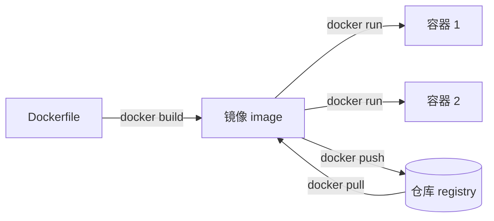

"我这儿能跑啊"——部署最老的敌人就是环境差异：你机器上有的依赖、库版本、系统配置，服务器上不一定有。Docker 的解法是把程序连同它的整个运行环境（系统库、依赖、配置）打包成一个可移植的"盒子"，在哪台机器上跑，环境都一模一样。

<!-- more -->

## [Docker](https://docs.docker.com/) 是什么：三个核心概念

Docker 是容器引擎——用比虚拟机轻得多的方式隔离和运行程序。上手前必须分清三个概念，绝大多数新手困惑都源于把前两个混为一谈：

- **镜像（image）**：只读的模板，包含程序和它的完整运行环境——类比面向对象里的"类"
- **容器（container）**：镜像跑起来的实例——类比"对象"，同一个镜像可以同时跑出多个互不干扰的容器
- **仓库（registry）**：集中存放镜像的服务，默认是 Docker Hub，`docker pull` 从这里拉镜像



## 安装：一条命令

```bash
curl -fsSL https://get.docker.com | sh
#     Linux 上的官方便捷安装脚本——-sSL 这套管道安装的参数含义在 curl 那篇讲过
#     -f：HTTP 出错时直接失败，不把错误页当脚本喂给 sh

docker run hello-world
#     装完跑这个验证：能输出欢迎信息说明引擎正常
```

macOS/Windows 用 [Docker Desktop](https://www.docker.com/products/docker-desktop/) 图形化安装（macOS 上轻量替代 OrbStack 也很流行），装完命令行用法完全一致。

## docker run：参数拆解

跑一个 nginx，把最常用的参数一次讲清：

```bash
docker run -d -p 8080:80 --name web nginx
#     nginx：镜像名，本地没有会自动去仓库拉取
#     -d：detached，后台运行，不占着当前终端
#     -p 8080:80：端口映射，方向是 宿主机:容器——
#         把宿主机的 8080 映射到容器里的 80，浏览器访问 localhost:8080 就到了容器里的 nginx
#         方向记反是最常见的新手错误：冒号左边永远是你机器上的端口
#     --name web：给容器起名，后续操作用名字代替随机生成的 ID
```

## 容器生命周期：从跑起来到删干净

```bash
docker ps
#     列出正在运行的容器

docker ps -a
#     -a：包含已退出的容器——容器停了不等于没了，还占着名字和磁盘

docker logs -f web
#     看容器的输出日志，-f 实时跟踪（和 tail -f 一个手感）

docker exec -it web sh
#     进入运行中的容器内部开个 shell，排查问题用
#     -i 保持输入、-t 分配终端，基本固定连用；exit 退出不影响容器运行

docker stop web
#     停止容器（先发 SIGTERM 优雅退出，超时再强杀——和 systemctl stop 同款逻辑）

docker rm web
#     删除已停止的容器；运行中的要先 stop 或用 rm -f

docker run --rm -it golang:1.26 bash
#     --rm：容器退出后自动删除自己——临时起个环境试点东西，用完不留垃圾
```

一个必须建立的认知：**容器不是轻量虚拟机，它的生命周期跟着主进程走**——`docker run` 启动时指定（或镜像默认）的那个进程退出了，容器就停了。跑个 `docker run ubuntu` 发现容器"秒退"，不是坏了，是它的默认命令执行完就结束了。

## 数据坑：容器删了，数据跟着没了

容器内部写的文件属于容器自己的可写层，`docker rm` 之后整层蒸发。数据库这类有状态的服务，必须把数据目录挂载到宿主机：

```bash
docker run -d --name pg \
  -e POSTGRES_PASSWORD=devpass \
  -v /data/pgdata:/var/lib/postgresql/data \
  postgres:17
#     -e：设置容器内的环境变量，镜像文档会列出支持哪些
#     -v 宿主路径:容器路径：把宿主机目录挂进容器——
#         数据实际写在宿主机 /data/pgdata，容器删了重建，数据还在
```

判断标准很简单：这个容器产生的数据丢了心不心疼？心疼就必须 `-v` 挂出来。

## 镜像管理与 tag

```bash
docker images
#     列出本地已有的镜像和它们的体积

docker pull nginx:1.27
#     拉取指定版本，冒号后面是 tag（版本标签）

docker rmi nginx:1.27
#     删除本地镜像，释放磁盘
```

tag 有个约定俗成的坑：不写 tag 默认拉 `latest`，但 latest 只是个普通标签，指向的版本会随时间漂移——今天构建和明天构建拉到的可能不是同一个东西。**生产环境永远写死具体版本号**，`postgres:17` 而不是 `postgres:latest`。

## Dockerfile：把自己的 Go 服务打成镜像

Dockerfile 是构建镜像的"配方"。Go 程序编译成单个静态二进制，特别适合多阶段构建——编译在带完整工具链的大镜像里做，运行只带二进制本身：

```dockerfile
# 阶段一：编译。golang 官方镜像自带完整编译工具链，体积几百 MB（Debian 底座的接近 1 GB），但只在构建时用
FROM golang:1.26-alpine AS builder
WORKDIR /app
COPY go.mod go.sum ./
RUN go mod download
#     先只拷贝依赖清单并下载依赖——这两层能吃缓存，
#     代码改动不会导致依赖重新下载，构建快很多
COPY . .
RUN CGO_ENABLED=0 go build -o server .
#     CGO_ENABLED=0：纯静态编译，产物不依赖任何系统库

# 阶段二：运行。只把二进制拷进一个几 MB 的空底座
FROM alpine:latest
WORKDIR /app
COPY --from=builder /app/server .
#     --from=builder：从上一阶段拷贝产物，工具链、源码统统不带
EXPOSE 8080
CMD ["./server"]
#     CMD：容器启动时执行的命令——就是前面说的"主进程"
```

```bash
docker build -t myapp:1.0 .
#     -t：给构建出的镜像打名字和 tag；最后的 . 是构建上下文（Dockerfile 所在目录）

docker run -d -p 8080:8080 myapp:1.0
```
多阶段构建的效果立竿见影：单阶段直接用 golang 镜像跑，成品接近 1 GB；两阶段下来通常只有十几 MB。

为什么差距这么大？关键在于**镜像是一层层叠出来的，最终镜像 = 基础镜像的所有层 + 你新加的层，叠上去的东西删不掉**。单阶段构建时基础镜像是 golang——里面装着 Go 编译器、标准库、git、gcc 这一整套构建工具（Debian 底座解压后就有 800 MB 上下），再叠上 `go mod download` 拉下来的依赖缓存和你的源码，成品轻松逼近 1 GB。可服务跑起来真正需要的只有那个十几 MB 的静态二进制，剩下全是"编译完就没用了"的东西。多阶段构建的本质就是把这些甩掉：`FROM alpine` 另起一个只有几 MB 的干净底座，只把二进制 `COPY` 进去——builder 阶段的所有层都不会进入最终镜像。

## docker compose：多容器一把梭

服务一多（web + 数据库 + 缓存），逐个 `docker run` 又长又难维护。compose 把整套服务声明在一个 `compose.yaml` 里：

```yaml
services:
  web:
    build: .
    ports:
      - "8080:8080"
    environment:
      - REDIS_ADDR=redis:6379
    depends_on:
      - redis
  redis:
    image: redis:7
    volumes:
      - ./redis-data:/data
```

```bash
docker compose up -d
#     一条命令把整套服务按依赖顺序拉起来
#     注意是 docker compose（空格）——v2 的写法，作为插件内置在现代 Docker 里
#     老文章里的 docker-compose（连字符）是 v1 独立程序，2023 年就停止更新了

docker compose logs -f
#     聚合看所有服务的日志

docker compose down
#     整套停掉并删除容器（挂载出来的数据不受影响）
```

compose 文件里服务名（如 `redis`）自动成为容器间互相访问的主机名——`web` 里连 `redis:6379` 就通，不用关心容器 IP。

## 排查与查看：network、inspect 与 docker info

容器出问题时光看 logs 不够，还得能看它的网络接在哪、完整配置是什么、引擎本身的状态如何。这几个都是只读的查看类命令，放心随便敲：

```bash
docker network ls
#     列出 Docker 的网络。默认有三个：bridge（容器不指定网络就接它）、host、none

docker network inspect bridge
#     看某个网络的详情：网段、网关、接在这个网络上的容器和它们各自的 IP

docker inspect web
#     输出容器的完整配置 JSON：环境变量、挂载、端口映射、IP、重启策略全在里面
#     镜像同样能 inspect：docker inspect nginx:1.27

docker inspect -f '{{.NetworkSettings.IPAddress}}' web
#     -f：format，用 Go 模板语法只取想要的字段——这个例子直接输出容器的 IP

docker port web
#     只看这个容器的端口映射，比在 inspect 的大 JSON 里翻快得多

docker info
#     Docker 引擎自身的配置和状态：存储驱动、数据根目录、容器/镜像数量、cgroup 版本

docker stats
#     实时看各容器的 CPU、内存、网络占用——容器版的 top

docker system df
#     镜像、容器、数据卷各占了多少磁盘，清理前先看这个
```

## 常用命令速查表

| 命令 | 作用 |
|---|---|
| `docker run -d 镜像` | 后台启动容器 |
| `docker run -p 宿主:容器` | 端口映射，冒号左边是宿主机 |
| `docker run -v 宿主:容器` | 目录挂载，有状态数据必挂 |
| `docker run -e KEY=VAL` | 设置容器内环境变量 |
| `docker run --name 名字` | 给容器命名 |
| `docker run --rm` | 退出后自动删除，临时容器用 |
| `docker run -it 镜像 sh` | 交互式进入容器 shell |
| `docker ps` / `ps -a` | 运行中的容器 / 含已退出的 |
| `docker logs -f 容器` | 实时跟踪容器日志 |
| `docker exec -it 容器 sh` | 进入运行中的容器 |
| `docker stop` / `rm` | 停止 / 删除容器 |
| `docker images` | 本地镜像列表 |
| `docker pull 镜像:tag` | 拉取镜像，生产写死具体 tag |
| `docker rmi 镜像` | 删除本地镜像 |
| `docker build -t 名:tag .` | 按 Dockerfile 构建镜像 |
| `docker network ls` | 列出网络 |
| `docker network inspect 网络` | 网络详情：网段、网关、容器 IP |
| `docker inspect 容器/镜像` | 完整配置 JSON |
| `docker inspect -f 模板` | 只取 JSON 里指定的字段 |
| `docker port 容器` | 只看端口映射 |
| `docker info` | 引擎配置与状态 |
| `docker stats` | 实时资源占用，容器版 top |
| `docker system df` | 镜像/容器/数据卷磁盘占用 |
| `docker compose up -d` | 按 compose.yaml 拉起整套服务 |
| `docker compose down` | 整套停掉并删容器 |
| `docker compose logs -f` | 聚合跟踪所有服务日志 |

## 写到这里

Docker 上手的关键是概念先行：镜像是模板、容器是实例、容器生死跟着主进程走、心疼的数据必须挂载出来。这四句话立住之后，命令都只是查表的事。Dockerfile 多阶段构建和 compose 是从"会用"到"用好"的两步——前者让镜像从 GB 瘦到 MB，后者让多服务环境一条命令起停。再往深走就是网络模型和编排（Kubernetes）的领域了，日常开发部署，本文这套已经够用。
