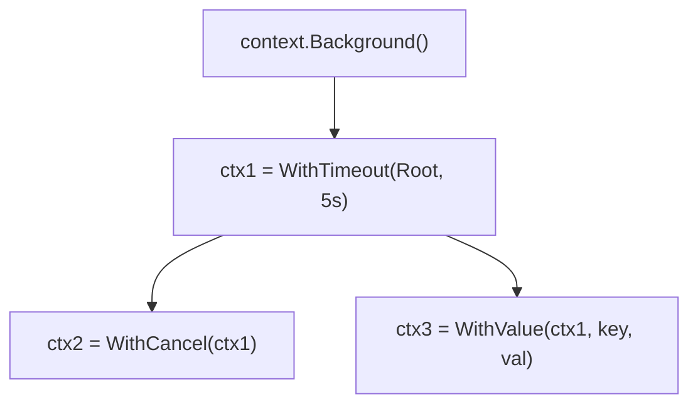

打开任何一个稍微上点规模的 Go 项目，函数签名里几乎都能看到这个熟悉的开头：

```go
func GetUser(ctx context.Context, id int) (*User, error)
```

`ctx` 通常什么都不做，只是原样往下传，直到某个地方真正用上它——这也是它最容易被当成摆设、随手 `context.Background()` 应付了事的原因。但 Context 要解决的问题很具体：**一次请求可能牵扯好几个 goroutine 和好几层函数调用，怎么让"调用方不想等了"这件事能传达到所有正在为它干活的地方**。

<!-- more -->

## Context 是什么

`context.Context` 是一个接口，核心是四个方法：

```go
type Context interface {
    Deadline() (deadline time.Time, ok bool) // 这个 context 会在什么时候被自动取消
    Done() <-chan struct{}                   // 取消或超时后会被关闭的 channel
    Err() error                              // 取消后返回具体原因：Canceled 还是 DeadlineExceeded
    Value(key any) any                       // 取出跟这个 context 绑定的某个值
}
```

日常写业务代码基本不用自己实现这个接口，而是用 `context` 包提供的几个构造函数派生出需要的 context——`WithCancel`、`WithTimeout`、`WithDeadline`、`WithValue`。

## `Background` 和 `TODO`：从哪里开始

一切 context 都要有个起点，`context` 包提供两个：

```go
context.Background() // 正式起点：main 函数、初始化代码、测试代码里用它
context.TODO()       // 占位起点：还没想好传什么 context、或者在改造老代码时先占个位
```

两者行为完全一样（都是空的、永不取消），区别只是给人看的语义——`TODO()` 相当于代码里留了一个"这里以后应该传个正经 context"的标记，方便后续搜索排查。

## `WithCancel`：手动喊停

```go
ctx, cancel := context.WithCancel(context.Background())

go func() {
    for {
        select {
        case <-ctx.Done():
            fmt.Println("收到取消信号，退出")
            return
        default:
            // 正常干活
        }
    }
}()

time.Sleep(time.Second)
cancel() // 调用 cancel，上面 goroutine 里的 ctx.Done() 会被触发
```

`cancel` 是个函数，调用它会关闭 `ctx.Done()` 返回的那个 channel。任何持有这个 `ctx` 并且在 `select` 里监听 `Done()` 的 goroutine，都会在这一刻感知到"该收工了"。`cancel` **必须被调用**，哪怕正常走完了业务逻辑也要调用——通常用 `defer cancel()` 保证这一点，不调用会导致关联的资源一直不被释放（linter 一般也会对此报警）。

## `WithTimeout` / `WithDeadline`：超时自动取消

比手动 `cancel` 更常见的场景是"最多等这么久，超了就自动放弃"：

```go
ctx, cancel := context.WithTimeout(context.Background(), 3*time.Second)
defer cancel()

result, err := doSomething(ctx)
```

`WithTimeout` 内部就是用当前时间加上超时时长算出一个绝对时间点，再调用 `WithDeadline`——两者本质相同，`WithTimeout` 只是传相对时长更方便。三秒之后 `ctx.Done()` 会被自动关闭，不需要谁去手动调用 `cancel`；但 `cancel` 仍然要 `defer` 调用，用来在业务提前完成时立刻释放定时器资源，不用干等到超时那一刻。

配合网络调用是最典型的用法：

```go
func fetchWithTimeout(url string) ([]byte, error) {
    ctx, cancel := context.WithTimeout(context.Background(), 2*time.Second)
    defer cancel()

    req, err := http.NewRequestWithContext(ctx, http.MethodGet, url, nil)
    if err != nil {
        return nil, err
    }

    resp, err := http.DefaultClient.Do(req)
    if err != nil {
        return nil, err // 超时会在这里以 context.DeadlineExceeded 的形式体现
    }
    defer resp.Body.Close()
    return io.ReadAll(resp.Body)
}
```

`http.NewRequestWithContext` 把 `ctx` 绑定到这次请求上，一旦超时，`http.DefaultClient.Do` 会提前返回错误，不会傻等到网络层自己超时。

## `WithValue`：跨协程传请求域数据

```go
type traceIDKey struct{} // 自定义的空结构体类型，专门用作 key

ctx := context.WithValue(context.Background(), traceIDKey{}, "req-12345")

// 在很深的调用链之后
traceID := ctx.Value(traceIDKey{}).(string)
```

`WithValue` 常用来传递请求级别的元数据——trace ID、认证信息这类"跟这次请求绑定、多个函数都可能要用到"的数据，让它们不用作为显式参数一层层传下去。

### 为什么 key 要用私有的具名空结构体

`ctx.Value(key)` 内部找值靠的是 `key1 == key2`，而这里的 `key` 类型是 `any`。接口值的 `==` 比较分两步：先比动态类型是否相同，类型都不同就直接判不相等，根本不会往下比"值"这一层——这是整个技巧的根基。

Go 语言规范还有一条规则：**具名类型（`type Xxx ...` 声明出来的类型）身份看"声明它的地方"，不是看名字文本**。哪怕两个包各自声明的类型名字、结构完全一样，也是两个不同的类型：

```go
// 包 A
type traceIDKey struct{}
ctx = context.WithValue(ctx, traceIDKey{}, "req-1")

// 包 B（代码长得一模一样）
type traceIDKey struct{}
ctx = context.WithValue(ctx, traceIDKey{}, "other-value")
```

`A包.traceIDKey` 和 `B包.traceIDKey` 依然是两个不同类型，`ctx.Value(traceIDKey{})` 比较时第一步就发现类型对不上，直接判不相等——不存在"拿错"的可能，类型层面已经把两拨 key 隔离开了。

这份保护有个前提：**必须是具名类型，不能是裸的匿名类型字面量**。如果图省事直接用 `struct{}{}`（不声明类型）：

```go
ctx = context.WithValue(ctx, struct{}{}, "req-1")       // 包 A
ctx = context.WithValue(ctx, struct{}{}, "other-value") // 包 B
```

这就真的会冲突——匿名的 `struct{}` 类型在任何地方写出来都是同一个类型（没有"声明处"这个身份来源），而且它只有唯一一个可能的值，`struct{}{} == struct{}{}` 永远成立，后 `WithValue` 的会直接覆盖前一个。字符串当 key 翻车也是同样的道理：`string` 是内置类型，任何包都能凑出一样的字面量。

选空结构体只是因为它零内存开销、又天然只有一个值，够用就不需要更多；一旦声明了自己的具名类型（哪怕是 `type traceIDKey int`）保护就已经生效。工程上更进一步的做法是把 key 类型设成不导出，再包一层存取函数，调用方全程不用接触 key：

```go
type traceIDKey struct{} // 小写，包外看不到这个类型

func WithTraceID(ctx context.Context, id string) context.Context {
    return context.WithValue(ctx, traceIDKey{}, id)
}

func TraceIDFromContext(ctx context.Context) (string, bool) {
    id, ok := ctx.Value(traceIDKey{}).(string)
    return id, ok
}
```

两个容易踩的坑：

**key 不要用字符串或者其他内置类型**：如上面所说，内置类型任何包都能造出相同的值，天然没有隔离保护。

**不要用它传业务参数**：`WithValue` 存取的是 `any` 类型，编译器无法检查类型对不对，滥用它传函数本该显式声明的业务参数（比如用户 ID、分页参数），会让函数签名对调用方撒谎——参数是隐式传递的，读代码时完全看不出这个函数依赖了什么。Context 的 value 应该只用来传请求域的、和业务逻辑无关的横切数据。

## 父子 context：取消会一路传下去

`WithCancel`/`WithTimeout`/`WithValue` 都是"派生"出一个新 context，新 context 内部持有对父 context 的引用：



一旦 `Root` 或 `ctx1` 被取消（超时或手动 `cancel`），`ctx2`、`ctx3` 全部一起被取消——取消信号只会往下游传，不会往上游传。反过来，子 context 的取消不会影响父 context 和其他兄弟 context。这个"一次取消、全链路收工"的传播机制，正是 Context 存在的核心价值：一次 HTTP 请求超时了，这个请求链路上所有正在跑的下游调用都应该跟着放弃，而不是各自继续傻等。

## 常见错误

**把 `ctx` 存进 struct 长期持有**：Context 设计成"每次调用传参"，而不是存成字段长期持有——一个绑定了具体请求生命周期的 context，被存进一个生命周期更长的对象里，取消信号和请求根本对不上，等于这个 context 的语义直接失效。官方约定是 `ctx` 永远作为函数的第一个参数显式传递，不要塞进 struct。

**忽略取消原因**：`select` 里收到 `<-ctx.Done()` 只知道"被取消了"，不知道是主动取消还是超时——`ctx.Err()` 会分别返回 `context.Canceled` 或 `context.DeadlineExceeded`，这两个本身就是 sentinel error，判断的时候用 `errors.Is(err, context.DeadlineExceeded)` 而不是 `==`（[原因见错误处理这篇](/Go错误处理进阶-errors.Is与errors.As)），日志里打印出这个区别，排查问题时能少走很多弯路。

**goroutine 里不监听 `Done()` 导致泄漏**：起了一个 goroutine 做耗时任务，却没有在它的循环或者阻塞点里 `select` 监听 `ctx.Done()`，调用方早就超时返回了，这个 goroutine 却会一直跑到自然结束，白白占着资源——排查 goroutine 泄漏时，"该收到取消信号的地方没写 select" 是最常见的原因之一。

## 记住两条就够用

Context 要解决的问题就三件：取消（`WithCancel`）、超时（`WithTimeout`/`WithDeadline`）、跨协程传请求域数据（`WithValue`）。它是接口，日常代码里不需要自己实现，只需要记住两条：`ctx` 永远显式传参、不存进 struct；`select` 里该监听 `Done()` 的地方一定要写，不然取消信号传到了也没人收。
