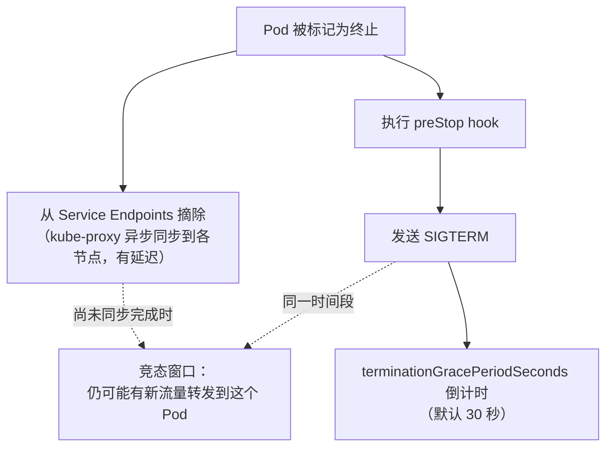

本地测试的时候，`kill` 掉 Go 服务进程，日志里"优雅退出"打印得漂漂亮亮，一切正常。部署到 Kubernetes 上滚动更新，监控面板上却总能看到几个稀疏的 502——概率不高，一天可能就那么几次，但确确实实存在。这类问题最容易被误判成"代码没写好"，回头去查 `Shutdown()` 的调用逻辑，翻来覆去都挑不出毛病。真正的原因往往不在应用代码里，而在 Go 的优雅关闭机制和 Kubernetes 的 Pod 终止流程之间，有一段本来就没对齐的时间差。

<!-- more -->

## 从 SIGKILL 到 Shutdown()：先解决应用层面的问题

进程收到 `SIGKILL`（或者代码里直接 `os.Exit`）会立刻终止，操作系统不给任何清理的机会——正在处理的请求连接被硬生生掐断，客户端拿到的是连接重置，而不是一个正常的响应。捕获 `SIGINT`/`SIGTERM` 自己决定何时退出，一直是标准做法，常见写法是 `signal.Notify` 配一个 channel：

```go
sigCh := make(chan os.Signal, 1)
signal.Notify(sigCh, syscall.SIGINT, syscall.SIGTERM)

srv := &http.Server{Addr: ":8080", Handler: mux}
go func() {
    if err := srv.ListenAndServe(); err != nil && err != http.ErrServerClosed {
        log.Fatalf("listen: %v", err)
    }
}()

<-sigCh // 阻塞等待信号

shutdownCtx, cancel := context.WithTimeout(context.Background(), 10*time.Second)
defer cancel()
if err := srv.Shutdown(shutdownCtx); err != nil {
    log.Printf("graceful shutdown failed: %v", err)
}
```

这样写完全能用，但有个不方便的地方：拿到的是一个 `chan os.Signal`，不是 `context.Context`。而 Go 里"取消"这件事的通用语言是 `context`——下游函数、其他 goroutine 大多是靠 `ctx.Done()` 感知退出信号的，如果想让"收到系统信号"也能统一接入这套机制，还得自己再包一层：起一个 goroutine 在 `<-sigCh` 之后手动调用 `cancel()`，等于多写一份样板代码才能把 channel 转换成 context。

Go 1.16 加入的 `signal.NotifyContext` 直接把这层转换做掉了，一次调用拿到的就是一个会在信号触发时自动取消的 `context.Context`：

```go
ctx, stop := signal.NotifyContext(context.Background(), syscall.SIGINT, syscall.SIGTERM)
defer stop()

srv := &http.Server{Addr: ":8080", Handler: mux}
go func() {
    if err := srv.ListenAndServe(); err != nil && err != http.ErrServerClosed {
        log.Fatalf("listen: %v", err)
    }
}()

<-ctx.Done() // 收到 SIGINT/SIGTERM，ctx 被取消，往下走

shutdownCtx, cancel := context.WithTimeout(context.Background(), 10*time.Second)
defer cancel()
if err := srv.Shutdown(shutdownCtx); err != nil {
    log.Printf("graceful shutdown failed: %v", err)
}
```

省掉的不只是几行样板代码——拿到手的是一个真正的 `context.Context`，可以直接和 `select` 里其他来源的 `ctx.Done()` 放在一起用，也可以直接传给下游需要 `context.Context` 参数的函数，不用再单独维护一个 channel 做桥接。

`srv.Shutdown(ctx)` 做三件事：立刻停止监听端口，不再接受新连接；等待所有已经在处理的请求自然结束；如果传入的 `ctx` 在这之前超时，直接返回错误，不再无限期等下去。这一步做完，本地那种"kill 掉就断连"的问题基本消失——但这只解决了应用进程自己能控制的那部分。

## `Shutdown()` 不管的一类连接：WebSocket

`Shutdown()` 的文档里有一句容易被忽略的话：它不会主动关闭、也不会等待被 hijack 的连接——[Go 官方 issue #17721](https://github.com/golang/go/issues/17721) 把这个行为明确记录了下来。WebSocket、SSE 这类通过 `http.Hijacker` 接管了底层 TCP 连接的场景，一旦被 hijack，这条连接就彻底脱离了 `net/http` 的管理范围，`Shutdown()` 根本看不到它，自然也没法把它算进"等待在途请求完成"这个逻辑里。

实际后果是：如果服务里有 WebSocket 连接，光调用 `Shutdown()` 进程可能永远等不到这些连接自然结束（只要客户端不主动断开），`Shutdown()` 只会老老实实等到传入的 `ctx` 超时为止，然后直接返回。想让这类连接也参与优雅关闭，得自己维护一份连接集合，用 `srv.RegisterOnShutdown` 注册一个回调，在 `Shutdown()` 被调用的同时主动通知这些连接关闭：

```go
srv.RegisterOnShutdown(func() {
    hub.CloseAll() // 主动关闭所有维护中的 WebSocket 连接
})
```

`Shutdown()` 只负责它管得到的那部分（普通 HTTP 请求），管不到的部分需要显式接管。

## K8s 里真正的坑：SIGTERM 和 Endpoint 摘除是并发的

前面这些都是单个进程内部能控制的逻辑，但线上环境的 502 大多不是应用层面的问题，而是来自 Kubernetes 终止一个 Pod 时的真实时序。Pod 被删除时，Kubernetes 会**同时**做两件事：把这个 Pod 从对应 Service 的 Endpoints 列表里摘除（这样负载均衡就不会再把新流量转发过来），以及走 Pod 自身的终止流程（执行 `preStop` hook，然后发送 `SIGTERM`，宽限期倒计时——默认 `terminationGracePeriodSeconds` 是 30 秒）。

问题就出在"同时"这两个字上：Endpoint 从 Service 里摘除，靠的是 kube-proxy 把这个变化同步到每个节点的 iptables/ipvs 规则，这个同步本身有延迟，不是瞬间生效的。也就是说，存在一个真实的时间窗口——Pod 已经收到 `SIGTERM`、`Shutdown()` 已经开始停止接受新连接，但集群里某些节点的负载均衡规则还没更新完，仍然可能把新请求转发到这个正在关闭的 Pod 上：



这类请求打到一个已经不再监听的端口，或者打到一个已经在优雅关闭窗口期里的连接上，表现出来就是零星的 502 或者连接被拒绝。

这不是 Go 代码能单独解决的问题——`Shutdown()` 做得再干净，也拦不住"流量还在被转发过来"这件事本身。常见的缓解办法是在 `preStop` hook 里加一段固定的 `sleep`，让 Endpoint 摘除有时间传播完，应用再真正开始处理 `SIGTERM`：

```yaml
lifecycle:
  preStop:
    exec:
      command: ["sh", "-c", "sleep 15"]
terminationGracePeriodSeconds: 60
```

`preStop` hook 会在 `SIGTERM` 发出**之前**执行——这个顺序本身就是关键：sleep 期间 Pod 已经从 Endpoints 摘除、但进程还没收到关闭信号，还能正常处理这段窗口期里可能残留的流量。这里有个需要工程判断的取舍：sleep 时间设短了，摘除还没传播完就已经进入下一阶段，等于白 sleep；设长了，每次发布都要多等这几秒，滚动发布的总耗时会被拉长。`terminationGracePeriodSeconds` 也要相应调大——它是"允许整个终止流程（`preStop` + `SIGTERM` 处理）花费的总时间"，如果只顾着加长 `preStop` sleep 却不调整这个总预算，应用自己优雅关闭的那部分时间反而被压缩了。具体 sleep 多久没有统一答案，取决于集群规模和 kube-proxy 同步延迟，一般从 5-15 秒起步测起。

## HTTP 之外：后台 goroutine 谁来管

`http.Server.Shutdown()` 只管 HTTP 请求这一条线，如果服务里还跑着消息队列消费者、定时任务这类独立的后台 goroutine，它们的退出顺序得自己协调，不然要么消费者被拦腰砍断丢消息，要么进程等 HTTP 关闭完了却对后台任务撒手不管。常见做法是用同一个 `ctx` 串起来，配合 `sync.WaitGroup` 等所有 goroutine 真正退出：

```go
var wg sync.WaitGroup

wg.Add(1)
go func() {
    defer wg.Done()
    consumer.Run(ctx) // ctx 取消时，consumer 内部的 for-select 循环负责退出
}()

<-ctx.Done()
shutdownCtx, cancel := context.WithTimeout(context.Background(), 10*time.Second)
defer cancel()
srv.Shutdown(shutdownCtx)

wg.Wait() // 等消费者这类后台任务也确认退出，才真正结束进程
```

顺序很重要：先让 HTTP 层停止接收新请求，再等所有后台任务把手头的活干完，最后才断开数据库、消息队列这些下游连接——反过来断开顺序，会让还在跑的任务在关键的最后一步失去依赖，产生比直接 kill 更难排查的半吊子失败。

## 优雅关闭是应用和基础设施两边的事

`http.Server.Shutdown()` 加 `signal.NotifyContext` 能保证：应用自己收到退出信号之后，不会粗暴打断正在处理的请求。但 Kubernetes 环境下零星出现的 502，大概率提醒的是另一件事——真正做到滚动发布零丢包，光在应用代码里做对是不够的，`preStop` hook 和 `terminationGracePeriodSeconds` 这些基础设施层面的配置得配合上，两边的时间窗口对齐了，Shutdown() 该等的才真等得到。
