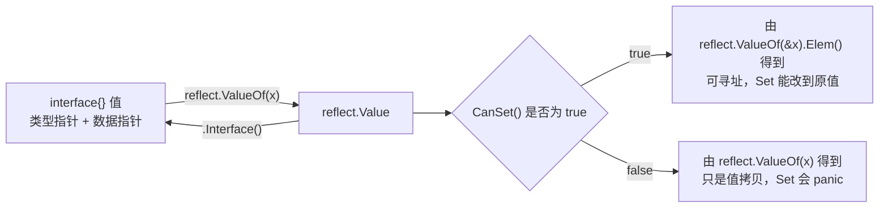

反射（reflection）说的是：程序在**运行时**检查、修改自己的结构和行为的能力。正常写代码时，要访问一个字段、调用一个方法，你必须在编译时就知道具体是哪个类型（比如写 `u.Name`，编译器得知道 `u` 是 `User`）。放到 Go 里，`reflect` 包解决的正是"编译时不知道具体类型"这个问题——它让代码能在运行时才拿到一个值的类型信息、遍历字段、读 tag、甚至调用方法。`encoding/json`、`gorm`、各种 validator 库能做到"传入任意 struct 都能处理"，靠的正是这套机制。

<!-- more -->

## 基础操作：TypeOf、ValueOf、Kind 与字段遍历

反射的入口只有两个函数：`reflect.TypeOf` 拿到类型信息，`reflect.ValueOf` 拿到值本身。

```go
type User struct {
	Name string `json:"name"`
	Age  int    `json:"age"`
}

func (u User) Greet(prefix string) string {
	return prefix + ", " + u.Name
}

u := User{Name: "Alice", Age: 30}
t := reflect.TypeOf(u)  // 拿到 u 的类型信息（reflect.Type），只关心"是什么类型"，不碰具体的值
v := reflect.ValueOf(u) // 拿到 u 的值本身（reflect.Value），后面读字段、调方法都靠它

fmt.Println(t)             // main.User
fmt.Println(t.Kind())      // struct —— Kind() 返回的是底层大类，不是具体类型名
fmt.Println(t.NumField())  // 2 —— NumField() 返回这个 struct 有几个字段
```

这里第一个容易混的点：**`Type` 和 `Kind` 不是一回事**。`Type` 是"具体是哪个类型"（这里是 `main.User`），`Kind` 是"底层属于哪一大类"（struct、int、slice、map、ptr 这些）。一个自定义类型 `type Age int` 的 `Type` 是 `main.Age`，但 `Kind` 是 `int`——写通用工具函数时，很多时候只关心 `Kind`（"这是不是个 struct"），不关心具体是哪个类型。

遍历字段、读 tag：

```go
for i := 0; i < t.NumField(); i++ {
	f := t.Field(i) // Field(i) 拿到第 i 个字段的类型信息（名字、tag 这些元数据，不是值）
	// f.Tag.Get("json") 读这个字段 tag 里 json:"..." 对应的内容
	// v.Field(i) 是从 Value 上取第 i 个字段的实际值，和上面的 t.Field(i) 一个管类型信息、一个管值
	fmt.Printf("field %d: name=%s tag=%s value=%v\n", i, f.Name, f.Tag.Get("json"), v.Field(i))
}
// field 0: name=Name tag=name value=Alice
// field 1: name=Age tag=age value=30
```

调用方法（按方法名字符串动态调用，而不是在代码里写死 `u.Greet(...)`）：

```go
method := v.MethodByName("Greet") // 按方法名字符串找到这个方法，返回一个可以调用的 reflect.Value
result := method.Call([]reflect.Value{reflect.ValueOf("Hi")})
// Call() 真正执行这次调用；参数必须包装成 []reflect.Value，返回值也是 []reflect.Value
// （因为一个方法可能有多个返回值，reflect 没法像普通函数调用那样直接给你元组）
fmt.Println(result[0].String()) // 取第一个返回值，用 .String() 把它还原成 Go 的 string 类型，结果是 Hi, Alice
```

创建一个新实例（`reflect.New` 返回的是指针，配合 `.Elem()` 拿到可操作的值）：

```go
newUserPtr := reflect.New(t) // 按类型 t 在内存里分配一份新值，返回指向它的指针（类型是 *main.User）
// .Elem() 解引用指针，拿到指针指向的那个实际值，跟代码里写 *ptr 是一个意思
// FieldByName("Name") 按字段名字符串找到这个字段，SetString 把它设成指定的字符串
newUserPtr.Elem().FieldByName("Name").SetString("Bob")
fmt.Println(newUserPtr.Elem().Interface()) // .Interface() 把 reflect.Value 转回普通值，fmt.Println 才能正常打印，结果是 {Bob 0}
```

以上代码本机实测全部按注释里写的结果输出，没有简化或省略步骤。

## 底层机制：反射到底在操作什么

要搞懂反射的行为边界，得先知道 Go 的 interface 值在内存里长什么样：一个 interface 值不是"直接存了这个数据"，而是存了**一对指针**——一个指向具体类型的信息，一个指向实际的数据。



Go 官方博客 [The Laws of Reflection](https://go.dev/blog/laws-of-reflection) 把这套机制归纳成三条定律：反射能把一个 interface 值转成一个反射对象（`reflect.ValueOf`）；反射对象也能转回 interface 值（`Value.Interface()`）；要修改一个反射对象，这个值必须是"可寻址"（settable）的。

前两条是一对镜像操作，好理解。第三条容易在两个地方踩坑：

**坑一：值类型取字段，`CanSet()` 是 false。** 直接对 `reflect.ValueOf(u)` 取字段，哪怕字段是导出的，也没法 `Set`——因为 `v` 本身是 `u` 的一份拷贝，改这份拷贝的字段没有意义。想让字段可写，得传指针再 `.Elem()`：

```go
u := User{Name: "Alice", Age: 30}
v := reflect.ValueOf(&u).Elem() // 传 &u（指针）再 .Elem() 解引用，这样拿到的 Value 才可寻址；直接传 u 拿到的还是拷贝
v.FieldByName("Age").SetInt(99) // SetInt 把这个字段设成 int 值 99——上面已确保可寻址，这里不会 panic
fmt.Println(u) // {Alice 99}
```

**坑二：未导出字段，`CanInterface()` 是 false。** 这不是可寻址性的问题，是 Go 的可见性规则（大写字母开头才导出）在反射层依然生效：

```go
type User struct {
	Name string
	age  int // 未导出字段
}

v := reflect.ValueOf(User{Name: "Alice", age: 30})
field := v.FieldByName("age")
fmt.Println(field.CanInterface()) // CanInterface() 检查这个 Value 能不能安全转回 interface{}，未导出字段这里是 false
fmt.Println(field.Interface())    // Interface() 就是把 reflect.Value 转回普通 interface{} 值的方法；
// CanInterface() 是 false 时还硬调 Interface()，直接 panic：
// reflect.Value.Interface: cannot return value obtained from unexported field or method
```

如果反射能随意读写任何包的私有字段，Go 的封装机制就形同虚设了，所以这里直接 panic 而不是安静地返回空值——这段报错文案和 panic 行为都是本机实测得到的，不是查文档编的。

严格来说这道限制不是完全绕不过去——用 `unsafe.Pointer` 拿到字段地址，再用 `reflect.NewAt` 重新构造一个不受限制的 `reflect.Value`，本机验证是能读到、甚至能改的：

```go
// field.Type() 拿到这个字段的类型；field.UnsafeAddr() 拿到它在内存里的真实地址（前提是这个 Value 可寻址）
// unsafe.Pointer(...) 把这个地址转成不带类型检查的通用指针
// reflect.NewAt(类型, 地址) 在这个地址上重新构造一个新的 reflect.Value，不经过原来那条"未导出字段"的检查
realField := reflect.NewAt(field.Type(), unsafe.Pointer(field.UnsafeAddr())).Elem()
fmt.Println(realField.Interface()) // 30，这次不 panic——新构造出来的 Value 没有继承"未导出"的限制
realField.SetInt(99)
```

一些老牌的 mock/深度比较类库确实用过这个手法，但它依赖的是"字段在内存里的实际布局"这种没有任何兼容性承诺的细节，官方从未保证这段行为在未来版本继续可用。正常业务代码遇到"这个字段没导出取不到"，正确做法是去改那个包的公开 API，而不是拿 `unsafe` 硬凿。

## 真实使用场景

搞懂了基础操作和底层规则之后，反射实际在解决什么问题就很清楚了：**在编译时不知道具体类型、只能等运行时才拿到类型信息的场景**。常见的几类：

**场景一：结构体和 map/JSON 之间转换。** `encoding/json`、`validator`、`gorm` 这类库的核心套路都是同一件事：拿到 `reflect.Type`，遍历 `NumField()`，读每个字段的 `Tag`，再决定怎么处理这个字段。一个简化版的"按 tag 转 map"：

```go
func ToMap(obj interface{}) map[string]interface{} {
	result := make(map[string]interface{})
	v := reflect.ValueOf(obj)
	t := v.Type() // 从 Value 上直接拿 Type，等价于单独写一句 reflect.TypeOf(obj)
	for i := 0; i < t.NumField(); i++ {
		field := t.Field(i)
		if !field.IsExported() {
			continue // IsExported() 判断这个字段是不是导出字段（首字母大写），未导出的没法 Interface()，直接跳过
		}
		tag := field.Tag.Get("map")
		if tag == "" {
			tag = field.Name
		}
		result[tag] = v.Field(i).Interface() // Interface() 把这个字段的值转回普通值，才能塞进 map[string]interface{}
	}
	return result
}
```

**场景二：按名字动态调用方法。** 前面 `MethodByName` + `Call` 那个例子，实际用在插件系统、RPC 框架、命令分发这类场景——请求里带一个方法名字符串（比如 `"CreateOrder"`），框架不需要写一长串 `if methodName == "CreateOrder" { ... } else if ...`，直接反射找到同名方法调用即可。这也是很多 RPC 框架内部的通用做法——把方法名映射到具体处理函数。

**场景三：通用工具函数。** `reflect.DeepEqual` 之类的深度比较、通用深拷贝（copier 类库）、依赖注入容器根据类型自动装配依赖，本质上都是"事先不知道具体类型，运行时靠反射读结构再决定怎么处理"这同一套逻辑的变体。

## 性能代价：什么时候不该用

反射不是免费的。用同一个字段读取操作写三个版本，在本机（Apple M1 Max，go1.26 darwin/arm64）跑一遍 `go test -bench=. -benchmem`（`-bench=.` 跑所有 benchmark，`-benchmem` 顺带统计内存分配），实测结果：

```
BenchmarkDirectAccess-10           0.3357 ns/op   0 B/op   0 allocs/op
BenchmarkInterfaceAssertion-10     0.3215 ns/op   0 B/op   0 allocs/op
BenchmarkReflectAccess-10          2.636  ns/op   0 B/op   0 allocs/op
BenchmarkReflectAccessByName-10    28.86  ns/op   0 B/op   0 allocs/op
```

直接字段访问和类型断言几乎没差别。用下标 `Field(0)` 走反射，慢了大约 8 倍；换成按名字查找的 `FieldByName`，慢了 86 倍——因为它每次调用都要在字段列表里做一次字符串匹配，不是像下标那样 O(1) 定位。这也是为什么 `encoding/json` 常年被吐槽性能一般，`sonic`、`easyjson` 这类库会选择在编译期生成专用的序列化代码，绕开运行时反射这条路。热路径（高频调用、性能敏感的代码）应该优先考虑类型断言、泛型或者代码生成，反射更适合用在初始化阶段、配置解析这类不那么频繁的路径上。

## 有了泛型之后，还要用反射吗

Go 1.18 加了泛型之后，一部分历史上"没有泛型只能用反射凑合"的代码确实可以退休了——比如一个对任意类型都成立的 `Filter`/`Map` 函数，以前要么写 `interface{}` + 反射，要么每种类型抄一遍，现在一个类型参数就解决了，而且是编译期展开，没有反射那部分运行时开销。

但泛型解决不了反射要解决的问题：泛型的类型参数是**编译时**确定的，写代码的人必须知道会用到哪些类型；反射面对的是**运行时才知道具体是什么类型**的场景——从配置文件、HTTP 请求体、数据库某一行读出来的数据，事先并不知道会映射到哪个 struct，这类通用序列化/ORM 映射的场景，本质上就得在运行时读类型信息，泛型在编译期完成不了这件事。能在写代码时就确定类型的地方，优先用泛型；只有等到运行时才能知道类型的地方，才是反射真正无法被替代的领域。

反射能解决"类型未知"的问题，代价是性能和一部分编译期检查——这也是为什么它更多出现在框架和工具库的底层，而不是业务代码的主路径上。
