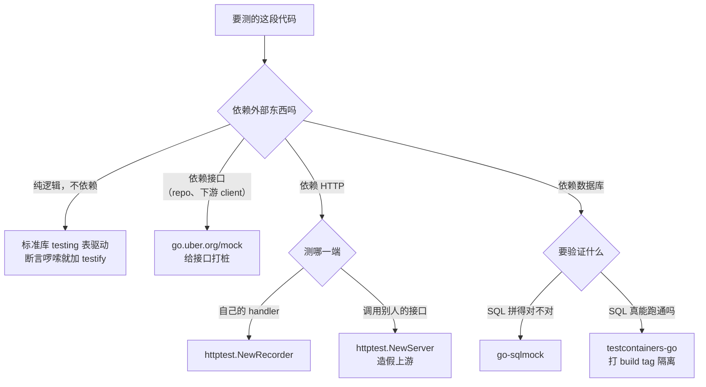

Go 的测试生态和其他语言不太一样：标准库 `testing` 只提供了最小的一套东西——跑用例、报失败、管清理，没有断言函数，没有 mock 框架，没有 setup/teardown 关键字。这不是缺失，是刻意的设计，所以社区库补的都是标准库故意不做的那部分。搞清楚每个库补的是哪一块，选型就不用靠感觉。

下面所有代码都在 go1.26.0 darwin/arm64 上实际跑过，版本是 testify v1.12.1、go.uber.org/mock v0.6.0、go-sqlmock v1.5.2、testcontainers-go v0.44.0。

<!-- more -->

## 标准库 testing 先能做到哪一步

上任何第三方库之前，先看清楚标准库自带了什么。很多人以为必须装 testify 才能写测试，其实标准库覆盖的范围比想象中大。

被测代码用下面这个例子，后面几节都拿它举例：

```go
type User struct {
    ID    int
    Name  string
    Email string
}

var ErrNotFound = errors.New("user not found")

type UserRepo interface {
    FindByID(ctx context.Context, id int) (*User, error)
}

type UserService struct {
    repo UserRepo
}

func NewUserService(r UserRepo) *UserService { return &UserService{repo: r} }

func (s *UserService) DisplayName(ctx context.Context, id int) (string, error) {
    u, err := s.repo.FindByID(ctx, id)
    if err != nil {
        return "", err
    }
    if u.Name == "" {
        return u.Email, nil    // 没填名字就退回用邮箱显示
    }
    return u.Name, nil
}
```

### 表驱动测试与子测试

Go 社区最主流的写法是把用例列成一张表，再用 `t.Run` 逐个跑。拿上面那条"没填名字就用邮箱"的规则单独拆出来测：

```go
func pickDisplayName(u User) string {
    if u.Name == "" {
        return u.Email
    }
    return u.Name
}

func TestPickDisplayName(t *testing.T) {
    cases := []struct {
        name string
        user User
        want string
    }{
        {"有名字就用名字", User{Name: "Alice", Email: "a@example.com"}, "Alice"},
        {"没名字退回邮箱", User{Name: "", Email: "b@example.com"}, "b@example.com"},
    }
    for _, c := range cases {
        t.Run(c.name, func(t *testing.T) {
            // t.Run 开一个子测试，名字会拼成 TestPickDisplayName/有名字就用名字
            // 好处是某个用例挂了，报错信息直接告诉你挂的是哪一条
            got := pickDisplayName(c.user)
            if got != c.want {
                t.Errorf("got %q, want %q", got, c.want)
            }
        })
    }
}
```

`t.Errorf` 记一个失败然后继续往下跑，`t.Fatalf` 记完立刻中断当前用例。取值失败之后再往下走只会连环报错的地方，用 `Fatalf`；只是想一次看到多个断言的结果，用 `Errorf`。

### 三个容易被忽略的辅助方法

```go
func setupTempFile(t *testing.T) string {
    t.Helper()
    // t.Helper() 声明"这是个辅助函数"，里面报错时
    // 错误行号会指向调用它的那一行，而不是这个函数内部，定位问题方便得多

    f, err := os.CreateTemp("", "demo-*.txt")
    if err != nil {
        t.Fatal(err)
    }
    t.Cleanup(func() {
        // t.Cleanup 注册清理函数，当前用例（含所有子测试）结束时自动调用
        // 比 defer 好用的地方在于：辅助函数里注册的清理，能等到调用方的用例结束才执行
        os.Remove(f.Name())
    })
    return f.Name()
}
```

Go 1.24 起 `*testing.T` 还带了 `t.Context()`，返回一个跟着用例生命周期走的 context——用例结束时它会自动取消，不用再自己写 `context.WithCancel` 加 `defer cancel()`。

### 测超时和定时逻辑：testing/synctest

涉及超时、重试、定时器的代码最难测，因为测试得真的等那么久。Go 1.25 起标准库里有了 `testing/synctest`，它给测试里的 goroutine 造一个假的时钟：代码里 `time.After(5 * time.Second)` 会立刻推进，不用真等 5 秒。

```go
func waitWithTimeout(ch <-chan int, d time.Duration) (int, bool) {
    select {
    case v := <-ch:
        return v, true
    case <-time.After(d):
        return 0, false
    }
}

func TestTimeout(t *testing.T) {
    start := time.Now()
    synctest.Test(t, func(t *testing.T) {
        // synctest.Test 里的时间是虚拟的：所有 goroutine 都阻塞住之后，
        // 时钟直接跳到下一个定时器该触发的时刻
        ch := make(chan int)
        _, ok := waitWithTimeout(ch, 5*time.Second)
        if ok {
            t.Fatal("应该超时")
        }
    })
    t.Logf("真实墙钟耗时: %v", time.Since(start))
}
```

实际跑出来的结果：

```
=== RUN   TestTimeoutWithSynctest
    synctest_test.go:28: 真实墙钟耗时: 50.708µs
--- PASS: TestTimeoutWithSynctest (0.00s)
```

一个语义上等了 5 秒的用例，真实耗时 50 微秒。

## testify：断言与 suite

标准库没有断言函数，所有判断都得自己写 `if got != want`。字段一多，测试代码里全是这种模板。[testify](https://github.com/stretchr/testify) 补的就是这一块。

### assert 和 require 的区别是"失败之后还跑不跑"

这两个包的函数签名完全一样，区别只有一个：失败之后的行为。

```go
import (
    "github.com/stretchr/testify/assert"
    "github.com/stretchr/testify/require"
)

func TestAssert(t *testing.T) {
    ok := assert.Equal(t, 1, 2)
    // assert 失败时内部调用 t.Errorf：标记用例失败，但函数继续往下执行
    // 它还有个返回值，true 表示断言通过
    t.Logf("assert.Equal 返回值 = %v，函数继续执行到这里", ok)
}

func TestRequire(t *testing.T) {
    u, err := repo.FindByID(ctx, 1)
    require.NoError(t, err)
    // require 失败时内部调用 t.FailNow：立刻中断当前用例，下面的代码不会执行
    // 这里如果查询出错，u 就是 nil，直接停掉，不会走到下一行去空指针 panic
    require.Equal(t, "Alice", u.Name)
}
```

实测 `assert.Equal(t, 1, 2)` 的输出，可以看到断言失败之后 `t.Logf` 那一行照样打印了出来：

```
=== RUN   TestAssertFailKeepsRunning
    testify_test.go:27: assert.Equal 返回值 = false，函数继续执行到这里
--- FAIL: TestAssertFailKeepsRunning (0.00s)
```

用哪个的判断标准很直接：**后面的代码依赖这个断言的结果，就用 require；只是想一次性看到多个字段哪些对不上，就用 assert**。取指针、取 error、拿返回值这类前置检查一律 require，检查结构体各个字段的值用 assert。

常用的几个断言：

```go
require.NoError(t, err)                      // err 必须是 nil，失败时会把 err 内容打出来
require.ErrorIs(t, err, ErrNotFound)         // 按 errors.Is 的语义比对错误链
require.JSONEq(t, `{"status":"ok"}`, body)   // 按 JSON 语义比对，忽略字段顺序和空白
require.InDelta(t, 26.5, temp, 0.001)        // 浮点数比对，允许 0.001 的误差
require.Len(t, users, 3)                     // 长度断言，失败时会打出实际长度
```

`ErrorIs` 和 `JSONEq` 这两个尤其省事：前者不用自己套 `errors.Is`，后者不用担心两段 JSON 字段顺序不同却是等价的。关于 `errors.Is` 和 `errors.As` 的语义差别，之前单独写过一篇 [Go 错误处理进阶](/Go错误处理进阶-errors.Is与errors.As)。

### suite：需要共享 setup 时才用

Go 没有 JUnit 那种 `@Before` 注解，多个用例要共享同一套初始化，标准做法是写个 `setup(t)` 辅助函数手动调。testify 的 `suite` 包提供了另一种选择：

```go
type UserServiceSuite struct {
    suite.Suite    // 嵌入进来，就有了 s.Equal / s.Require() 等方法
    repo *MockUserRepo
    svc  *UserService
}

func (s *UserServiceSuite) SetupTest() {
    // 名字是固定的：SetupTest 在每个用例前跑，TearDownTest 在每个用例后跑
    // 还有 SetupSuite / TearDownSuite，整个套件只跑一次
    s.repo = NewMockUserRepo(gomock.NewController(s.T()))
    s.svc = NewUserService(s.repo)
}

func (s *UserServiceSuite) TestName() {
    // 方法名以 Test 开头才会被当成用例
    s.repo.EXPECT().FindByID(gomock.Any(), 1).Return(&User{ID: 1, Name: "Alice"}, nil)
    got, err := s.svc.DisplayName(context.Background(), 1)
    s.Require().NoError(err)   // s.Require() 拿到 require 版本的断言，失败即中断
    s.Equal("Alice", got)      // 直接 s.Equal 是 assert 版本，失败继续
}

func TestUserServiceSuite(t *testing.T) {
    // 必须有这么一个普通的 Test 函数把套件跑起来，go test 才认
    suite.Run(t, new(UserServiceSuite))
}
```

跑出来是这样，套件下的每个用例都是一个子测试：

```
=== RUN   TestUserServiceSuite
=== RUN   TestUserServiceSuite/TestEmailFallback
    suite_test.go:22: SetupTest 每个用例前都会跑一次
=== RUN   TestUserServiceSuite/TestName
    suite_test.go:22: SetupTest 每个用例前都会跑一次
--- PASS: TestUserServiceSuite (0.00s)
```

suite 不是必需品。初始化只有一两行的时候，普通的 `setup(t)` 函数更直白，也不用记 `SetupTest` 这些约定的方法名。只有当一组用例共享的初始化又长又多、而且要保证每个用例拿到的是全新实例时，suite 才划算。

## go.uber.org/mock：给接口打桩

`UserService` 依赖 `UserRepo` 这个接口。测 `DisplayName` 的逻辑不该连数据库，得给这个接口塞一个假的实现进去。手写当然可以，但要控制"第几次调用返回什么""必须被调用一次"这类行为，手写就啰嗦了。

### 为什么是 uber 这个仓库

历史上大家用的是 `github.com/golang/mock`，Google 在 2023 年 6 月归档了那个仓库，Uber fork 出来继续维护，成了社区事实上的接班人。**新项目直接用 Uber 维护的这个** —— [go.uber.org/mock](https://github.com/uber-go/mock)，API 跟老版本兼容，导入路径换一下即可。

### mockgen 生成桩代码

gomock 不是运行时反射生成 mock，而是靠代码生成。先装工具：

```bash
go install go.uber.org/mock/mockgen@latest
#      install：编译并把可执行文件放进 $GOPATH/bin
```

然后在定义接口的文件里写一行 `go:generate` 指令：

```go
//go:generate mockgen -source=store.go -destination=mock_store.go -package=demo
//                    -source：从哪个文件里找接口（source 模式，会给文件里所有接口都生成 mock）
//                    -destination：生成的代码写到哪
//                    -package：生成代码的包名，写成和被测代码同包最省事
type UserRepo interface {
    FindByID(ctx context.Context, id int) (*User, error)
}
```

`go generate ./...` 跑一遍就有了 `MockUserRepo`。

### 三种最常用的期望写法

```go
func TestDisplayName_fallbackToEmail(t *testing.T) {
    ctrl := gomock.NewController(t)
    // Controller 管着所有 mock 的期望。把 t 传进去之后，
    // 它会自己注册一个 t.Cleanup，用例结束时校验期望有没有全部满足
    repo := NewMockUserRepo(ctrl)

    repo.EXPECT().
        FindByID(gomock.Any(), 42).
        // EXPECT() 之后跟的是"我期望这个方法被这样调用"
        // gomock.Any() 表示这个参数是什么都行；42 表示这个参数必须等于 42
        Return(&User{ID: 42, Name: "", Email: "u42@example.com"}, nil).
        // Return 指定这次调用的返回值，参数个数和顺序要跟接口方法的返回值一致
        Times(1)
        // Times(1) 要求恰好被调用一次；还有 AnyTimes() 不限次数、MinTimes(1) 至少一次

    svc := NewUserService(repo)
    got, err := svc.DisplayName(context.Background(), 42)
    require.NoError(t, err)
    require.Equal(t, "u42@example.com", got)
}
```

需要根据入参动态决定返回什么，用 `DoAndReturn`：

```go
repo.EXPECT().
    FindByID(gomock.Any(), gomock.Any()).
    DoAndReturn(func(ctx context.Context, id int) (*User, error) {
        // DoAndReturn 接一个签名跟被 mock 方法相同的函数，
        // 真实入参会传进来，返回值就是这次调用的返回值
        return &User{ID: id, Name: fmt.Sprintf("user-%d", id)}, nil
    }).
    AnyTimes()
```

### 期望没被满足会自动报错

老版本的 gomock 需要手写 `defer ctrl.Finish()` 才会校验。从 golang/mock v1.5 开始，只要 `NewController` 传的是 `*testing.T`，校验会自动挂到 `t.Cleanup` 上。实测设了期望却不调用：

```
=== RUN   TestMissingCallStillFails
    gomockfinish_test.go:15: 没有调用 FindByID，也没写 ctrl.Finish()
    controller.go:97: missing call(s) to *demo.MockUserRepo.FindByID(is anything, is anything)
    controller.go:97: aborting test due to missing call(s)
--- FAIL: TestMissingCallStillFails (0.00s)
```

确实报了错。所以新代码里不用再写 `defer ctrl.Finish()`。

顺带一提，mock 只对接口有用。要让业务代码能被 mock，依赖必须以接口形式注入进来，而不是在函数内部直接 `new` 一个具体类型。这一点属于设计问题而不是测试问题，之前在 [Go 接口设计](/Go接口设计-参数不够用时的struct化重构) 里聊过。

## net/http/httptest：HTTP 两个方向都能测

`net/http/httptest` 是标准库的一部分，不用装。它解决两个方向的问题，很多人只知道其中一个。

### 方向一：测自己写的 handler

```go
func TestHealthHandler(t *testing.T) {
    req := httptest.NewRequest(http.MethodGet, "/health", nil)
    // NewRequest 造一个假的入站请求，第三个参数是请求体，没有就传 nil
    // 它和 http.NewRequest 的区别是不会真的去解析 URL 建连接，专门给服务端测试用

    rec := httptest.NewRecorder()
    // ResponseRecorder 是个假的 http.ResponseWriter，
    // handler 往它里面写的状态码、header、body 都被记下来供断言

    HealthHandler(rec, req)

    res := rec.Result()   // Result() 把记录到的东西组装成一个 *http.Response
    defer res.Body.Close()
    require.Equal(t, http.StatusOK, res.StatusCode)
    require.Equal(t, "application/json", res.Header.Get("Content-Type"))

    body, _ := io.ReadAll(res.Body)
    require.JSONEq(t, `{"status":"ok"}`, string(body))
}
```

整个过程没有监听端口，也没有真实的 TCP 连接，就是直接调用 handler 函数，速度和普通单测一样。

### 方向二：给客户端代码造一个假的上游服务

这个方向用得更少，但更有价值。业务里调用第三方 HTTP 接口的代码，测的时候不能真的打过去，`httptest.NewServer` 能起一个只在本机监听、随用随关的真实 HTTP 服务：

```go
func TestWeatherClient(t *testing.T) {
    srv := httptest.NewServer(http.HandlerFunc(func(w http.ResponseWriter, r *http.Request) {
        // NewServer 会在本机随机端口起一个真实 HTTP 服务，
        // 传进去的 handler 就是这个假上游的全部行为
        require.Equal(t, "/weather", r.URL.Path)                   // 顺便断言客户端请求路径对不对
        require.Equal(t, "beijing", r.URL.Query().Get("city"))     // 以及查询参数拼对没有
        w.Write([]byte(`{"temp": 26.5}`))
    }))
    defer srv.Close()   // 关掉监听，释放端口

    c := &WeatherClient{
        BaseURL: srv.URL,      // srv.URL 是形如 http://127.0.0.1:54321 的地址
        HTTP:    srv.Client(), // srv.Client() 返回一个已经配好、能直连这个服务的客户端
    }
    temp, err := c.Temp("beijing")
    require.NoError(t, err)
    require.InDelta(t, 26.5, temp, 0.001)
}
```

`srv.Client()` 在测 HTTPS 时特别有用：`httptest.NewTLSServer` 用的是自签证书，普通 `http.Client` 会因为证书校验失败而拒绝连接，`srv.Client()` 返回的客户端已经信任了那张证书。

## go-sqlmock：不起数据库，测 SQL 层

repository 层的代码，逻辑往往就是"拼一条 SQL、扫描结果、映射成结构体"。想验证 SQL 拼对没有、`sql.ErrNoRows` 有没有被正确翻译成业务错误，起一个真数据库有点重。[go-sqlmock](https://github.com/DATA-DOG/go-sqlmock) 的做法是伪造一个 `database/sql` 的驱动：你的代码照常调 `db.QueryRowContext`，但底层不连任何数据库，而是拿你预设的期望来比对。

```go
func TestSQLUserRepo_FindByID(t *testing.T) {
    db, mock, err := sqlmock.New()
    // 返回三个值：一个假的 *sql.DB、一个用来设置期望的 mock 对象、错误
    require.NoError(t, err)
    defer db.Close()

    rows := sqlmock.NewRows([]string{"id", "name", "email"}).
        // NewRows 声明结果集有哪几列，顺序要和被测代码里 Scan 的顺序一致
        AddRow(1, "Alice", "alice@example.com")

    mock.ExpectQuery("SELECT id, name, email FROM users WHERE id = ?").
        // ExpectQuery 期望一条查询语句，参数默认按正则匹配（下面会讲这个坑）
        WithArgs(1).           // 期望绑定参数是 1
        WillReturnRows(rows)   // 命中时返回上面造的结果集

    repo := &SQLUserRepo{db: db}
    u, err := repo.FindByID(context.Background(), 1)
    require.NoError(t, err)
    require.Equal(t, "Alice", u.Name)

    require.NoError(t, mock.ExpectationsWereMet())
    // ExpectationsWereMet 校验所有设过的期望是否都被真的触发了，
    // 这一行不写的话，代码压根没执行那条查询也不会报错
}
```

想测错误分支也很方便：

```go
mock.ExpectQuery("SELECT id, name, email FROM users").
    WithArgs(99).
    WillReturnError(sql.ErrNoRows)   // 让这次查询直接返回指定的错误
```

### 默认的匹配器是正则，SQL 里的括号会翻车

这是 go-sqlmock 最容易踩的地方：`ExpectQuery` 和 `ExpectExec` 的参数**默认按正则表达式解析**，不是按字符串相等比。SQL 里常见的 `(`、`)`、`?`、`.` 都是正则元字符。

实测一条最普通的 INSERT：

```go
mock.ExpectExec("INSERT INTO users (name) VALUES (?)").
    WithArgs("Bob").
    WillReturnResult(sqlmock.NewResult(1, 1))
    //                              NewResult(lastInsertId, rowsAffected)

_, err := db.ExecContext(ctx, "INSERT INTO users (name) VALUES (?)", "Bob")
```

期望和实际执行的 SQL 一模一样，却匹配失败：

```
默认正则匹配器结果: err=ExecQuery: could not match actual sql:
  "INSERT INTO users (name) VALUES (?)"
  with expected regexp "INSERT INTO users (name) VALUES (?)"
```

原因是括号在正则里是分组，`?` 是"前一个字符可有可无"，整条期望被解析成了完全不同的模式。两种解法：

```go
// 解法一：改用字符串相等匹配器，最省心
db, mock, _ := sqlmock.New(sqlmock.QueryMatcherOption(sqlmock.QueryMatcherEqual))
//                         QueryMatcherEqual：去掉首尾空白后按字符串完全相等比对

// 解法二：继续用正则，但把元字符转义掉
mock.ExpectExec(regexp.QuoteMeta("INSERT INTO users (name) VALUES (?)"))
//              QuoteMeta 把字符串里所有正则元字符加上反斜杠
```

换成 `QueryMatcherEqual` 之后同一段代码就通过了。团队里如果没人指望用正则做模糊匹配，建议在项目里统一封装一个带 `QueryMatcherEqual` 的构造函数。

要注意 sqlmock 验证的是"你的代码发出了什么 SQL"，不验证这条 SQL 在真实数据库里跑不跑得通。SQL 语法写错、字段名拼错、索引没建，它一概发现不了。

## testcontainers-go：需要真数据库的时候

sqlmock 管不了的部分——SQL 语法对不对、事务隔离级别的行为、数据库特有的函数——只能用真数据库测。[testcontainers-go](https://golang.testcontainers.org/) 的做法是在测试代码里直接起 Docker 容器，用完自动销毁：

```go
func TestWithRealPostgres(t *testing.T) {
    ctx := t.Context()

    pg, err := postgres.Run(ctx,
        "postgres:17-alpine",              // 镜像名和 tag，建议钉死版本
        postgres.WithDatabase("testdb"),   // 这三个 With 选项对应容器的环境变量
        postgres.WithUsername("test"),
        postgres.WithPassword("test"),
        testcontainers.WithWaitStrategy(
            wait.ForListeningPort("5432/tcp"),
            // 等待策略：容器启动完不代表数据库能连了，
            // 这里等到 5432 端口真的开始监听才算就绪
        ),
    )
    testcontainers.CleanupContainer(t, pg)
    // 注册清理，用例结束时销毁容器。注意它要写在 err 判断之前，
    // 这样即使启动失败，已经拉起来的部分也能被清掉
    if err != nil {
        t.Fatal(err)
    }

    dsn, err := pg.ConnectionString(ctx, "sslmode=disable")
    // 容器端口是随机映射的，ConnectionString 拼出真实可用的连接串，
    // 后面的参数会作为查询参数拼到 DSN 上
    if err != nil {
        t.Fatal(err)
    }

    db, err := sql.Open("pgx", dsn)
    // 用哪个驱动名取决于你 import 了哪个驱动包，
    // 比如 _ "github.com/jackc/pgx/v5/stdlib" 注册的是 "pgx"
    if err != nil {
        t.Fatal(err)
    }
    defer db.Close()

    if err := db.PingContext(ctx); err != nil {
        t.Fatal(err)
    }
}
```

代价也很明确：**必须有能用的 Docker 环境，而且慢**。拉镜像加启动容器通常是几秒到几十秒，不可能像单测那样每改一行代码就跑一遍。实践中的做法是把它单独打个标签隔离开：

```go
//go:build integration
// 加了这行的文件，只有显式带上 -tags=integration 才会被编译进来
```

```bash
go test ./...                      # 日常开发：只跑快的那些
go test -tags=integration ./...    # CI 或者提交前：把容器测试也跑上
```

关于集成测试跟单元测试的边界到底在哪，之前专门写过一篇 [单元、集成、契约、端到端](/测试类型全景-单元集成契约端到端的边界与取舍)。

## 怎么选：按"要不要真依赖"往下走

这些库的关系不是竞品，是分工。一个项目里同时用四五个是很正常的。



一张对照表：

| 库 | 补的是哪一块 | 什么时候不该用 |
| --- | --- | --- |
| `testing`（标准库） | 用例组织、清理、虚拟时钟 | 没有不该用的情况 |
| testify assert/require | 断言，省掉手写 if 比对 | 团队约定不引三方断言库时 |
| testify suite | 一组用例共享复杂 setup | 初始化只有一两行时，纯属增加心智负担 |
| go.uber.org/mock | 接口打桩、调用次数与参数校验 | 依赖不是接口时（先改设计） |
| httptest | HTTP 两端，标准库自带 | 没有不该用的情况 |
| go-sqlmock | 验证代码发出的 SQL | 想验证 SQL 在真库能跑通时 |
| testcontainers-go | 起真容器做集成测试 | 没有 Docker 环境、或者追求快速反馈时 |

## 跑测试时值得加的几个参数

```bash
go test -race ./...
#       -race：开竞态检测器，会插桩记录内存访问，能抓出并发读写同一变量的问题
#              代价是慢好几倍、内存占用高，适合 CI 上跑，不适合本地每次都开

go test -cover ./...
#       -cover：输出每个包的语句覆盖率

go test -coverprofile=c.out ./... && go tool cover -func=c.out
#       -coverprofile：把覆盖率明细写进文件
#       go tool cover -func：按函数列出覆盖率，找出哪个函数没测到
#       换成 go tool cover -html=c.out 会开浏览器，逐行标出哪些代码没被覆盖

go test -count=1 ./...
#       -count=1：跑一遍，且这个值会让 Go 跳过测试结果缓存
#                 没有它的话，代码没改动时 go test 会直接打印上次的缓存结果

go test -run 'TestUserService/TestName' -v ./...
#       -run：按正则筛用例，斜杠后面可以继续筛子测试
#       -v：打印每个用例的名字和 t.Log 输出
```

`go tool cover -func` 的输出长这样，能直接看出哪个函数还有分支没走到：

```
demo/store.go:25:	NewUserService	100.0%
demo/store.go:27:	DisplayName	83.3%
total:			(statements)	94.4%
```

覆盖率是个参考指标而不是目标。83.3% 提示 `DisplayName` 还有分支没测到，这条信息有用；但把它硬拉到 100% 而写出一堆没有断言意义的用例，就本末倒置了。
