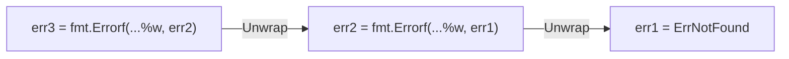

一个存储层函数返回了 `sql.ErrNoRows`，业务层拿到之后想判断"是不是没查到"，直接写：

```go
if err == sql.ErrNoRows {
    // 没查到，走兜底逻辑
}
```

能跑，但只要中间有一层代码想加点上下文信息，用 `fmt.Errorf("query user: %v", err)` 包一下，这个 `==` 比较立刻失效——包装之后的错误是个新对象，跟 `sql.ErrNoRows` 不再相等，业务层的判断悄悄失效，日志里只会看到"没走兜底逻辑"这个诡异结果，很难第一时间联想到是错误包装惹的祸。

<!-- more -->

## sentinel error：约定俗成的"错误常量"

Go 里判断"发生了哪种错误"最常见的手法是 sentinel error——包级别定义一个 `error` 类型的变量，充当一种可比较的"错误常量"：

```go
var ErrNotFound = errors.New("not found")

func FindUser(id int) (*User, error) {
    if !exists(id) {
        return nil, ErrNotFound
    }
    // ...
}
```

调用方判断的时候直接 `err == ErrNotFound`。这个套路在没有错误包装的场景下没问题，但现实中的错误往往要经过好几层函数调用往上传，每一层加一点"是在哪个环节出的错"的上下文信息几乎是刚需——这也是文章开头那个坑的根源。标准库里 `context.Canceled`、`context.DeadlineExceeded`（[用法见 Context 这篇](/GoContext实战-超时取消与跨协程数据传递)）也是同样的 sentinel error 套路。

## 错误包装：`%w` 和 `Unwrap`

Go 1.13 给 `fmt.Errorf` 加了一个新的格式化动词 `%w`，专门用来包装错误：

```go
err := fmt.Errorf("query user %d: %w", id, ErrNotFound)
```

`%w` 和 `%v` 打印出来的字符串长得一模一样，区别在于：`%w` 包出来的错误会额外实现一个 `Unwrap() error` 方法，返回被包装的那个原始错误；`%v` 只是把错误转成字符串拼进去，包完之后原始错误对象彻底丢了，没有任何办法再找回来。



这条由 `Unwrap()` 串起来的链就是"错误链"。`errors.Is` 和 `errors.As` 都是顺着这条链一层层往下找，直到找到匹配的目标或者链走到头。

## `errors.Is`：链上有没有这个 sentinel error

```go
err := fmt.Errorf("query user %d: %w", 42, ErrNotFound)

if errors.Is(err, ErrNotFound) {
    // 无论包了多少层，只要链上有 ErrNotFound 就会命中
}
```

开头那个坑，把 `err == sql.ErrNoRows` 换成 `errors.Is(err, sql.ErrNoRows)`，中间包多少层都不影响判断结果。

### 源码里到底做了什么

`errors.Is` 的核心逻辑在标准库 [`src/errors/wrap.go`](https://github.com/golang/go/blob/master/src/errors/wrap.go) 里，去掉包装直接看核心循环：

```go
func is(err, target error, targetComparable bool) bool {
    for {
        if targetComparable && err == target {
            return true
        }
        if x, ok := err.(interface{ Is(error) bool }); ok && x.Is(target) {
            return true
        }
        switch x := err.(type) {
        case interface{ Unwrap() error }:
            err = x.Unwrap()
            if err == nil {
                return false
            }
        case interface{ Unwrap() []error }: // errors.Join 的产物走这条分支
            for _, err := range x.Unwrap() {
                if is(err, target, targetComparable) {
                    return true
                }
            }
            return false
        default:
            return false
        }
    }
}
```

翻译成人话：每一层先看当前的 `err` 能不能直接 `==` 目标；不能就看它有没有实现 `Is(error) bool` 方法（有就调用它——这正是自定义 `Is` 方法生效的地方，见后面那一节）；两条都不满足，就调用 `Unwrap()` 剥掉这一层换成里面包着的错误，重复以上过程，直到 `Unwrap()` 返回 `nil`（链走到头，没找到，返回 `false`）。这也是为什么 `errors.Is` 能做到"包多少层都不影响判断"——它本来就是顺着 `Unwrap()` 一层层挖下去比较的，不是简单的一次性 `==`。

`targetComparable` 这个前置判断也值得留意：调用方传的 `target` 类型如果本身不可比较（比如里面带了 slice、map、func 字段），Go 语言层面对不可比较类型做 `==` 会直接 panic。`errors.Is` 提前用反射确认了这一点，不可比较就跳过 `==` 这一步，只依赖 `Is()` 方法或者继续往下 `Unwrap()`，不会让调用方意外收到一个 panic。

## `errors.As`：把链上某个具体类型的错误取出来

sentinel error 只能回答"是不是这个错误"，回答不了"这个错误里到底是什么数据"。想要拿到错误里的具体字段（比如 HTTP 状态码、SQL 错误码），要用自定义错误类型配合 `errors.As`：

```go
type APIError struct {
    Code int
    Msg  string
}

func (e *APIError) Error() string {
    return fmt.Sprintf("api error %d: %s", e.Code, e.Msg)
}

// 调用方
err := callAPI()

var apiErr *APIError
if errors.As(err, &apiErr) {
    // 无论 err 被包装了多少层，只要链上有 *APIError 类型就会命中
    // 命中后 apiErr 被赋值成链上那个具体的 *APIError 实例
    fmt.Println(apiErr.Code)
}
```

跟 `errors.Is` 判断"是不是同一个值"不同，`errors.As` 判断的是"是不是同一个类型"。

### target 参数的硬性要求：这里最容易翻车

上面例子里 `errors.As` 的第二个参数是 `&apiErr`，而 `apiErr` 声明成的是 `*APIError`（指针），所以传进去的 `target` 实际类型是 `**APIError`——指针的指针。第一次接触的人几乎都会下意识把它简化成看起来更顺眼的写法：

```go
var apiErr APIError // 少了个 *
if errors.As(err, &apiErr) {
    fmt.Println(apiErr.Code)
}
```

这行代码编译能过，运行时直接 panic：

```
panic: errors: *target must be interface or implement error
```

原因在标准库 [`src/errors/wrap.go`](https://github.com/golang/go/blob/master/src/errors/wrap.go) 的 `As` 函数里写得很直白：

```go
func As(err error, target any) bool {
    if err == nil {
        return false
    }
    if target == nil {
        panic("errors: target cannot be nil")
    }
    val := reflectlite.ValueOf(target)
    typ := val.Type()
    if typ.Kind() != reflectlite.Ptr || val.IsNil() {
        panic("errors: target must be a non-nil pointer")
    }
    targetType := typ.Elem() // 拿到 target 指向的那个类型
    if targetType.Kind() != reflectlite.Interface && !targetType.Implements(errorType) {
        panic("errors: *target must be interface or implement error")
    }
    // ...后面才是顺着 Unwrap 链查找、用 AssignableTo 做类型匹配
}
```

`target` 要满足两条硬性要求：**本身必须是非 nil 指针**；**它指向的那个类型（`typ.Elem()`），要么是接口类型，要么自己就实现了 `error` 接口**。开头那个 `APIError` 的 `Error()` 方法是**指针接收者**（`func (e *APIError) Error() string`），Go 的方法集规则决定了只有 `*APIError` 实现了 `error` 接口，值类型 `APIError` 本身并不实现——`var apiErr APIError; &apiErr` 得到的 `target` 指向的是 `APIError`，这个类型不满足"实现 error"的条件，直接触发上面那个 panic。

再往下看 `as` 函数的匹配逻辑，用的是 `reflectlite.TypeOf(err).AssignableTo(targetType)`——也就是说 target 指向的类型必须和错误链里**实际存的那个具体类型完全一致**（能相互赋值）。判断该写成指针还是值类型，只看一件事：`FindAPIError` 这类函数当初 `return` 出来的具体是 `&APIError{...}`（指针）还是 `APIError{...}`（值），target 就必须对应声明成同样的形态，再取一次地址传进去。

### `errors.AsType`：更省心的写法（Go 1.26+）

Go 1.26 加入了泛型版本 `errors.AsType[E]`，直接把类型当参数传，不用再声明变量、取地址、纠结要不要多一层指针：

```go
apiErr, ok := errors.AsType[*APIError](err)
if ok {
    fmt.Println(apiErr.Code)
}
```

`errors.AsType[*APIError](err)` 里的 `*APIError` 就是要找的具体类型，找到就返回这个类型的值和 `true`，没找到就返回类型的零值和 `false`——和老的 `errors.As` 语义完全一致，只是不再需要手写 `var apiErr *APIError` 这一步，也就没有了"忘了写指针"这个坑。如果项目的 Go 版本已经到 1.26，新代码可以直接用它替代 `errors.As`；老代码不用急着迁移，两者可以共存。

## `errors.Join`：合并多个独立错误（Go 1.20+）

有时候一个操作要并发/依次做好几件事，每件事都可能各自出错，这些错误之间不存在包装关系，是并列的。Go 1.20 加入的 `errors.Join` 就是为这种场景准备的：

```go
err1 := errors.New("disk full")
err2 := errors.New("network timeout")
joined := errors.Join(err1, err2)

fmt.Println(joined)
// disk full
// network timeout

errors.Is(joined, err1) // true
errors.Is(joined, err2) // true
```

`errors.Join` 返回的错误实现的是 `Unwrap() []error`（注意返回的是切片，不是单个 `error`），`errors.Is`/`errors.As` 都能正确遍历这种"一对多"的错误树，不只是链表。同一批改动里 `fmt.Errorf` 也支持了多个 `%w`：`fmt.Errorf("%w and %w", err1, err2)`。

## 自定义错误类型什么时候需要实现 `Is`/`As`

大多数情况下，`errors.Is` 默认的 `==` 比较和 `errors.As` 默认的类型匹配已经够用，不需要额外实现方法。唯一需要自己实现 `Is(error) bool` 的场景是：**判断"相等"不能只看类型，还要看某个字段**。比如一个 `*APIError` 想让 `errors.Is` 认为"只要 `Code` 字段相同就算同一种错误"，而不是要求指针完全相同：

```go
func (e *APIError) Is(target error) bool {
    t, ok := target.(*APIError)
    if !ok {
        return false
    }
    return e.Code == t.Code
}
```

没有这个自定义 `Is` 方法，`errors.Is(err, &APIError{Code: 404})` 永远不会命中——因为默认比较是看两个指针是不是同一个对象，而不是看字段。

## 常见坑

**最容易手滑的地方**：把 `%w` 打成了 `%v`，链路当场断掉，`errors.Is`/`errors.As` 都会判断失败，而且不会有任何编译错误或运行时报错提示你哪里出了问题，只会表现成"错误判断逻辑莫名其妙不生效"。这是这类问题里最难排查的一种，代码 review 时值得专门留意。

**错误链包太深，调试报错信息又长又难读**：每一层都 `%w` 一遍确实保留了完整信息，但打印出来的错误字符串会变成一长串"做什么时: 做什么时: 做什么时: 原始错误"。实践中一般只在真正跨越了模块边界（比如从数据访问层到业务层）时包一次，同一层内部传递不需要每次都包。

## 三个函数，一个共同前提

`errors.Is` 判断"错误链上有没有这个哨兵错误"，替代不安全的 `==` 直接比较；`errors.As` 判断"错误链上有没有这个类型"并把它取出来用；`errors.Join` 处理并列而非层层包装的多个错误。三者共同的前提是错误必须用 `%w` 正确包装，链路完整才能被正确遍历——这是这套机制唯一但也是最容易忽视的依赖。
