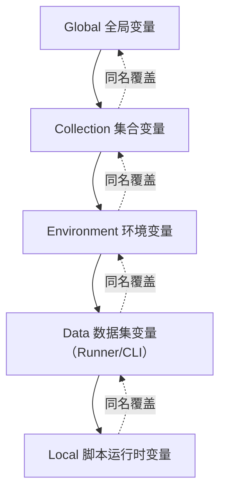

大部分人对 [Postman](https://www.postman.com/) 的印象停留在"图形化的 curl"：填个 URL，点 Send，看返回。这样用完全没问题，但真正拖慢效率的是那些重复劳动——测个受保护的接口，先手动调登录接口拿 token，再复制粘贴到别的请求头里，改天 token 过期了再来一遍；测试数据每次都手打；换个环境要把 URL 里的域名一个个改掉。这些事 Postman 本身都有办法自动化掉。

<!-- more -->

## 变量与作用域：环境切换不用改一行 URL

Postman 的变量分五层作用域，从大到小：**Global**（跨集合全局共用）、**Collection**（整个集合共用）、**Environment**（当前选中的环境，比如 dev/staging）、**Data**（Collection Runner/Postman CLI 批量跑时从 CSV/JSON 文件读进来的数据集变量）、**Local**（只在当前请求脚本运行期间有效）。同名变量作用域越小优先级越高，按 Local > Data > Environment > Collection > Global 取值。



这五层不是随处可见，各自的设置入口容易漏看：**Global** 在界面底部点 **Globals** 就能打开，不依赖任何环境；**Collection** 在集合的 Variables 标签页里设置；**Environment** 得先建一个环境（右上角环境下拉框选 **Create One**）并切换过去，才会出现对应的变量面板——如果一直停留在 "No Environment"，自然找不到这个入口；**Data** 不是"设置"出来的，是跑 Collection Runner 或 Postman CLI 时挂载的外部 CSV/JSON 文件；**Local** 干脆没有持久化的设置面板，只能在 Pre-request/Post-response 脚本里用 `pm.variables.set()` 临时写入，运行结束就清空。

实操上最常见的用法：把请求里的域名换成变量，`{{base_url}}/users` 代替 `https://api.dev.example.com/users`，再建三个环境 dev/staging/prod，分别把 `base_url` 设成对应的域名。测试环境切换只需要在右上角环境下拉框里换一下，不用去改任何一个请求的 URL。

## Scripts：自动登录、自动续 Token

Postman v11 之后把原来分开的 "Pre-request Script" 标签和 "Tests" 标签合并进统一的 **Scripts** 标签页，里面再分 Pre-request（请求发出前执行）和 Post-response（拿到响应后执行，就是老版本"Tests"标签做的事）两个子标签。名字变了，脚本能力和写法没变。

### 脚本语法速览：pm 对象怎么用

这两个标签页里写的都是普通 JavaScript，跑在 Postman 自带的沙箱环境里（不是完整 Node.js，不能 `require` 任意 npm 包，但内置了几个常用库，比如后面会用到的 `pm.sendRequest`）。所有跟 Postman 本身打交道的操作，都通过一个全局对象 `pm` 完成，新手只需要先认全这几个最常用的：

- `pm.environment.get(name)` / `pm.environment.set(name, value)`：读写当前选中 Environment 里的变量
- `pm.collectionVariables.get/set`、`pm.globals.get/set`：分别读写 Collection 变量和 Global 变量，用法跟 environment 那一对完全一样，只是作用域不同（见上一节的作用域讲解）
- `pm.request`：仅在 Pre-request 脚本里有意义，代表"即将发出的这个请求"，比如 `pm.request.headers`
- `pm.response`：仅在 Post-response 脚本里有意义，代表"刚收到的响应"，`pm.response.json()` 把响应体解析成对象，`pm.response.code` 是状态码
- `pm.test(name, fn)` + `pm.expect(...)`：写断言用的，`pm.test` 定义一条测试用例，`pm.expect` 是断言语法（跟 JS 测试框架 Chai 用法一致）
- `console.log(...)`：输出到 Postman 自带的调试台，菜单栏 **View → Show Postman Console** 打开，脚本报错或者变量值不对，先来这里看

一个最小的 Post-response 例子，跑完就能在 Postman Console 里看到打印结果：

```javascript
// Scripts → Post-response
pm.test("状态码是 200", function () {
    pm.response.to.have.status(200);
    // pm.response.to.have.status(...) 是 pm.response 提供的语法糖，
    // 断言失败会让这条请求在 Runner/CLI 里显示为不通过
});

const data = pm.response.json();
console.log("拿到的 user id:", data.id); // 在 Postman Console 里能看到这行输出
```

Pre-request 脚本写法一样，只是没有 `pm.response`（响应还没收到），常见用途是提前算好一个值塞进变量：

```javascript
// Scripts → Pre-request
pm.environment.set("request_time", Date.now());
// 后面这次请求里可以用 {{request_time}} 引用这个刚算出来的时间戳
```

认清这几个对象和调用方式之后，下面这几个自动化场景的脚本就是同一套语法的组合应用，不用死记硬背。

### 登录一次，后面全自动带上 token

在"登录"请求的 **Scripts → Post-response** 里写：

```javascript
const data = pm.response.json();
pm.environment.set("token", data.access_token);
// pm.environment.set：把值写进当前选中的 Environment，
// 后面任何请求都能用 {{token}} 取到，不用手动复制
```

后续所有需要鉴权的请求，Header 里写 `Authorization: Bearer {{token}}`，就不用每次手动去登录接口的返回里复制那一长串 token 了——发一次登录请求，`token` 变量自动就位。

### 进阶：过期自动重新登录

如果嫌"忘了重新登录导致后面请求全部 401"烦，可以把检查逻辑写到 **Collection 级别的 Pre-request Script**（在 Collection 的设置里编辑，会在集合下每一个请求发出前先执行一遍）：

```javascript
const expiresAt = pm.environment.get("token_expires_at");

if (!expiresAt || Date.now() > Number(expiresAt)) {
    const loginRes = pm.sendRequest({
        url: pm.environment.get("base_url") + "/login",
        method: "POST",
        header: { "Content-Type": "application/json" },
        body: {
            mode: "raw",
            raw: JSON.stringify({ username: "demo", password: "demo123" })
        }
    });
    // pm.sendRequest 是同步阻塞的，在 Pre-request 脚本里可以直接拿到结果用
    const data = loginRes.json();
    pm.environment.set("token", data.access_token);
    pm.environment.set("token_expires_at", Date.now() + data.expires_in * 1000);
}
```

这段脚本挂在 Collection 上之后，集合里任何一个请求发出前都会先检查 `token` 是不是快过期了，过期就自动重新登录换新的，业务请求本身完全不用关心鉴权这件事。

### Console 调试：两个容易漏掉的细节

脚本报错、变量值不对，第一反应都是去 **View → Show Postman Console** 打开控制台看 `console.log` 的输出。这里有个顺序问题很容易踩：**控制台只记录"打开之后"发出去的请求**，如果先点了 Send 再想起来去看控制台，之前那次请求的日志已经错过了，得再发一次。调试的时候先把控制台开着挂在一边，再去点 Send，别等报错了才现开。

另外 `console.log("token:", token)` 这种多参数写法，Postman 控制台会把每个参数分开渲染成单独一段、字符串还会自动带上引号，看起来像断成了两截，这是正常的展示方式，不是哪里出错了。想要一行干净的输出，用模板字符串 `` console.log(`token: ${token}`) `` 就行。

真正麻烦的调试场景是"脚本没报错，但结果就是不对"——比如自己实现的哈希算法算出来的值跟服务端预期的对不上，报错信息又只是一个通用错误码，看不出具体哪一步错了。这时候光盯着 Postman 里的代码逐行看很难看出问题，更有效的办法是把关键的中间值（原始输入、拼接后的字符串、算出来的哈希）一次性用 `console.log` 打出来，跟一个独立的、可信的实现（比如同一个加密库单独装到本地跑一遍，或者服务端语言自己的库）算出来的"标准答案"逐项比对，缩小范围比死盯代码快得多。

## 动态变量：测试数据不用手写

Postman 内置一批以 `$` 开头的动态变量，值在请求真正发出的那一刻生成，最基础的三个是 `{{$guid}}`（v4 格式的 GUID）、`{{$timestamp}}`（当前 Unix 时间戳）、`{{$randomInt}}`（0-1000 的随机整数）。从 7.2 版本开始接入了 faker.js，扩出一大批更贴近真实数据的变量，比如 `{{$randomEmail}}`、`{{$randomFirstName}}`、`{{$randomUserName}}`。

测注册接口时，请求体直接写：

```json
{
    "email": "{{$randomEmail}}",
    "username": "{{$randomUserName}}",
    "requestId": "{{$guid}}"
}
```

每次点 Send，邮箱、用户名都是新的，不用因为"这个邮箱已被注册"这种报错手动改测试数据。

## Postman Vault：敏感信息不进集合、不同步云端

Environment 变量方便，但有个问题：API Key、密码这类东西如果直接明文存在 Environment 变量里，一旦这个 Environment 被导出分享或者同步到 Postman 云端团队空间，敏感信息就跟着一起泄露了。

Postman 的 **Vault** 就是为这个准备的——存进去的密钥只留在本地（Local Vault），不会同步到云端，也不会被导出的 collection 文件带出去。设置好之后，在任意请求的字段里直接用 `{{vault:api-key}}` 这种语法引用；脚本里则通过 `pm.vault.get("api-key")` 访问。团队协作分享 collection 时，Vault 里的值不会被带出去，队友本地要用自己单独配置一份。

## 批量编辑 headers/params：别一行行加

Header 或 Query Param 一多，一行行点加号、填 key、填 value 很浪费时间。Headers/Params 表格右上角有个 **Bulk Edit** 按钮，点开切换成纯文本编辑模式，直接粘贴多行 `key: value`（Headers）或 `key=value`（Params），保存自动拆成一行行的表格——从接口文档或者旧 curl 命令里复制一段 headers 过来，几秒钟搞定，比逐行填快得多。

这个纯文本模式还有个不太起眼的用法：**行首加 `//` 会把这一行当成禁用状态加进去**（显示出来、勾选框是灰的、不会被发送），可以拿来在批量粘贴的参数列表里顺手留个备注，不用跑去写文档：

```
custom_date=2026-07-01~2026-07-28
//custom_date 格式是开始日期~结束日期，不传就是不按时间过滤
platform=1
```

注意这不是传统意义上的"注释"，本质还是加了一行禁用的参数，只是拿它的展示效果当备注用。

## 二进制响应预览不了是正常的，别以为是 bug

测导出类接口（比如导出 Excel、导出 PDF）的时候，Postman 的 Body 面板经常显示一堆乱码，或者直接提示"无法预览"——这不是接口出了问题，是 Postman 本身只原生支持渲染 JSON、XML、HTML、图片这几类内容，遇到 `.xlsx`、`.pdf` 这种二进制格式没有内置的渲染器。

正确的验证方式是点响应区域右上角的 **Save Response**（下载图标），把这次响应存成本地文件——存的时候留意一下后缀，Postman 有时候默认存成 `.txt`，得手动改成 `.xlsx`/`.pdf` 之类的实际格式，存完用对应软件（Excel、WPS、PDF 阅读器）打开才能看到真实内容。如果只是想确认接口跑没跑成功、不关心具体内容，看响应状态码是不是 200、响应体大小是不是明显大于几百字节（一个真的有数据的 Excel 文件不会只有几十个字节），基本就能做个粗判断，不用每次都存下来打开看。

## 代码互转：Code 生成 + curl 导入

**从 Postman 导出成代码**：每个请求编辑器右侧有个 `</>` Code 按钮，点开能选一堆语言/工具的代码片段——curl、JavaScript (fetch/axios)、Python (requests)、Go (net/http)，把这个请求现在的 URL、Header、Body 原样翻译成对应语言的代码。调好一个请求之后甩给写业务代码的同事，不用他们对着 Postman 界面手抄。

**反过来，把 curl 导入成请求**：点左上角 Import，选 Raw Text，把从浏览器 devtools 复制来的 `curl -X POST ...` 整段粘贴进去，Postman 会自动解析出 URL、方法、Header、Body，生成一个可以直接编辑运行的请求，不用手动拆 curl 参数一个个填进对应的框。

## 批量跑与接入 CI：Runner 面板和 Postman CLI

调好的请求攒成一个 Collection 之后，右上角 **Runner** 面板能把整个 Collection 一次性批量跑一遍，还能配合 CSV/JSON 数据文件做参数化——同一套请求，用文件里的每一行数据各跑一次，很适合边界值、批量账号这类重复测试。

接入 CI 这块要提醒一句：**网上大量教程还在教用 Newman 命令行工具跑 collection 接 CI，这个方案已经过时了**。Postman 官方在 2026 年 4 月的博客里明确说明不再维护 Newman，而且 Newman 不兼容 Postman v12 开始使用的 collection v3 格式。现在官方推荐的是 **Postman CLI**：

```bash
curl -o- "https://dl-cli.pstmn.io/install/unix.sh" | sh
#    官方安装脚本，Unix/macOS 通用；也可以用 npm i postman-cli

postman login --with-api-key <your-api-key>
#    --with-api-key：用 API Key 登录，CI 环境里免交互，key 从 Postman 账号设置里生成

postman collection run <collection-id> -e <environment-id>
#    <collection-id>：要跑的集合 ID，在 Postman 里分享/导出集合时能拿到
#    -e：指定用哪个 environment 跑
```

这条命令跑完会在终端里输出每个请求的通过/失败情况，登录状态下结果还会同步回 Postman 云端，比 Newman 更适合塞进现在的 CI pipeline。如果项目还在用旧的 Newman 命令，趁早换成这套。

## Mock Server：没有真后端也能先联调

前后端约定好接口文档之后，不用等后端把接口全部写完，用 **Mock Server** 直接把约定好的返回值模拟出来——建一个 Mock Server，绑定到某个 Collection，Collection 里每个请求上例子（Example）里写的返回数据，就是 Mock Server 实际返回的内容。前端拿着 Mock Server 给的 URL 当作真实后端地址开发，后端接口写完之后原地切换成真实域名即可，两边不互相等。

## 小结：把重复劳动交给 Postman 自己

这几个技巧共同的思路是同一个：**只要是"每次测试都要重复做的手动操作"，Postman 大概率已经有办法自动化**——变量解决"环境/数据到处改"，Scripts 解决"手动传令牌"，Bulk Edit 和代码生成解决"重复敲字"，Runner/CLI 解决"批量跑和接 CI"。日常测几个接口不需要样样都用上，但一旦项目里同一套接口要反复测、多人协作维护，这些进阶用法省下来的时间是实打实的。
