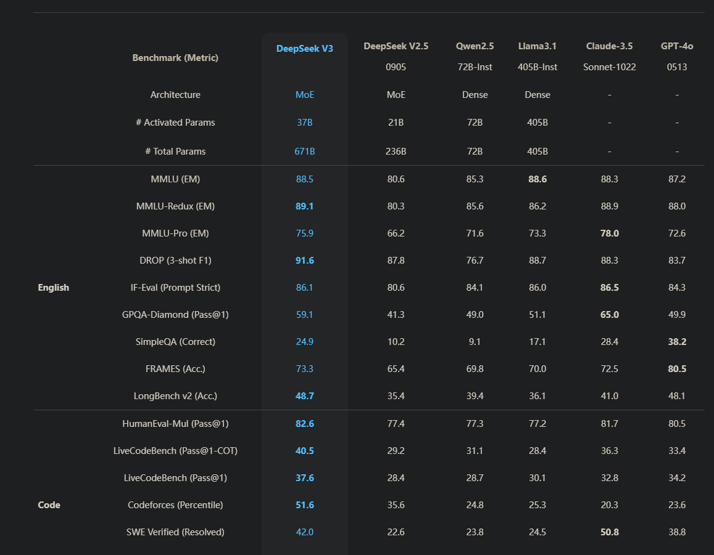
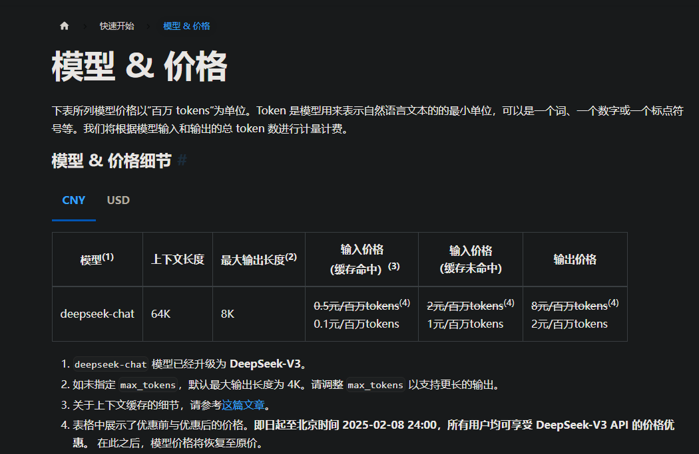
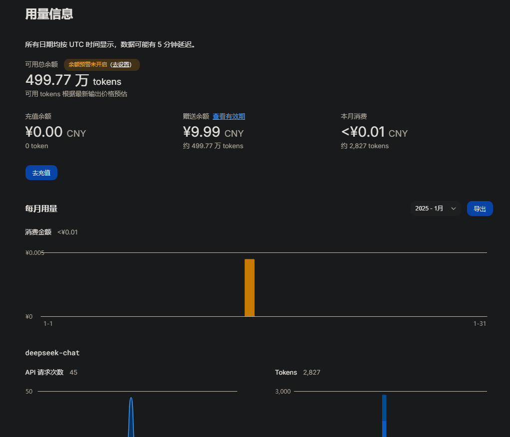
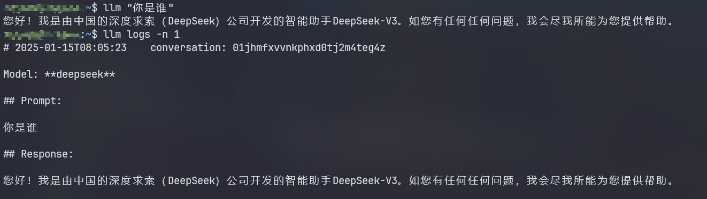
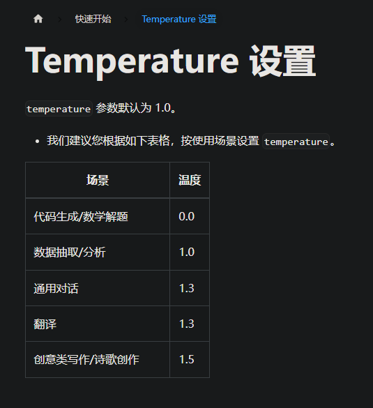

最近国内的DeepSeek爆发出强劲的势头，纵观网友们的评价下来，很少有国产AI能有这样不错的评价。再加上最近DeepSeek注册就送500百万tokens，还有1块钱一百万tokens的这样的优惠力度，不得不去体验了一下。
[deepseek官网](https://www.deepseek.com/)

<!-- more -->






# 概述

目前来讲，我并没有很强的tokens使用场景，大多数以网页的chat聊天为主。
基于这种场景下的有个**痛点**就是：在终端和网页之间来回切换，有点浪费时间，不太友好。
所以我想着能不能把ai集成到cli中，让我在终端中可以直接和ai聊天，不需要切换到网页。

经过搜索，方案是可行的，工具采用的是[LLM](https://github.com/simonw/llm).

> 在一切配置开始前，需要如下前置条件：
> 1. 安装python环境
> 2. 注册deepseek账号

上面两个是最基本的条件，如果不满足建议谷歌搜索一下，这里不在赘述。

# 配置

## 安装LLM

用`pip`安装:
```bash
pip install llm
```

以后有需要更新版本，可以使用：
```bash
pip install -U llm
```

## 获取DeepSeek的API Key

1. 前往[deepseek官网](https://www.deepseek.com/)，注册一个新的账户。
2. 在[API Keys](https://platform.deepseek.com/api_keys)页面，点击**创建 API key**按钮，复制API Key，这是你的私钥，最好不要外泄。（注意：窗口一旦关闭后，API Key就会看不见，一定要保存好！当然如果没了，直接重新创建一个也可以）

## 配置LLM

由于LLM是基于OpenAI的，所以需要设置模型采用DeepSeek的模型。

1. 配置要使用模型的名称，这里是`deepseek`，名字随便取一个即可：
```bash
llm keys set deepseek
```
回车之后，会提示你输入你的API Key，输入你的API Key回车即可。不确定可以采用`dirname "$(llm logs path)"`找到`keys.json`文件，查看里面的API Key是否正常。

1. 配置默认使用的模型名称：
```bash
# 这里deepseek是你第一步输入的名称
llm models default deepseek
```
1. 配置请求`deepseek api`：
     * `dirname "$(llm logs path)"`，会输出llm的配置路径
     * 在这个路径下新建一个`extra-openai-models.yaml`文件，添加如下内容:
       ```yaml
        - model_id: deepseek
          model_name: deepseek-chat
          api_base: "https://api.deepseek.com/v1"
          api_key_name: deepseek
       ```
      * 如果你第一步的模型名称不是deepseek，这里的`model_id`和`api_key_name`需要改成第一步设置的名称。
      * `model_id`、`api_key_name`都是LLM里面概念，而`model_name`才是请求对应厂商的模型名称
2. 如果第二步没有设置成默认模型，也可以采用参数选用模型：
```bash
llm -m your_model_name "你的问题"
```


## 使用验证

终端下直接输入`llm "你的问题"`即可：



# LLM常见使用方式

## 1. 直接提问

```bash
llm "你的问题"
```
这个命令每次运行都会开启一个会话，每用一次会得到当前这个会话AI的回答。如果相继于当前会话继续提问，参考下面命令。


## 2. 持续对话

```bash
llm "你的问题" -c
```
上面那个命令每次都会开启一个chat，那如果想要在一个会话中多次提问，则需要使用`llm -c`命令。但是注意这个命令是基于最近一次chat的上下文继续进行的，如果你有好几个chat，你想基于指定的chat多次提问，那么可以使用:
```bash
llm "你的问题" --cid/--conversation <id>
```
`conversation`可以通过`llm logs`查看。


## 3. 交互式对话

介绍完一次对话的基本用法，接下来来看看如何实现交互式对话。
```bash
llm chat -m chatgpt
```
chatgpt是你设置llm中的model_id，像本文中设置的就是`deepseek`。每次chat也会开启一个新的对话，退出之后你还想基于这个对话继续对话，可以使用:
```bash
llm chat -c
```
另外，还支持对模型使用一些参数，比如:
```bash
llm chat -m gpt-4 -o temperature 0.5
```
temperature是控制AI的回答的随机性，数值越大，AI的回答越随机，数值越小，AI的回答越有序。像deepseek的话，可以参考[官方文档](https://api-docs.deepseek.com/zh-cn/quick_start/parameter_settings):



退出交互式对话，可以使用只需要输入`quit`或者`exit`然后回车即可。

### 3.1 设置系统提示词

交互式对话的时候，可以设置系统提示词`-s/--system`，这样AI的回答会更加有意义。
```bash
llm chat -m gpt-4 -s 'You are a sentient cheesecake'
```
这里也可以设置`temperature`参数，比如:
```bash
llm chat -m gpt-4 -s 'You are a sentient cheesecake' -o temperature 0.5
```

如果不想每次都这样敲命令，可以设置简短的别名，比如:
```bash
llm --system 'You are a sentient cheesecake' -m gpt-4 --save cheesecake
```
然后每次只需要输入`llm chat -t cheesecake`即可基于你设置的系统提示词进行对话！


### 3.2 交互式对话，如何多行输入

多行输入常见于贴一些错误信息啥的，操作如下：
1. 输入`!multi`开启多行输入，然后粘贴
2. 输入`!end`结束多行输入，然后回车即可。

有一种特殊情况，如果输入的信息里面包含了`!end`那该怎么办？很简单，官方也提供解决方案，设置自定义的开始结束符号即可！
例如：可以是`!multi abc`、`!end abc`，这样来避免。


## 4. 结合Linux命令

1. 参数拼装：`llm "Tell me about my operating system: $(uname -a)"`
2. 管道： `cat myscript.py | llm 'explain this code'`
3. git： `git diff | llm -s 'Describe these changes'`
   
这些都可以设置模型、系统提示和temperature等选项，在使用中可以配合好发挥出工具的最大作用！


## 5. 查看模型的参数

```bash
llm models --options
```
没什么好说，会直接输出模型的参数，使用时按照需求设置即可。

> 另外还有添加的附件的使用方式，这里就不再列出了，可以参考[官方文档](https://llm.datasette.io/en/stable/usage.html)


> 参考：
> https://github.com/simonw/llm
> https://llm.datasette.io/en/stable/setup.html
> https://llm.datasette.io/en/stable/other-models.html
> https://api-docs.deepseek.com/zh-cn/
> https://github.com/simonw/llm/issues/393