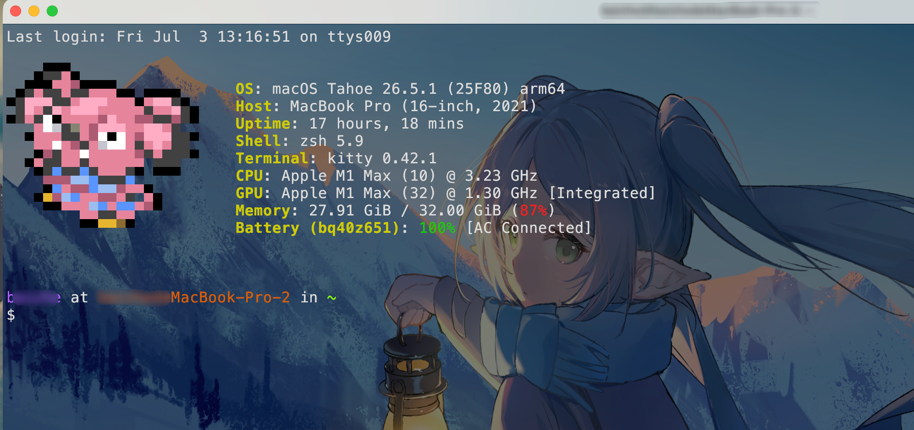

每次打开终端默认就是一个空白提示符。fastfetch 可以在启动时打印系统信息，pokemon-colorscripts 可以随机显示一只像素风宝可梦。两个工具都是纯装饰向，不影响任何工作流。

<!-- more -->

---

## [fastfetch](https://github.com/fastfetch-cli/fastfetch)：比 neofetch 快 10 倍的系统信息展示

fastfetch 是 neofetch 的现代替代品，用 C 写成，启动速度比 neofetch 快很多，且 neofetch 已停止维护（2023 年归档）。显示内容包括 OS、内核版本、CPU/GPU、内存、Shell、终端等，支持高度自定义。

### 安装

```bash
brew install fastfetch
```

### 直接运行

```bash
fastfetch
```

默认会显示一个 Apple logo（ASCII art）加上右侧系统信息。

### 配置文件

fastfetch 的配置文件在 `~/.config/fastfetch/config.jsonc`（JSONC 格式，支持注释）。先生成默认配置：

```bash
fastfetch --gen-config
# 在 ~/.config/fastfetch/ 下生成 config.jsonc
```

生成后打开编辑，配置文件结构是一个 `modules` 数组，每个元素对应一行显示内容：

```jsonc
{
  "$schema": "https://github.com/fastfetch-cli/fastfetch/raw/dev/doc/json_schema.json",
  "modules": [
    "title",       // 用户名@主机名
    "separator",   // 分隔线
    "os",          // 操作系统
    "host",        // 机器型号
    "kernel",      // 内核版本
    "uptime",      // 运行时长
    "packages",    // 已安装包数量
    "shell",       // 当前 Shell
    "display",     // 分辨率
    "de",          // 桌面环境
    "wm",          // 窗口管理器
    "terminal",    // 终端
    "cpu",         // CPU 型号
    "gpu",         // GPU 型号
    "memory",      // 内存使用
    "disk",        // 磁盘使用
    "battery",     // 电池状态（Mac 有效）
    "break",       // 空行
    "colors"       // 终端颜色块
  ]
}
```

不需要的模块直接从数组里删掉，顺序即显示顺序。

### 常用命令行选项

```bash
fastfetch --logo none
# 不显示 logo，只输出文字信息

fastfetch --logo small
# 显示较小的 logo

fastfetch --logo /path/to/image.png
# 用图片作为 logo（需要终端支持图片渲染，如 kitty）

fastfetch --config none
# 忽略配置文件，使用默认设置

fastfetch --list-logos
# 列出所有内置 logo 名称
```

### 只看特定信息

```bash
fastfetch -s cpu
# -s：structure，只显示 CPU 模块

fastfetch -s cpu,memory,disk
# 只显示指定的几个模块，逗号分隔
```

---

## [pokemon-colorscripts](https://gitlab.com/phoneybadger/pokemon-colorscripts)：终端里的像素宝可梦

pokemon-colorscripts 是一个命令行工具，用 Unicode 字符拼出像素风格的宝可梦图案并输出到终端。支持全部 898 只宝可梦（第一代到第八代），以及 shiny 色和小尺寸变体。

### 安装

官方不提供 brew formula，macOS 通过 git clone 安装脚本安装：

```bash
git clone https://gitlab.com/phoneybadger/pokemon-colorscripts.git
cd pokemon-colorscripts
sudo ./install.sh
```

安装完成后 `pokemon-colorscripts` 命令即可全局使用，不需要额外配置 PATH。

### 基本用法

```bash
pokemon-colorscripts --random
# 随机显示一只宝可梦（最常用）

pokemon-colorscripts --name pikachu
# --name：显示指定宝可梦（英文名，一般和游戏里拼写一致）

pokemon-colorscripts --random --shiny
# --shiny：显示 shiny 色版本

pokemon-colorscripts --random --no-title
# --no-title：不显示宝可梦名称，只显示图案

pokemon-colorscripts --list
# 列出所有可用的宝可梦名称
```

### 只显示特定世代

世代编号直接跟在 `--random` 后面作为参数：

```bash
pokemon-colorscripts --random 1
# 只从第一世代（151 只）里随机选，可选值：1-8

pokemon-colorscripts --random 1-3
# 从第 1 到第 3 世代里随机

pokemon-colorscripts --random 1,3,6
# 从第 1、3、6 世代里随机（逗号分隔，无空格）
```

---

## 集成到 .zshrc：每次打开终端自动运行

把两个工具的调用加到 `~/.zshrc` 末尾，让新终端窗口打开时自动执行：

```bash
# 终端启动展示
fastfetch
pokemon-colorscripts --random 1 --no-title
# --random 1：只从第一世代选，颜色辨识度更高
# --no-title：不显示名称，保持画面干净
```

如果不想每次都显示系统信息，只要宝可梦，把 `fastfetch` 那行去掉即可。

两个工具各自独立，顺序也可以反过来——宝可梦在上、系统信息在下，看个人喜好。

### 控制显示频率（可选）

如果终端开太频繁觉得每次都显示有点烦，可以改成只有新 tab/窗口才显示，而不是 source 配置时也触发：

```bash
# 只在交互式且非嵌套的 Shell 里显示
if [[ -o interactive ]] && [[ -z "$TMUX" ]] && [[ $SHLVL -eq 1 ]]; then
  fastfetch
  pokemon-colorscripts --random 1 --no-title
fi
```

---

## 效果展示



---

## 从哪里开始

两个工具可以独立安装：

- **fastfetch**：先跑一次 `fastfetch` 看默认效果，再用 `--gen-config` 生成配置，按需删掉不想看的模块（通常 `de`/`wm` 对 Mac 没意义，可以去掉）
- **pokemon-colorscripts**：装完先 `pokemon-colorscripts --name pikachu` 确认能显示，再加进 `.zshrc`

不喜欢了随时把 `.zshrc` 里那两行注释掉，零负担。
