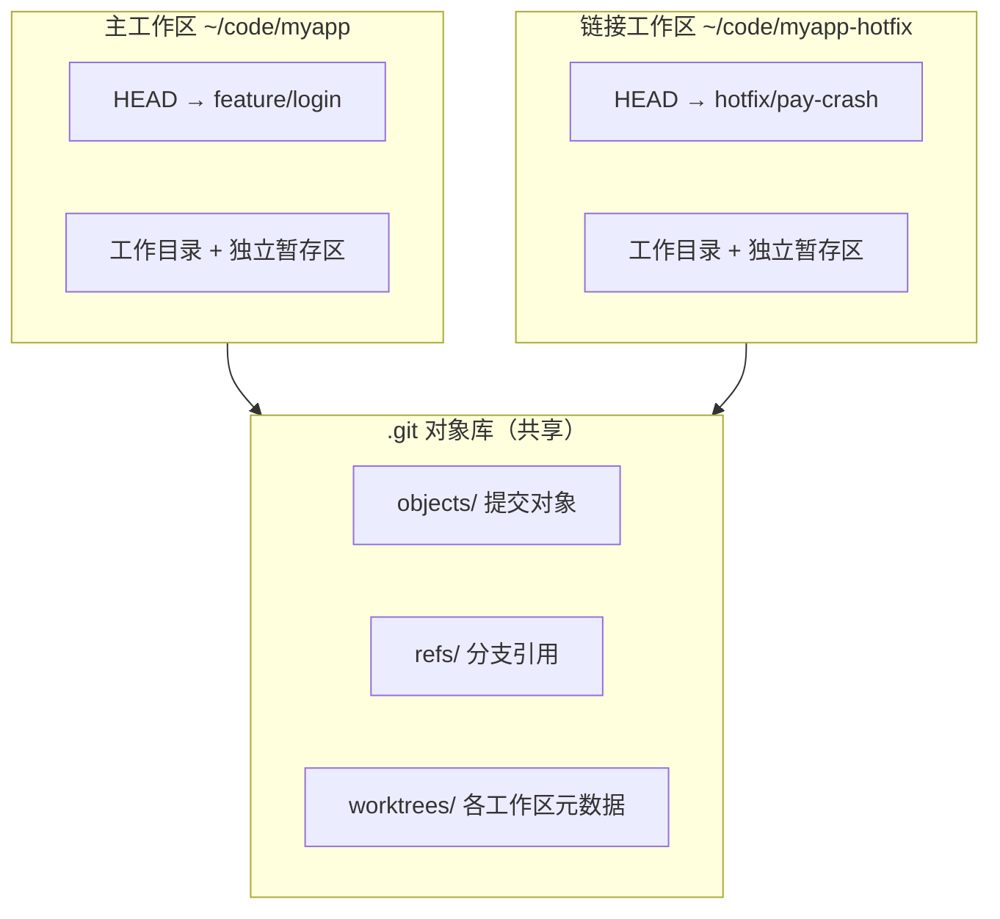

改一个 feature 改到一半，线上突然报了个 bug 要紧急修复。这时候你有两个选择：`git stash` 存起来切分支，修完再切回来 `stash pop`；或者随手 commit 一个 "WIP"（Work In Progress，表示"改到一半"的占位提交）再切。前者容易在 stash 栈里越积越多忘了恢复，后者污染提交历史。而且切换分支后 IDE 索引重建、依赖重装，来回折腾一次十几分钟就没了。

`git worktree` 是 Git 内置的第三种方案：给同一个仓库挂多个工作目录，每个目录检出不同分支，互不干扰。修 bug 去另一个目录修，手头的改动原地不动。

<!-- more -->

> Git 三区域、分支模型等基础概念见：[Git 基础教程：原理、常见操作与企业实践规范](/Git基础教程-原理操作与企业实践)

## worktree 的工作原理：一个仓库，多个工作目录

worktree 是 Git 自带的子命令（Git 2.5+ 引入，2.17+ 功能完整），默认情况下每个仓库只有一个工作目录——也就是你 clone 下来的那个，称为**主工作区（main worktree）**。`git worktree add` 可以额外创建**链接工作区（linked worktree）**，它们共享同一份 `.git` 对象库和引用，但各自有独立的工作目录、暂存区和 HEAD。



关键点：

- **提交共享**：任何一个工作区里的 commit，其他工作区立即可见（本来就是同一个仓库）
- **状态隔离**：每个工作区有自己的 HEAD、index 和未提交改动，互不影响
- **磁盘开销小**：链接工作区不复制 `.git` 对象库，只多一份检出的源码文件

链接工作区目录下的 `.git` 不是目录而是一个文本文件，内容指向主仓库的 `.git/worktrees/<name>`，这就是"链接"的含义。

## git worktree 基本操作四件套：add / list / remove / prune

### add：创建工作区

```bash
git worktree add ../myapp-hotfix hotfix/pay-crash
#                ../myapp-hotfix：新工作区的路径，习惯放在主工作区同级目录
#                hotfix/pay-crash：要检出的已有分支
```

如果分支还不存在，用 `-b` 顺便创建：

```bash
git worktree add -b hotfix/pay-crash ../myapp-hotfix origin/main
#                -b：branch，基于起点创建新分支并检出
#                origin/main：新分支的起点，省略则基于当前 HEAD
```

不指定分支时，Git 会用路径的最后一段作为分支名自动创建（同名分支已存在则直接检出）；如果只想临时看某个 commit 的代码、不想建分支，加 `--detach`：

```bash
git worktree add --detach ../myapp-v1.2 v1.2.0
#                --detach：以 detached HEAD 方式检出，不创建也不占用分支
#                v1.2.0：任意 commit-ish，tag、commit hash 都可以
```

### list：查看所有工作区

```bash
git worktree list
# /Users/dylan/code/myapp          a1b2c3d [feature/login]
# /Users/dylan/code/myapp-hotfix   e4f5g6h [hotfix/pay-crash]
# /Users/dylan/code/myapp-v1.2     i7j8k9l (detached HEAD)
```

第一行永远是主工作区。加 `--porcelain` 输出机器可读格式，方便写脚本。

### remove：删除工作区

```bash
git worktree remove ../myapp-hotfix
# 有未提交改动时会拒绝删除，确认不要了加 --force 强删
```

remove 只删工作目录和元数据，分支还在。工作区用完、分支也合并了，记得单独删分支：

```bash
git branch -d hotfix/pay-crash
#          -d：delete，删除已合并的分支，未合并会拒绝
```

### prune：清理失效记录

如果你没用 `remove` 而是直接 `rm -rf` 删了工作区目录，`.git/worktrees/` 里会残留元数据，`git worktree list` 还能看到它。用 prune 清理：

```bash
git worktree prune
# 扫描并删除指向已不存在目录的工作区元数据
```

Git 也会在 `gc` 时自动 prune 超过宽限期（默认 3 个月，由 `gc.worktreePruneExpire` 控制）的失效工作区，但手动删目录后建议立即跑一次。

## 场景一：hotfix 不打断手头的 feature

最经典的用法。假设你在 `feature/login` 上开发到一半：

```bash
# 1. 基于线上分支创建 hotfix 工作区，手头改动完全不用动
git worktree add -b hotfix/pay-crash ../myapp-hotfix origin/main

# 2. 去新目录修 bug、提交、推送
cd ../myapp-hotfix
vim internal/pay/handler.go
git add -A && git commit -m "fix: 修复支付回调空指针"
git push -u origin hotfix/pay-crash
#        -u：upstream，建立本地分支与远端分支的跟踪关系

# 3. 修完回主工作区继续开发，hotfix 工作区留着等 review
cd ../myapp

# 4. PR 合并后清理
git worktree remove ../myapp-hotfix
git branch -d hotfix/pay-crash
```

整个过程不需要 stash，也不会产生 WIP commit，主工作区连分支都没切过，IDE 状态和构建缓存原封不动。

## 场景二：并行 code review 与长时间任务

**review 同事的 PR**：不想为了跑一下同事的代码而切走自己的分支，开个临时工作区：

```bash
git fetch origin
git worktree add --detach ../myapp-review origin/feature/new-api
# --detach：只是看看代码跑跑测试，不需要本地分支
cd ../myapp-review && go test ./...
```

**长时间构建 / 跑测试**：完整测试套件要跑 20 分钟，期间想继续写代码。在另一个工作区跑测试，主工作区照常编辑，两边文件互不干扰：

```bash
git worktree add ../myapp-ci feature/login
# 报错：fatal: 'feature/login' is already used by worktree ...
```

这里会撞上 worktree 的一条硬规则：**同一个分支同时只能被一个工作区检出**，否则两边提交会让对方的 HEAD 和工作目录脱节。绕过方式是基于当前提交用 detached HEAD 跑：

```bash
git worktree add --detach ../myapp-ci HEAD
cd ../myapp-ci && make test   # 慢任务在这跑
cd ../myapp                   # 回来继续写代码
```

## 进阶操作：move / lock / repair

**move**：工作区目录想换个位置，不要直接 `mv`（会破坏 `.git` 文件里的路径引用），用：

```bash
git worktree move ../myapp-hotfix ~/work/myapp-hotfix
# 移动工作目录并自动更新双向路径引用
```

**lock**：工作区放在移动硬盘或网络盘上时，防止盘没挂载时被 prune 误清理：

```bash
git worktree lock ../myapp-usb --reason "在移动硬盘上"
#                 --reason：说明锁定原因，unlock 前 list 可见
git worktree unlock ../myapp-usb
```

被 lock 的工作区也不能被 move 和 remove，需要先 unlock。

**repair**：如果已经手动 `mv` 过目录导致链接断裂，或主仓库整个换了位置，用 repair 修复引用：

```bash
git worktree repair ~/work/myapp-hotfix
# 省略路径参数则修复主仓库到各工作区的引用
```

## worktree 踩坑清单：依赖不共享、submodule 与 IDE

**依赖目录不共享**。worktree 只共享 Git 数据，`node_modules/`、Python venv、构建产物这些 gitignore 的文件每个工作区都要重新生成。前端项目每开一个工作区就要 `npm install` 一次，这是 worktree 最大的隐性成本。Go 项目好一些，module 缓存在 `$GOPATH/pkg/mod` 全局共享。

**submodule 支持不完整**。带 submodule 的仓库创建工作区后，需要在新工作区里手动 `git submodule update --init`；官方文档明确提示对 superproject 做多工作区检出的支持不完整、不推荐（`man git-worktree` 的 BUGS 一节），且含 submodule 的工作区不能用 `move` 移动、`remove` 删除时必须加 `--force`。重度使用 submodule 的项目建议先小范围验证。

**IDE 多开的内存开销**。每个工作区是独立目录，IDE 会当成独立项目建索引。GoLand/IDEA 同时开两三个大项目窗口，内存占用直接翻倍。VS Code 相对轻量，或者用只跑命令行的方式使用副工作区。

**hooks 与配置共享**。`.git/hooks` 和仓库级 `git config` 是所有工作区共享的（除非启用 `extensions.worktreeConfig` 做每工作区配置）。依赖 hooks 里写死路径的项目要注意路径可能指向主工作区。

## worktree 还是再 clone 一份？

| 维度 | worktree | 多次 clone |
|---|---|---|
| 磁盘占用 | 共享 `.git`，只多源码文件 | 每份都有完整对象库 |
| 提交可见性 | 即时共享，无需 push/fetch | 要经过远端中转（或本地 remote） |
| 分支限制 | 同一分支只能检出一次 | 无限制 |
| 配置/hooks | 共享，改一处全生效 | 完全独立 |
| 误操作影响面 | 损坏 `.git` 影响所有工作区 | 相互隔离 |

日常并行开发（hotfix、review、跑测试）用 worktree，成本低、提交即时同步。需要完全隔离的场景——比如要对 `.git` 本身做危险操作、或两份代码用完全不同的仓库配置——再考虑单独 clone。

一句话总结使用节奏：`add` 开新工作区，干完 `remove`，手滑直接删了目录就 `prune`。把"切分支"变成"切目录"，stash 栈从此清净。
