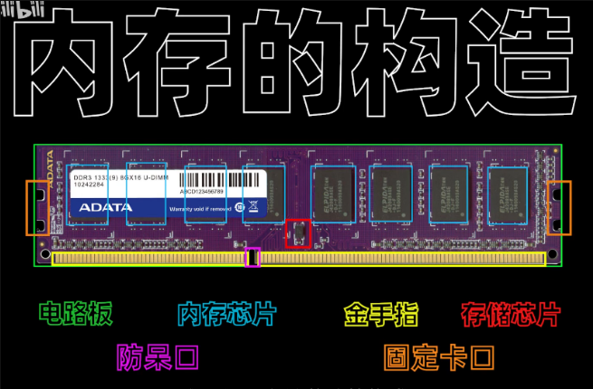
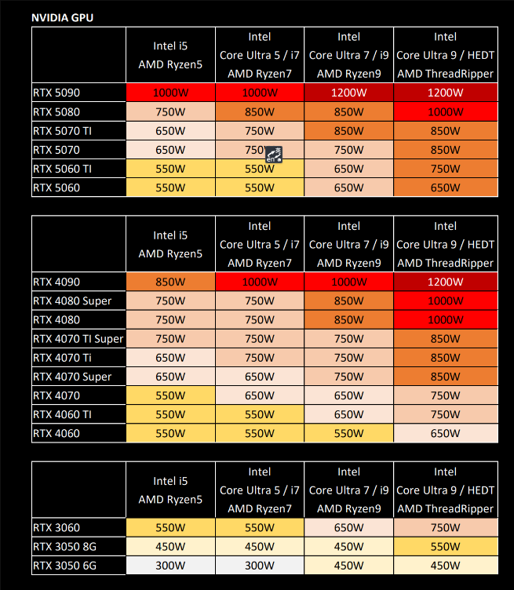
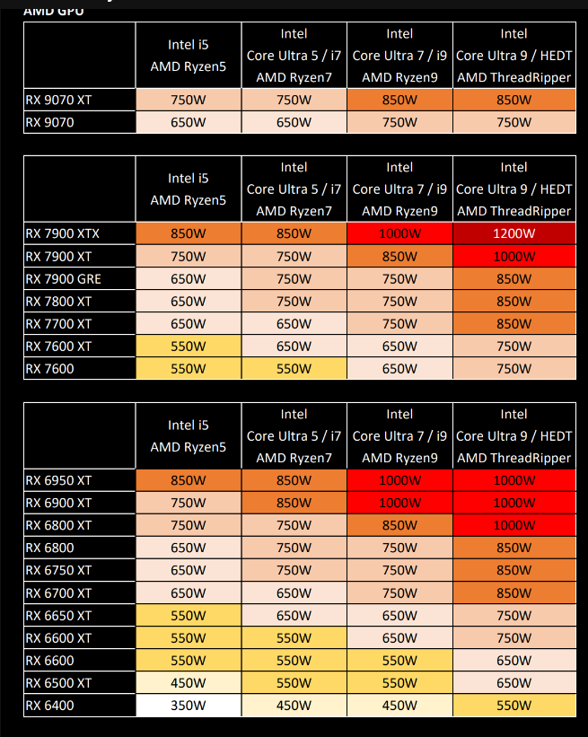
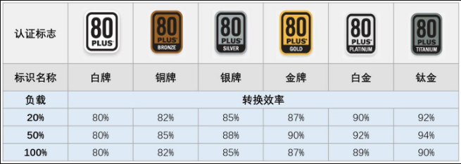
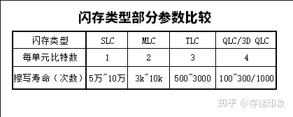

一直以来用的大学时代的笔记本，近来发现越来越卡，而且已经跟不上生产力的需求了，
所以想着自己动手配置一台台式机。

笔者本人专业虽然是计算机，但是不是数码爱好者，所以对于配置台式不甚了解吧，特此
做个记录。

<!-- more -->

# 台式机部件组成

记录选择配置台式机，那么很重要的就是看组成有哪些，知道组成之后，剩下的就是
看组成的参数、品牌了。

1. CPU
2. 主板
3. 显卡
4. 内存
5. 电源
6. 机箱
7. 散热器
8. 固态硬盘

必要硬件就是以上8个，影响性能的主要是cpu、显卡、内存，其余的不拖后腿就行。
在了解组成之后，我们就需要了解硬件的参数该如何看、品牌如何选择。

# CPU

## 型号区分
intel处理器型号区分： 
1. 没有后缀的表示支持核显
2. 后缀F表示无核显
3. 后缀K代表可以超频
4. 后缀KS代表超频加强版

以“ i7-13700K”为例，它由系列、代数、SKU、后缀组成；
“-”前字母数字表示系列，数字越大，级别越高， i3低端，i5中端 ，i7高端 ， i9旗舰版；
“-”后面两个数字为“代数”，数字越大，型号越新，“13”表示13代CPU，“12” 则是第12代；前面说的架构，也是随着代数不断更新的；
数字“700”表示SKU（产品编号）值，同一级别代数，较高的 SKU 一般表示具有更多功能，性能越强。

AMD处理器型号区分：
1.后缀G代表有核显
2.后缀X代表加强版
3.后缀XT代表超级加强版
4.后缀X3D代表游戏优化版

以“R7-5700X”为例，也是由系列，代数，SKU，后缀组成；
“-”前字母数字表示系列，数字越大，级别越高，R3低端入门，R5市场主流，R7高端，R9发烧旗舰，线程撕裂者表示顶级旗舰；
“-”后面两个数字为“代数”，数字越大，型号越新，“5”表示第五代，“3” 则是第三代；
数字“700”表示SKU值，数字越大，性能越强；
后缀“X”代表可以超频，“G”代表自带核显。（锐龙桌面CPU都可以超频）

> 这两个也是cpu的两大品牌。

## 核显

核显，即**核心显卡**，也称为**集成显卡**（Integrated Graphics）[1](https://www.lenovo.com/us/en/glossary/integrated-vs-dedicated-graphics-cards/?srsltid=AfmBOoqb524Hp8EcEEh_X3BLjAOzSM_vOuqEKK0_J7VSyu0MbR6XmmaM)。它是一种集成在 CPU 内部或主板芯片组上的图形处理器 [4](https://www.quora.com/What-is-the-definition-of-integrated-graphics-How-does-it-differ-from-other-types-of-graphics-cards)。与独立显卡不同，核显不拥有独立的显存，而是**共享系统内存**作为显存 [6](https://www.pcmag.com/encyclopedia/term/integrated-graphics)。

**核心显卡的特点：**

1.  **集成性**：
    *   集成在 CPU 内部或主板芯片组上，无需额外的显卡插槽。
2.  **共享内存**：
    *   与系统共享内存，通常会占用一部分系统内存作为显存。
3.  **低功耗**：
    *   相比独立显卡，功耗较低，发热量也较小。
4.  **性能有限**：
    *   图形处理能力相对较弱，通常只适合日常办公、网页浏览、观看视频等轻量级应用。

**核心显卡的优缺点：**

*   **优点**：
    *   **成本低**：无需额外购买独立显卡，降低了整机成本。
    *   **功耗低**：降低了功耗和发热量，延长了电池续航时间（对于笔记本电脑）。
    *   **体积小**：节省了空间，适合轻薄型设备。
*   **缺点**：
    *   **性能弱**：无法流畅运行大型游戏和专业图形软件。
    *   **占用系统内存**：共享系统内存会影响整体性能。
    *   **升级困难**：由于集成在 CPU 或主板上，无法单独升级。

**核心显卡的应用场景：**

*   **日常办公**：处理文档、表格、邮件等办公任务。
*   **网页浏览**：流畅浏览网页，观看在线视频。
*   **轻度娱乐**：运行一些简单的休闲游戏。
*   **轻薄型笔记本电脑**：追求便携性和长续航的笔记本电脑。

**核心显卡与独立显卡的区别：**

| 特性       | 核心显卡 (Integrated Graphics) | 独立显卡 (Dedicated Graphics) |
| ---------- | ------------------------------ | ----------------------------- |
| 集成方式   | 集成在 CPU 或主板芯片组上       | 独立的显卡插槽                |
| 显存       | 共享系统内存                   | 拥有独立的显存                |
| 功耗       | 低                             | 高                            |
| 性能       | 弱                             | 强                            |
| 成本       | 低                             | 高                            |
| 升级       | 无法单独升级                   | 可以单独升级                  |

**总结**

核心显卡是一种集成在 CPU 内部或主板芯片组上的图形处理器，它具有成本低、功耗低、体积小等优点，但性能相对较弱。核心显卡适合日常办公、网页浏览、观看视频等轻量级应用。如果需要运行大型游戏或专业图形软件，建议选择独立显卡。

但是购买带有核显的 CPU 并不妨碍你安装独立显卡。安装独立显卡后，电脑会自动或手动切换到独立显卡作为主要的图形输出设备。核显可以作为备用显示输出或用于加速视频处理。

## 散片、盒装

CPU 的散片和盒装是指 CPU 的两种不同销售方式，它们在包装、保修和价格上有所区别。

**1. 盒装 CPU (Boxed CPU)**

*   **定义**：盒装 CPU 是指以零售包装形式出售的 CPU，通常包含完整的包装盒、散热器（原装风扇）、安装说明书和保修卡。
*   **优点**：
    *   **完整的包装**：提供更好的保护，避免运输过程中的损坏。
    *   **原装散热器**：通常配备厂商提供的原装散热器，虽然性能可能一般，但足以满足日常使用需求。
    *   **较长的保修期**：通常提供较长的保修期，例如 2-3 年，让用户更有保障。
    *   **售后服务**：享受厂商提供的完整售后服务。
*   **缺点**：
    *   **价格较高**：相比散片 CPU，盒装 CPU 的价格通常更高。
*   **适用人群**：
    *   普通消费者：对电脑硬件不太了解，追求稳定性和售后保障的用户。
    *   新手装机用户：需要简单方便的安装体验，以及厂商提供的技术支持。

**2. 散片 CPU (Tray CPU / OEM CPU)**

*   **定义**：散片 CPU 是指没有零售包装的 CPU，通常只有 CPU 本身，没有散热器、说明书和保修卡。
*   **优点**：
    *   **价格较低**：相比盒装 CPU，散片 CPU 的价格通常更便宜。
    *   **灵活选择散热器**：可以根据自己的需求选择更高级的散热器，提升散热效果。
*   **缺点**：
    *   **简易包装**：包装简陋，运输过程中可能存在损坏风险。
    *   **没有散热器**：需要单独购买散热器。
    *   **保修期较短或无保修**：保修期通常较短（例如 1 年）或根本没有保修，售后服务也可能受限。
*   **适用人群**：
    *   有经验的 DIY 玩家：对电脑硬件有一定了解，可以自行选择散热器和解决可能出现的问题。
    *   追求性价比的用户：希望以更低的价格购买 CPU，并能承担一定的风险。
    *   系统集成商：批量采购 CPU 用于组装电脑。

**总结表格**

| 特性       | 盒装 CPU (Boxed CPU)                               | 散片 CPU (Tray CPU / OEM CPU)                               |
| ---------- | -------------------------------------------------- | ------------------------------------------------------------ |
| 包装       | 完整零售包装，含散热器、说明书、保修卡             | 简易包装，只有 CPU 本身                                     |
| 散热器     | 通常配备原装散热器                                 | 没有散热器，需要单独购买                                     |
| 保修期     | 较长，通常 2-3 年                                  | 较短或无保修                                                 |
| 价格       | 较高                                               | 较低                                                         |
| 适用人群   | 普通消费者，新手装机用户                             | 有经验的 DIY 玩家，追求性价比的用户，系统集成商             |

**购买建议**

*   **如果追求稳定性和售后保障**，建议购买盒装 CPU。
*   **如果对电脑硬件有一定了解，并且希望以更低的价格购买 CPU**，可以考虑散片 CPU，但需要承担一定的风险。

**注意**

*   无论购买盒装还是散片 CPU，都要选择正规渠道购买，避免买到假货或翻新货。
*   在安装 CPU 时，一定要小心操作，避免损坏 CPU 或主板。
*   散热器的选择也很重要，要根据 CPU 的 TDP（热设计功耗）选择合适的散热器，保证 CPU 的稳定运行。

另外：散片不是二手CPU，盒装二手还是盒装。（当然也不排除有无良JS卖二手散片，一般销量大的淘宝店都不会搞事情或者会标记清楚）
散片由于是OEM版本，京东自营和天猫是买不到的，只有淘宝&拼多多三方店有卖。

## 推荐

办公家用（带核显）：12400/13400、5600G/8600G

游戏性价比：12400F、5600、7500F、12600KF、9600X

游戏中端型号：9700X、14600KF

游戏发烧友：7800X3D、9800X3D

生产力性价比：265K

高生产力：9950X、285K

# 主板

主板是电脑其他硬件的载体，所有的硬件都要安装或连接到主板上，主板本身并不提供性能，但主板能决定其他硬件性能，所以选择合适的主板就很重要了。

选择主板主要考虑以下几点：
1、主板供电（供电能满足CPU需求就不会对电脑性能有影响）

2、拓展性（多内存/显卡插槽、硬盘插槽、IO接口等）

3、WIFI/蓝牙功能（需要这两个功能主板需要选择带WIFI后缀的版本）

越高端的主板包含的功能越多，超频能力也越强，如果没有超频需求，在满足自身拓展性需求的情况下，选择供电够的主板即可，主板不提供性能，花太多钱不划算。

小知识：双内存槽主板的内存超频能力强于四内存插槽主板，最强超频主板ROG APEX就是双槽主板。

## 主板芯片组介绍
首先，芯片组有AMD和Intel两种，其次每家又有高端、中端、低端三种，每一代CPU都会推出一代芯片组，所以主板在选择时要选择适配CPU的芯片组系列。

举例：

B550适配锐龙5000系列
B650适配锐龙7000系列
B850适配锐龙9000系列
不过有的芯片组主板在更新换代时不会更换扣具接口，所以也会出现互相兼容的情况，比如B650/B850同时兼容7000和9000系列，但不兼容更早的锐龙5000系列。

AMD

高端芯片组X系列：X670&X870
中端芯片组B系列：B650&B850&B840
低端芯片组A系列：A620
AMD芯片组中，A系列不支持CPU超频，B和X系列均支持CPU超频。

Intel

高端芯片组Z系列：Z890/Z790
中端芯片组B系列：B860/B760
低端芯片组H系列：H610
Intel芯片组中，H和B系列不支持CPU超频，只有Z系列支持CPU超频。

## 主板品牌介绍
主板品牌以御三家为首：华硕、微星、技嘉

华擎紧跟御三家之后，后面还有映泰、昂达、七彩虹、铭瑄、影驰

对于小白来说，一般只推荐一线品牌，由于技嘉自身原因，本文只介绍和推荐华硕和微星。

### 华硕主板分级介绍
华硕主板主要分为四个等级

1. ROG MAXIMUS（满血ROG）

    代表型号：HERO

    EXTREME GLACIAL：高端旗舰冰川版，为土豪而生。
    EXTREME：高端旗舰板，为土豪而生。
    APEX：高端超频板，专为超频而生。
    HERO：高端入门款，性价比高，各方面均衡。

2. ROG STRIX（普通ROG）

    代表型号：吹雪

    E：ROG STRIX旗舰型号。
    F：ROG STRIX高端型号。
    H：ROG STRIX入门型号。
    A：吹雪纯白主板（ROG STRIX入门型号）。
    I：ITX版型（ROG STRIX入门型号）。
    G：后缀带G一般指MATX板型，现在有小吹雪也用后缀G（ROG STRIX入门型号）。

3. TUF GAMING（电竞特工）

    代表型号：重炮手

    E：重炮手阉割版
    PLUS：重炮手
    PLUS II：重炮手加强版
    PRO：重炮手加强版
    PRO S：重炮手再次加强版

4. ASUS Prime（大师）

    代表型号：大师-A

    A：大师系列最高端系列。
    E：大师系列次高端系列。
    D：大师系列中端系列。
    P：大师系列中低端系列。
    K：大师系列入门型号。

### 微星主板分级介绍
微星主板主要分为四个等级

1. MEG系列

    代表型号：ACE 战神

    GODLIKE：MEG旗舰型号超神。
    ACE：MEG高端型号战神。
    UNIFY：超频专用板。
    UNIFY-X：超频专用强化板。

2. MPG系列

    代表型号：CARBON 暗黑

    CARBON：MPG旗舰型号暗黑。
    EDGA：MPG高端型号刀锋。

2. MAG系列

    代表型号：MORTAR 迫击炮

    TOMAHAWK：MAG旗舰型号战斧。
    MORTAR MAX：迫击炮升级版。
    MORTAR：MAG高端型号迫击炮。
    BAZOOKA：MAG入门型号爆破弹。

3. PRO系列

    代表型号：PRO A

    微星PRO系列这一代出的不多，以PRO A和PRO P为主，A的定位高于P。

    14代酷睿新出的主板微星这边主要是后缀带Ⅱ，比如迫击炮Ⅱ，或者加MAX，比如-A MAX。

## 推荐

### 英特尔主板推荐篇
1. 12100/12400/12490/13100
    推荐主板：华硕PRIME H610M-A D4

    （D4 D5选择要区分开，这个级别的主板建议选D4版本）

    i3、i5非K系列功耗不高，搭配H610就足够了，华硕H610M-A还给了2个M2接口，很实用，玩灯还有ARGB接口，不过H610芯片组不支持PCIE4.0硬盘，如果上PCIE4.0硬盘主板要选B660/B760，推荐型号华硕B760M-K。

2. 13400/13490/12600K
    推荐主板：微星B760M爆破弹

    （D4 D5选择要区分开，这个级别的主板建议选D4版本）

    这三个CPU对于供电要求不算高，搭配入门级别的B760主板就足够了，微星爆破弹就是很实用性价比很高的主板。

3. 13600K/13700K/14600K
    推荐主板：b760华硕重炮手/微星迫击炮

    如果不考虑超频，13600K/13700K/14600K/14700K也是可以搭配b760的

    目前DDR5内存价格也降下来了，如果上D5平台可以选b760华硕重炮手/微星迫击炮 DDR5版本

    随着14代发布的还有第二代迫击炮和重炮手，搭配14代估计支持D5频率能更高一些，二代多一个M.2插槽，价格相差不大的话，建议买二代

4. 13900K/14700K/14900K
    推荐：微星PRO Z790-A （DDR4/DDR5）

    微星PRO Z790-A是性价比非常高的主板，该有的都有，供电、超频、M2拓展都做的很好，入门级Z790里挺值得买的，特别是DDR5平台，Z790对D5的内存频率优化了，可以达到更高的频率。

    微星PRO Z790-A可以完全发挥出13900K/13900KS的全部性能，属于性价比较高的配法，如果想配个好点的主板可以选择更好一点主板。

5. U245K/U265K/U285K
    推荐：华硕Z890 AYW GAMING

    U265K和U285K这一代功耗很低，搭配主板选择入门级别的Z890就足够了，Z890 AYW属于是性价比高的配法，如果想配高端主板也是可以的，根据预算选择就行。

### AMD主板推荐篇

1. 5600G/5700G/5600/5700X3D
    推荐主板：华硕b550M重炮手

    （微星的迫击炮和华硕的重炮手属于平替，选哪个都可以）

    5600/5700X3D搭配b550主板是支持PCIE4.0的，但是这四个也是可以搭配b450的，如果对PCIE4.0没需求，搭配b450性价比会高一些。

2. 7500F/8600G/8700G/9600X
    推荐主板：华硕A620M重炮手

    B650太贵了，像7500F搭配B650就有点不划算了，搭配一块A620就可以完全发挥出全部性能，不用浪费钱给主板。

    性价比还可以选其他牌子更便宜的A620M或者丐版B650M主板

3. 7700/7700X/7800X3D/9700X/9800X3D
    推荐主板：华硕TUF GAMING B650M-PLUS重炮手(B850也可以)

    遇事不决重炮手（迫击炮）。

4. 9900X/9950X（X3D)
    推荐主板：

    华硕TUF GAMING X870-PLUS WIFI

    预算够可以买华硕ROG CROSSHAIR X870E HERO

如果考虑超频的话，X870E HERO就很不错，微星这边同级别为ACE战神。

# 显卡

显卡主要有两大阵营：AMD和NVIDIA。

大概翻了一下网上关于显卡参数的讲解，总结下来，对于配置电脑的人来说没什么多大用处，不需要了解，看了反而更加头疼。只需要看预算和使用场景，对比网上大的数码博主推荐的显卡型号，选择性价比较高的即可。

当然如果实在好奇的可以参考这篇[文章](https://zhuanlan.zhihu.com/p/501640217)。

个人建议，游戏方面有光追需求选N，无光追需求看具体的性价比，生态方面由于N卡一直保持领先，布局比A卡更广，生产力N卡在部分领域还是有明显优势的，如果CUDA生态圈生产力的还是选N卡吧，包括这两年热门的AIGC领域N卡的优势非常明显。

目前热门的AIGC对显卡的要求，主要是显卡的算力和显存容量，容量决定出图的分辨率，算力决定出图的效率，一般来说中端显卡会推荐60Ti 16GB，中高端会推荐5070Ti，高端推荐5080和5090D，Ai绘图不推荐A卡。

## 品牌

1. N卡阵营：
    * 一线品牌：华硕、微星、技嘉、七彩虹（准一线）
    * 二三线品牌：索泰、影驰、映众、耕升、铭瑄、万丽、盈通等
2. A卡阵营：
    * 一线品牌：蓝宝石、华硕
    * 二三线品牌：微星、讯景、撼讯、华擎、盈通、速驹、瀚铠等

## 显卡推荐
1080P推荐：5060 & 7600GRE（不光追）

2K推荐：5060 & 7700XT（不光追）

4K推荐：5070 & 9070（不光追）

当然，超过推荐级别的帧数会更高，体验也会更好。

### 千元内的显卡推荐
目前有：6400、6500XT、1630、1650、A380

这几张卡性价比都非常低，如果非要推荐的话，6500XT是里面性价比最高的。

### 1000~2000价位的显卡推荐
有矿卡概率型号：6600、6600XT、3060 12GB

目前有：6650XT、A750/A770、7600、6750GRE、7650GRE

有矿卡概率的这里就不推荐了， A750/A770其实性价比可以，但是intel显卡优化还有待提高，7600和6650XT性能接近，这两张可以买6650XT，6750GRE 10G现在降价很多，现在2000以内挺值得入手

7650GRE：推荐指数⭐×4
目前价算是2000左右目前性价比最高的游戏显卡之一了，性能和4060基本一样，比4060便宜几百块，如果能接受A卡，那7650GRE性价比就很不错。

游戏性能在1080P分辨率通吃，2K入门也基本没问题。

### 2000~4000价位的显卡推荐
中端型号目前有：9060XT，5060，5060Ti 8G/16G，7700XT，7800XT

如果预算2000+不想选A卡，5060是不错的选择。

5060：推荐指数⭐×5
性能略强于4060Ti，多一个多帧生成，价格2500左右，丐卡后续还会降价，目前2000出头最合适的显卡，大部分游戏在2K分辨率都能高画质畅玩。

5060Ti 8G/16G：推荐指数⭐×5
8G版本适合游戏用户，16G版本适合游戏+AI用户，对于游戏用户来说加几百块买16G版本也是可以的，这一代大显存版本便宜了，而且现在AI应用盛行，保不齐后面用到AI应用，而且现在新出的3A游戏对于显存要求也越来越高，不过预算紧张追求性价比的纯游戏用户还是买8G版本好一点。

7700XT：推荐指数⭐×4
7700XT这张卡的性能要比价格接近的4060Ti要强20%，如果是纯3A游戏需求，目前还是值得入手的，可以花更少的钱买更强的性能，但是如果你想玩光追，那还是选N卡。

7800XT：推荐指数⭐×4
目前价格可以买，相比4070稍微有点性价比，性能比4070略强一点，但是比4070便宜几百块，不过光追性能肯定是不如4070的，能耗比也不如4070。

### 4000~6000价位的显卡推荐
5070 VS 9070

5070：推荐指数⭐×3
9070：推荐指数⭐×5
5070是4070的升级款，性能大约比4070强15%左右，基本和4070S持平，但是比4070S又多一个多帧生成，对于3A游戏党还是很适合的，但是性价比相比9070就低不少了，9070的性能只和5070Ti差10%，价格基本和5070差不多，追求性价比就直接入9070。

9070XT：推荐指数⭐×5
性能和5070Ti持平，价格比5070Ti便宜1000多，性价比神卡，4K标准游戏卡，大部分3A游戏4K都能高画质七八十帧畅玩，而且这一代光追性能也有所提高，值得入手。

### 高端级别的显卡推荐（6000以上）
5070Ti：推荐指数⭐×3
5070Ti性能≈4080SUPER，虽然目前有溢价但是比4080S要便宜不少，而且50系独有多帧生成，所以相比之下肯定是比4080S要值得买。

5080：推荐指数⭐×3
卡是好卡，但是有溢价，不太推荐加太多钱买。

5090D：推荐指数⭐×5
预算够冲就完了，跟性价比无关，但是是目前国内能买到的最强游戏卡。

# 内存

内存主要包括：电路板、内存芯片（内存颗粒）、金手指和存储芯片（EEPROM）等构成，部分还有散热马甲、灯带等。

买内存条时，首先要考虑自己要不要超频，如果不考虑超频，只需要考虑选择哪个品牌，购买多大的内存，多少频率的内存即可。
个人不建议超频，稳定性差，散热问题，风险大。

内存的主要参数有：
容量、频率、接口和内存时序。

## 容量

容量就是内存有多大的空间，可以放多少个 G 的数据，理论上来说当然是越大越好。
这个看个人的需求，纯办公8g足矣，玩游戏16g足矣，别的一些生产力软件，比如AI绘图，视频编辑，3D建模等，24g/32g足矣。

16G对于绝大多数人都是足够的，除非是要吃内存的专业软件需要才考虑选择32G及以上的内存大小，购买时注意购买**2根组成双通道**，同等条件下双通道效能大于单通道。

## 频率

频率就是内存工作的速度，是以 100Mhz 或者 133.33333MHz 为基本单位的倍数，
比如 2400MHz就等于 100基频 x 24倍频 或者等于 133.3333基频 x 18倍频。

内存都会标注频率，2666MHz、3200MHz、3600MHz、4800MHz、5600MHz、6000MHz等，根据需求选。（注：购买高频内存需要进bios开启xmp，不然D4默频2666MHz运行，D5默认4800MHz运行）

（超频党是选内存颗粒，不超频就是直接选频率）

## 内存频率该如何选择
1. Intel平台CPU：
    *   12代intel：D4平台推荐选3600MHz，D5平台推荐选6400MHz。

    *   13代intel：D4平台推荐选3600MHz，D5平台推荐选6800MHz。

    *   （12代/13代后缀没带K的U锁了SA电压，D4内存频率一般选3200MHz，超不上去，DDR5由于都是gear2运行，不受SA电压的影响）

    *   14代intel：D4平台推荐选3600MHz，D5平台推荐选7200MHz。

    *   U200S系列：U200S系列仅支持DDR5内存，对于DDR5频率支持大幅提升，推荐7200MHz~8000MHz频率。

2. AMD平台CPU：
    *   5代锐龙：5代锐龙仅支持DDR4平台，超频根据CPU FLCK体质超，效能比最大FLCK：内存频率是1：2，五代锐龙一般体质2000左右，内存最佳频率大概在4000MHz左右。

    *   7代锐龙：7代锐龙仅支持DDR5平台，内存同步甜点频率6000MHz。

    *   9代锐龙：7代锐龙仅支持DDR5平台，内存同步甜点频率6000MHz。

    *   AMD 7代&9代选择内存就买6000MHz时序尽量低的即可，目前c28 6000MHz最合适。

    *   目前锐龙AMD 7代&9代搭配B850X&870主板内存频率可以到8000MHz，8000MHz c36＞6000MHz c28 ，预算充足可选8000MHz c36。

## 接口
接口是内存能不能用的最主要参数，因为要找准位置，选好接口，才能插进去嘛。

这个就去看主板支持的是什么插槽。当然，如果都买新的，现在是 DDR4 内存时代，一般不用考虑这个问题，但是有人捡垃圾或者升级旧电脑，就一定要注意了。

> 时序的话，小白用户基本不用考虑。这里也不再扩展

## 超频

超频 (Overclocking) 是指将计算机硬件（通常是 CPU、GPU 或内存）的运行频率提高到超过其制造商指定的默认频率。这样做可以提升硬件的性能，但同时也会带来一些风险。

超频的目的：
*   提升性能：通过提高运行频率，可以使 CPU、GPU 或内存更快地执行任务，从而提升整体性能。
*   免费升级：超频可以看作是一种免费的性能升级，无需购买新的硬件。
*   满足游戏需求：对于游戏玩家来说，超频可以提高游戏的帧率，从而获得更流畅的游戏体验。

超频的风险：
*   稳定性问题：超频可能会导致系统不稳定，出现崩溃、死机等问题。
*   硬件损坏：过高的电压和频率可能会导致硬件过热，从而损坏硬件。
*   缩短寿命：即使没有损坏硬件，超频也会加速硬件的老化，缩短其使用寿命。
*   失去保修：超频可能会使硬件失去保修资格。

## 品牌
宏碁掠夺者、芝奇、威刚、金士顿、海盗船、英睿达、科赋、十铨、光威、阿斯加特、宇瞻等（排名不分先后，只要听过名字的品牌基本都能买）

想支持国产的话不看品牌，认准长鑫颗粒。

## 推荐

### DDR5内存
目前DDR5内存价格已经掉了不少，生产力党可以考虑上DDR5内存了，DDR5颗粒最好的目前是海力士，其次是三星，美光的颗粒目前没有超频潜力。

* 性价比推荐：
    *   现在DDR5内存逐步普及，目前主流频率已经来到了6400~7200MHz，性价比选这个区间的频率即可，追求性能越高越好，时序越低越好。

    *   C28 6000（适用于AMD）
    *   追求性价比就买金百达的银爵，内存价格目前卷的很厉害，价格便宜的还有阿斯加特、光威等等都可以选。

    *   C34 7200MHz（适用于Intel）
    *   如果想买灯条，白色系主机推荐阿斯加特女武神套条，黑色主机推荐阿斯加特TUF联名RGB套条，价格不贵，颜值也挺高。

* 高性能D5内存条推荐
    *   芝奇幻锋戟 C40 8000MHz M-die
    *   24G×2的M-Die就是目前最强的D5超频条，但是这个容量两条48G，比大部分人的需求都高，而且内存价格偏高，除了热爱超频的用户或者追求极限性能，一般不推荐买。

* 大容量D5内存条推荐
    *   D5的主力销售容量一般是32G套条，64G以上的套条价格目前还是有点贵的，目前建议是6000MHz 32G×2，性价比最高的金百达，一线大牌金士顿，或者用料价格都不错的宏碁掠夺者。

    *   金百达银爵6000MHz C36 32G×2

    *   追求性价比，就买金百达或者光威的，如果只要容量，对频率无所谓的可以买英睿达的，镁光颗粒，价格便宜，但是频率低一些。

    *   64G不够可以上96G

    现在最新推出的48G单根规格，双条96GB，4根就是192G，对于绝大部分用户来说都够用了。

### DDR4内存
性价比推荐：
最性价比肯定是金百达、光威的，3200MHz 16G×2价格都干到300多了。

D4就别玩超频了，现在三星b-die内存都没几个了。

# 电源

电源是给整个主机所有硬件供电的设备，所以选择一款质量好的电源很重要，电源也是电脑中使用寿命比较长的，完全可以选一个好的用2~3代。

电源选择标准：
* 额定功率
* 电源转换率
* 全模组、非模组
* 电源品牌

## 额定功率

额定功率要满足高负载的功耗，同时还要有溢出。
如何计算整机功耗呢？

电脑整机（台机或笔记本）的主要功耗来源是CPU+GPU，我们通常将两者的TDP（最大散热设计功耗）相加得到的就是这台整机的负载功耗数值。
按照整机功耗来选择电源的时候我们不光要看电源的额定功率，还需要看电源的转化效率。
结论： 电源额定功率*45%≤整机功耗≤电源额定功率*80%

举例：

整机功耗=400W，则需要选购最低400W/0.8（+12V极限）=500W，最优400W/0.45（电源最佳使用曲线最高值）=800W 的电源，当然500-800W以内的电源都是可以使用的~

* NVIDIA显卡系列

* AMD显卡系列

额定功率大小不代表电源的品质。

## 电源转换率

电源上有很多线材，有线材就有电阻，有电阻就有电损，有了电损就会有转换率，选择电源时我们会看到很多会标80Plus铜牌、80Plus金牌之类，这就是电源转换率的标准。一般选择80PLUS铜牌认证以上的电源就可以了，额定功率是指除去电损过之后的功率，不然就是虚标。

等级越高转换效率越高也就越省电，但是和电源的品质不是正相关的，一般来说金牌以上的电源绝大部分质量都不错。

购买高转换率的电源优势：

1.发热量小，电源静音。

2.省电。

电源转换率不代表电源的品质。

## 全模组、非模组

非模组电源的线是不可拆卸的，在装机过程中，非模组电源的线有很多是多余的，走线很难，机箱会有点不整洁，如果有强迫症会很难受。

全模组电源的线都是可以拆卸的，你可以用什么线插什么线，机箱内部会很整洁，也可以自己购买定制线，让你的电脑更拉风。

还有半模组电源

半模组电源的主板供电线和CPU供电线和非模组电源一样，不能拆卸。但是其余的的供电线是和全模组一样可以拆卸的。

全模组、非模组不代表电源的品质。

## 电源品牌
首选：海韵、振华

次选：海盗船、安钛克、全汉、台达、EVGA、酷冷至尊、长城、TT、华硕、微星

次次选：航嘉、鑫谷、先马、金河田

品牌不是绝对的选择标准，每个品牌都有高中低端定位的产品，所以具体还要看型号。

## 电源推荐

### 450W&550W
全汉蓝暴经典PLUS 450/550W

450/550W同理，口碑比较好的全汉蓝暴经典PLUS、振华铜皇，建议是哪个便宜入手哪个，全汉一般价格低，这里推荐全汉。

如果需要全模组，这里还可以选长城X5或者酷冷GX550，理线更方便一些。

当然这里有一个特殊的选择，那就是玄武550V4

这个只有PDD淘宝京东第三方卖，近两年兴起的一个品牌，用料可以价格便宜，性价比很高，但是是个小厂，追求性价比的话可入。

### 650W
酷冷至尊GX650

650W推荐我经常购买的酷冷GX650。

650W非模组铜牌电源，侨威代工，整体性价比还行，在打出口碑后价格小涨，但是也值得入手。

### 750W
利民TG750

ATX3.0+PCIE5.0，全日系电容，价格便宜，性价比之选。

振华LEADEX III750W
振华最新推出的ATX3.1电源，振华的品质不用多说了。

### 850W~1000W
Tt 钢影 GF1 850

850W性价比最高的当属Tt最新推出的GF1 850，中源电脑代工，PCIe5.1+ATX3.0，7年换新，全日系电容，主要是价格还很便宜，性价比极高的存在。

振华LEADEX III850W

振华最新推出的ATX3.1电源，振华的品质不用多说了。

### 1000W以上旗舰电源
性价比可选振华Ⅶ1300

海韵至尊旗舰钛金PRIME TX1600（ATX3.0电源）

# 机箱
选择机箱要清楚自己的需求：颜值？静音？大小？

如果没有额外需求，那机箱一定是越便宜性价比越高，因为机箱不会带来任何实际性能提升。
但不论怎样的需求，**能装进去硬件**都是第一要考虑的，其次才是根据需求选择机箱。

机箱需要注意的硬件规格：
散热器限高（风冷）
风扇位（水冷规格）
显卡尺寸（显卡长度）
主板规格（ATX、MATX、ITX主板）
电源规格（ATX、SFX电源）
硬盘位（拓展性）
至于机箱的用料，基本符合一分价格一分货的规律。

这样看下来，建议机箱选择放在最后，因为前面的硬件选完之后就需要考虑机箱
的大小。

## 推荐

### 200元以内
1、先马平头哥M2
MATX机箱，支持HDD×2、SSD×4，支持240水冷，散热器限高160mm，支持长显卡345mm。

散热性能凑活，主要是价格便宜，MATX小机箱，我装了好几台这机箱了。

2、先马鲁班1
ATX机箱，支持HDD×2（其中一个兼容SSD）、SSD×2（或HHD×1），支持360水冷，散热器限高165mm。

先马鲁班1是200左右价位我推荐最多的机箱，因为这款机箱在这个价位是综合最好的之一，不论是用料还是机箱内部设计，缺点就是外观可能没那么好看。

### 250~450元
1、酷冷MB520
ATX机箱，SSD×6，支持360水冷，散热器限高165mm。

酷冷MB系列做的都还算不错，MB520外观朴实，用料可以，散热性能也还不错，但是HDD硬盘只能装两个，硬盘拓展性一般，有一丝遗憾。

2、松果D41
ATX机箱，SSD×2+HDD×2，支持360水冷，散热限高168mm。

这是一款设计很不错，兼容性很好的小机箱，近期热度很高，装机需要看一下详情页的尺寸限制。

3、骨伽乘风MX600
ATX机箱，HDD×2（兼容SSD），SSD×2，支持420水冷，散热器限高180mm。

散热性能优秀，六面皆透风，但是机箱没有标配风扇，所以加上风扇就不是这个价格了，没有风扇的机箱DIY属性比较高，可以自己选择如果加装风扇。

### 400~600元
1、安钛克P20C
E-ATX机箱，前置Type-C口，HDD×2，SSD×2，支持420水冷，散热器限高170mm。

预装了3个ARGB风扇，机箱带了ARGB接头灯效控制板，支持神光同步，机箱散热表现很不错，而且支持E-ATX大板，前面金属格栅面板，质感很高。

更多推荐参考： https://zhuanlan.zhihu.com/p/337206779

# 散热器

散热器是用来给cpu散热的，一般来说盒装cpu是自带散热的，那为什么要另行购买散热器呢？
* 原装散热压不住。
* 像散片cpu本身就不带散热器所以也需要另外买一个散热器。

## 风冷、水冷

散热器一般分为风冷和水冷两种，风冷和水冷各有优缺点：
* 风冷更安全，比较简单，性能上限较低，
    * 细分的话风冷还有下压式，下压式比较适合itx小机箱，而塔式就适合普通机箱，塔式也分单塔和双塔，双塔风冷的性能更强一些
* 而水冷在外观、性能方面有很大的优势，缺点就是相对比较贵，还有漏液风险，不过现在的水冷漏液概率很小。
    * 水冷也分一体式水冷和分体式水冷，常见的都是一体式水冷。

不是土豪玩家，我建议就风冷,cpu频率高选择双塔；频率低选择单塔，如果想要小机箱，选择下压式风冷。

## 怎么选择散热器
拿风冷来说，鳍片、热管、风扇、材质都会影响散热器性能
鳍片越厚，越多，散热越好
热管越多，越粗，散热越好
风扇越大散热越好，此处注意风扇噪音也是要关注的点
底座材质，也就是接触cpu的那面，有热管直触的、铜底的材质不同散热能力也有区别

可以看这个[视频](https://www.bilibili.com/video/BV1E9YueeEJr/?spm_id_from=333.337.search-card.all.click&vd_source=428d32ac5556a6a38659408b8c8fb403)扫盲。

总结一下就是用料越好，散热能力越好。

cpu有个参数TDP(热设计功耗），简单解释就是cpu正常在标准频率工作所散发的热量，散热器厂家就是根据TDP来设计散热器，原装散热器不行就是原装散热通常卡住TDP值设计，而正常使用中，cpu的功耗是要大于TDP的，所以我们在选择散热器时要选择能压制住CPU正常睿频情况下的功耗（超频另说），散热器本身有个参数叫解热功耗，解热功耗＞CPU功耗的情况下散热器就能在合理的温度下压制住CPU。

目前在售CPU型号散热器搭配：
①12100F/12400F/12600KF/13400F/5600/5600GT/7500F/9600X：百元级风冷

②14600KF/245K/265K/9700X/7800X3D/9800X3D：双塔风冷或360水冷

③285K/14900KF/9900X/9950X/9900X(3D)/9950X(3D)：360水冷

## 散热器推荐
### 百元级风冷
1、玄冰400V5
玄冰400一直是百元风冷的标杆，V5是最新出的版本，百元四热管无脑买这款，设计最合理没有之一，其他拆装都要先弄风扇，玄冰400 V5可以不动风扇直接安装，小白神器。

2、AX120R SE/雅浚E3
安装不如玄冰400V5，价格如果便宜10块以上可以考虑。

### 两百元风冷
1.大霜塔V5
大霜塔算是200价位的老朋友了，现在被一众同价位散热压着打，优势就是价格便宜，经常200以内，也算是一款好散热了，V5是新版，风扇噪音控制比较好。

2.利民PA120
利民的散热性能都不错，利民这个品牌不怎么搞花里胡哨的东西，利民自家的风扇噪音低，风量大，，风扇四周有硅胶垫减震，整体算是一个不错的散热器，200价位值得购买，送的硅脂依然是标志性的TF7硅脂，压R7、i7非K系列无压力。

利民的产品线比较丰富，除了PA120，现在还有老款FS140、新款FC140，PA120其实应对不超频的需求大部分U都可以满足，FC140的性能就非常强势了，i7 K系列小超频需求都可以满足。

最新的PS120也是相当强力的存在，7热管散热器，性能极强，而且价格不高，性价比很不错。

### 顶级风冷
猫头鹰D15、阿萨辛4、Dark Rock Pro 4等
散热性能表现优先级：阿萨辛4＞猫头鹰D15＞德商必酷PRO 4

噪音表现优先级：猫头鹰D15＞德商必酷PRO 4＞阿萨辛4

综合表现：猫头鹰D15≈阿萨辛4＞德商必酷PRO 4

猫头鹰D15和阿萨辛4优先级最高，猫头鹰D15偏安静，阿萨辛4偏性能，看需求选择

德商必酷PRO 4的性能略弱，但是颜值拉满，噪音表现不错，也是可以选择的。

### 水冷推荐
水冷注意要点：

120水冷除非是颜值党，可以直接无视，要上水冷就240起步。
杂牌水冷直接忽视，杂牌不是指不知名品牌，只要是京东自营卖的都不算杂牌。
水冷就在京东买吧，理赔方便。
240和360水冷差距不是很大，够用就240，极限超频就上360水冷。

#### 性价比水冷
1. 瓦尔基里VK C360
    5年保，漏液包赔，支持个人送保，实测性能还行，价格很实惠。

    还有GL和E、V更高端的型号，但是价格也更高了。

2. 利民冰封棱镜360
    漏液包赔，中端水冷代表性型号。

    利民的产品线比较丰富，往上还有冰封雅境聚境等，棱镜属于性价比较高的型号，5年保。

3. 先马二代XW36SD
    先马这个加屏幕的价格比其他牌子低不少，实测性能也还行，如果对屏幕有需求，二代XW36SD性价比还不错，也不用担心漏液，二代售后升级到了六年漏液包赔。

360水冷>顶级风冷≈240水冷
240水冷基本能和顶级风冷持平。

#### 顶级水冷：顶级水冷一般都是颜值兼顾性能的存在

ROG龙神360三代
信仰无价。

硅脂：硅脂的作用是导热，硅脂之间是有差距，但是差距并不明显，一般散热器自带的硅脂就可以用，也可以自己换信越7921、tfx、暴力熊等散热性能更好的硅脂。

风道：风冷是很吃机箱风道的，合理的机箱风道能让cpu温度降很多，而水冷的冷排会直接和机箱外交互，所以机箱风道对水冷的影响并不大。

水冷冷排安置方案：

顶出：顶出的优点是机箱内部温度低，但是冷排用的是机箱的热气，cpu温度会略高。
前进：前进的优点是直接利用外部冷空气对冷排散热，cpu温度低，但是冷排加热后的热空气会进入机箱，机箱内部温度会比顶出高。
我个人觉得如果打游戏，为了显卡温度和机箱内部温度，可以选择顶出，如果cpu压力更大可以选择前进。

# 固态硬盘

没有垃圾的固态，只有垃圾的价格，选择固态的时候是从品牌价值、性能、价格之间寻找一个平衡点，如果对价格不敏感，也没必要选，无脑最贵的是不会错的，我们都知道同级别的固态三星卖的最贵，所以选择固态其实是在品牌、性能和价格之间做一个妥协。

**另外就是注意匹配主板上的接口即可。**

目前，PCIe 3.0可以满足大多数用户的数据传输需求，在游戏性能的测试体验上，PCIe 3.0和PCIe 4.0差别并不大，而且只有更高端的设备才能较好地发挥PCIe的性能优势。
PCIe 3.0的M.2 NVMe SSD是当前最具性价比的选择，完全可以轻松胜任日常工作和玩游戏的需要。如果电脑配置好，对于从事3D设计、视频剪辑及渲染的专业人群来说，如果预算充足，选择PCIe 4.0的M.2 NVMe SSD这样高速稳定的大容量固态硬盘是不错的选择，甚至选择更高速的M.2 NVMe PCIe5.0 SSD，像复杂3D建模、模型渲染、3D动画制作、视频剪辑等这些工作处理起来会更合适。

## 品牌

固态硬盘值得信赖的推荐品牌有三星（SAMSUNG）、西部数据（西数WD）、闪迪（SanDisk）、东芝铠侠（KIOXIA）、雷克沙（Lexar）、金士顿（Kingston）、英睿达（Crucial）、致钛（ZHITAI）等。

## 介质

闪存是有特殊的物理参数的，闪存分SLC、MLC、TLC、QLC等类型，主要区别在于一个存储单元存储的比特数不同；不同类型的闪存颗粒，其擦写寿命（次数）是不同的；在单元价格上，SLC最贵，MLC次之，然后是TLC，最便宜的是QLC，用不等式表达单元价格的关系为SLC<MLC<TLC<QLC。

> 更加详细参数可以参考：https://www.zhihu.com/tardis/zm/art/575593403?source_id=1003

## 推荐

### M.2固态推荐

### PCIE5.0固态
现在PCIe5.0固态开始降到大众消费价位了，传输速度确实要更快一些，但是对于大部分普通用户来说感知不大，性价比还是选择PCIe4.0固态好一些，等价格降到PCIe4.0固态价位才推荐入手。

### PCIE4.0固态推荐
1. 铠侠SD10
    铠侠以前叫东芝，也是一线品牌，但也是因为知名度不高所以产品的性价比更高一些。

    推荐指数：五颗星

    原厂颗粒，满血PCIe5.0固态，无外缓，主要是价格便宜，性价比高。

    考虑到价格铠侠SD10一直是我首推的型号，原厂盘里性价比最高的之一，铠侠也有一款有缓的SE10，也是个不错的选择，就是价格略微贵一些。

2. 三星990 PRO
    推荐指数：四颗星

    三星旗舰990PRO，读写速度7450/6900MB/s；随机读写1400K/1550KIOPS，与 980 PRO 相比，990 PRO 的随机读写性能提高了 55%，能效和散热也有所提升。

3. 致态TiPro7000
    推荐指数：四颗星

    国产固态品牌致钛，闪存颗粒自家的，主控为国产的英韧IG5236，读写速度可达7400MB/s 5400MB/s，价格也还行，不过外置缓存用的三星的，支持国产选择没问题，本身性价比一般。

    致态还有一款TiPlus 7100，无缓方案，性价比相对更高一些。

    Ti600 QLC颗粒，价格也不算低，不推荐。

4. 西数SN850X
    推荐指数：三颗星

    性能对标三星990PRO，也是旗舰级别的盘，不过价格也略贵，西数还有性价比型号比如SN770和SN580，但是价格相比铠侠SD10没有优势，如果喜欢西数这个品牌是可以入手的。

### PCIE3.0固态
PCIE3.0目前更适合选择大容量追求性价比。

1. 铠侠RC20
    推荐指数：五颗星

    东芝原厂盘，缓存512MB，读写速度1700MB/s 1600MB/s，缺点是温度控制不行，发热量较大，不过台式机无所谓温度。

其他PCIe3.0盘基本没了，现在大家都热衷于名头，做PCIe4.0入门盘，比如西数SN580、铠侠SD10，用起来区别不大，价格倒贵不少。

### SATA固态推荐

SATA盘实际使用和M.2盘差距并不明显，主要在于读取大文件时会有明显差距，而SATA盘的价格相较于M.2盘并没有低太多，所以现在如果主板支持M.2接口，依然优先选择M.2硬盘。

1. 三星870evo
    推荐指数：四颗星

    顺序读560MB/s 顺序写530MB/s 性能很强，价格较高。

    870EVO是860EVO的升级款，随机读写增强了不少，但是价格和860EVO相同，很值得购买，目前消费级最强SATA固态。

# 总结

台式机虽然组成只有八个，但是每一个的参数、品牌延申下来的知识都是非常庞大且
复杂的。
个人建议：对于小白来说，看一下使用场景，然后直接就是看数码博主推荐
这个场景的配置，最后了解下主要参数看看这个配置是否可靠即可。
这是最简单直接、快速的，实在不放心，选好配置后找懂行的朋友看一下是否有问题。

综上，根据我看的知乎博主推荐选择的配置如下：
1. cpu： Ultra 7 265K
2. 主板： 华硕PRIME Z890M-PLUS WIFI
3. 显卡： RTX 5070 
4. 内存： 金百达 银爵 海力士 6000MHz 32GB*2 DDR5
5. 电源： 海韵 750w CORE 金牌
6. 机箱： 先马SAMA 鲁班1
7. 散热： 利民 PA120 6x6MM 双塔标准版
8. 固态： 铠侠 Gen4 旗舰SE10 1TB

> 因为我的场景是：敲代码、剪视频、有可能跑一下ai，所以选的配置整体偏向
生产力这方面，比如cpu和内存。
> 总之还是要看个人需求。

> 参考： 
> https://www.zhihu.com/tardis/zm/art/217881116?source_id=1003
> https://zhuanlan.zhihu.com/p/156088622

