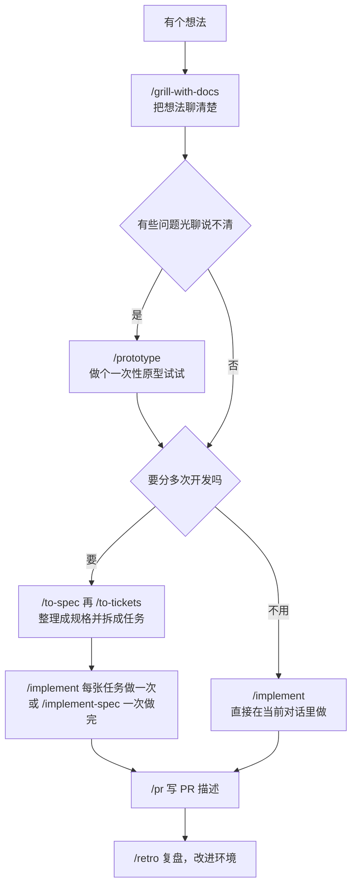

[mattpocock/skills](https://github.com/mattpocock/skills) 是 Matt Pocock 公开的一套 skill，给 Claude Code、Codex 这类 AI 编程助手用。它解决的是一个很常见的问题：你以为助手懂了你要什么，做出来才发现它理解错了。这套 skill 的做法是，让助手在动手之前先反过来问你，把想法聊清楚，再一步步拆成任务、写代码、检查。

这篇教程先讲怎么装、怎么上手，再把仓库里的全部 skill 按用途列一遍。资料核对时间是 2026 年 10 月，以仓库当前的 README 为准。

<!-- more -->

## 先记住一件事：skill 分手动和自动两类

仓库的 README 把这套 skill 分成两类：

1. 手动触发的：只有你自己输入斜杠命令才会运行，助手不会自己决定用，比如 `/grill-with-docs`。
2. 自动触发的：你可以手动输入，助手也可以在任务合适的时候自己调用，比如 `/tdd`。

后面的清单里，每个 skill 后面都标了是哪一类。

## 安装：插件和 skills.sh 二选一

官方给了两种安装方式，只选一种就行，两种都装会让每个 skill 出现两份。

```bash
# 方式一：Claude Code 插件。整套作为只读的托管包安装，上游更新时自动更新
claude plugins install mattpocock-skills
#      plugins install：从 Claude Code 官方 marketplace 安装插件，不需要先添加 marketplace
# 在会话里也可以直接输入：/plugin install mattpocock-skills

# 方式二：skills.sh。把 skill 文件复制到你自己的环境，可以随便改，不会自动更新
npx skills@latest add mattpocock/skills
#     @latest：用最新版安装器
#     add：安装；安装器会让你勾选要装哪些 skill、装到哪些 agent 上
#     以后想拉取上游更新，执行 npx skills update
```

想省事、跟着上游走，选方式一；想改 skill 的内容、按自己习惯调整，选方式二。用 Codex 等其他 agent 的话，目前走方式二。

装完以后，在每个项目里先跑一次：

```
/setup-matt-pocock-skills
```

它会问你三件事：用哪种 issue tracker（GitHub、Linear，或者本地文件）、给 issue 分类时用哪些标签、生成的文档存到哪里。回答完就配置好了。

### 忘了跑 setup，已经聊了很久怎么办

不要紧，随时可以补跑，已经聊出来的内容不会丢。

原因是这两部分互不依赖。`/grill-with-docs` 不读 setup 的配置，术语表和 ADR 是聊到哪记到哪，第一次需要时才创建文件。setup 配的 issue tracker 和标签，只有 `/to-spec`、`/to-tickets`、`/triage` 这类要往 issue tracker 里写东西的 skill 才会用到。

所以补跑的时机是：聊完想法、准备输入 `/to-spec` 之前，在同一个对话里先输入 `/setup-matt-pocock-skills`。它只写配置，不碰你聊出来的术语表和 ADR：会在 `CLAUDE.md`（没有就用 `AGENTS.md`，两个都没有会问你建哪个）里加一段 `## Agent skills`，再在 `docs/agents/` 下生成几个配置文件。跑完之后接着输入 `/to-spec` 就行，新开的对话也会从 `CLAUDE.md` 里读到这份配置。

如果忘了补跑就直接输入 `/to-spec` 或 `/to-tickets`，这两个 skill 的说明里写着“没有配置就先跑 setup”，助手通常会停下来提醒你。

## 三步上手：先把一个想法聊清楚

最常用的入口只有一个：`/grill-with-docs`。输入命令，后面接上你的想法：

```
/grill-with-docs 我想给图书馆的小程序加一个借阅功能
```

助手不会立刻写代码，而是开始问你问题，一轮问好几个，每个问题都附上它自己的推荐答案：

```
❓ Q1 - 一个读者最多能同时借几本：现在没有借阅数量的限制。

➡️ 设上限 5 本，后面可以按读者等级调整。
```

你按编号回答就行：同意推荐答案就说“Q1 同意”，不同意就直接说你的想法。问完所有分支之后，助手会说它认为已经和你达成共识，等你确认，确认之前不会动手。这个过程中，它还会把谈定的术语记进项目里的 `GLOSSARY.md`，把重要的决定记成 ADR（架构决策记录）。

这样一来，需求就对齐了。接下来怎么走，看下面的推荐流程。

## 一个需求从想法到上线：推荐流程



几个要点：

1. 从聊想法到拆任务（`/to-tickets`）这几步，放在同一个对话里连着做，中间不要清空上下文，这样规格和任务都建立在同一次讨论之上。
2. 拆成多张任务之后，每张任务单独跑一次 `/implement`，跑之前用 `/clear` 清空上下文，因为每张任务都是自成一体的。
3. `/implement` 内部会自己调用 `/tdd` 一小块一小块地写代码，提交前再调用 `/code-review` 检查，这两个不用你手动输入。
4. 需要做原型的时候，要先用 `/handoff` 把讨论带到新对话里做，做完再带回来，具体步骤见下一节。

### 做原型时 `/handoff` 怎么用

原型代码写在它自己的目录里，试错过程又会产生大量代码，放在原对话里会把上下文挤满。所以官方的做法是：原对话只负责聊，原型换一个新对话去做，做完只把结论带回来。`/handoff` 就是在两个对话之间传话的工具，它会把当前对话整理成一份交接文档，存到系统的临时目录里（不在你的项目里），其中已经写进 ADR、issue、提交的内容只给路径，不重复，并且会附上建议新对话使用的 skill。

1. 在原对话里输入：

   ```
   /handoff 要做一个原型，验证借阅状态怎么流转
   ```

   助手生成交接文档，并告诉你文件路径。

2. 新开一个终端窗口，进入项目目录，启动一个新的对话，第一句话让它读交接文档并做原型：

   ```
   读一下 <交接文档路径>，然后用 /prototype 做原型
   ```

3. `/prototype` 会按你要验证的问题选形式。验证逻辑和状态流转，它生成一个 HTML 文件，双击打开，点按钮就能看状态怎么变。验证界面长什么样，它在同一个页面里做几套差别很大的方案，用网址参数切换。你在里面实际玩一玩，判断对不对。

4. 玩出结论之后，还在这个新对话里输入：

   ```
   /handoff 把原型的结论带回原对话
   ```

   生成第二份交接文档。

5. 回到原对话，说“读一下 <第二份文档路径>，接着往下聊”，继续 `/grill-with-docs`。

原型本身不进主分支：做完后它会提交到一个 `prototype/<名字>` 分支，并在对应的 issue 里留下指向这个分支的链接，验证过的结论写进 issue 或提交说明，主分支里只留最终的决定。

## 完整案例：给图书馆小程序加借阅功能

下面是一个假想的案例，演示各个 skill 在什么时机出场，对话内容是示意，不是某次真实运行的记录。

### 1. 开工前：配置一次

```
/setup-matt-pocock-skills
```

issue tracker 选 GitHub，标签保持默认，文档放项目根目录。拿不准下一步用哪个 skill 的时候，随时输入 `/ask-matt 我现在想……`。

### 2. 把借阅功能聊清楚

```
/grill-with-docs 我想给图书馆的小程序加一个借阅功能
```

助手开始追问：一个读者最多借几本、借多久、能不能续借、逾期怎么办。底层的 `/grilling` 和 `/domain-modeling` 由它自己调用，你不用输入。聊的过程中会遇到几种情况：

1. 助手冒出一个你没听懂的词，比如“借阅状态机”：输入 `/wait-what`，它会用大白话把刚才那句重新讲一遍。
2. 聊到“读者”和“用户”到底是不是一回事：助手会指出术语不统一，谈定之后记进术语表。
3. 逾期罚款的规则你自己定不了，得问馆长：输入 `/to-questionnaire`，它会问你发给谁、要对方回答什么，然后写一份问卷。把馆长的回答贴回对话，接着聊。
4. 需要查证一个事实，比如“小程序的订阅消息能不能用来做到期提醒”：输入 `/research 小程序订阅消息能否用于到期提醒`，它在后台读官方资料，生成一份带引用的文件，你不用等，继续聊。

所有问题聊完，助手会说它认为已经达成共识，等你确认。确认之后，它会主动问要不要把术语和决定写进术语表和 ADR，建议选“写”。

### 3. 借阅状态说不清：做个原型

“可借、已借、已续借、逾期、已预约”这几个状态怎么互相转换，光靠聊很难想全。这时走前面讲的 `/handoff` 加 `/prototype`，用一个 HTML 点一点就能看出来哪个转换不合理。

### 4. 整理成规格，拆成任务

回到原对话，不要清空上下文：

```
/to-spec
/to-tickets
```

`/to-spec` 把前面聊的内容整理成一份规格，发布到 GitHub issue，不会再重新采访你，只会跟你确认一下准备从哪一层来测试。`/to-tickets` 把规格拆成几张任务，比如“能借一本书、能还一本书”“续借”“逾期提醒”，每张任务写明要等哪些任务先做完。它会先把拆法列给你看，你确认之后才发布。

### 5. 一张任务一张任务地实现

```
/clear
/implement 实现 issue #12
```

每做一张任务之前先 `/clear`，因为每张任务都是自成一体的。`/implement` 内部会自己调用 `/tdd` 一小块一小块地写，写完用 `/code-review` 检查。做完之后用 `/pr` 写 PR 描述。如果任务很多，想一次做完，可以改用 `/implement-spec`。

### 6. 上线前：只有人能做的步骤

注册小程序、配置订阅消息模板、往 GitHub 里填密钥，这些必须你自己在网页后台点。助手遇到这类步骤会自己调用 `/wizard`，生成一个交互式脚本，一步步带你打开网址、粘贴数值，再自动写进配置。

### 7. 上线之后

1. 读者提了一堆 bug 和建议：输入 `/triage`，它会逐条分类、验证，把能交给助手做的整理成任务书。
2. 出现一个偶发的 bug，两个读者同时借到了同一本书：输入 `/diagnosing-bugs`，它会先想办法稳定复现，再缩小范围、修复。
3. 平时有空的时候：输入 `/improve-codebase-architecture`，它扫描代码，找出可以改得更好的地方，选一项之后回到第 2 步的 `/grill-with-docs` 再聊。它内部用的设计词汇来自 `/codebase-design`。
4. 这一轮结束之后：输入 `/retro` 复盘，看助手的工作环境哪里可以改进。

### 案例里没用到的 skill

1. 整个小程序从零开始做，工作量大到一个对话装不下：第一步换成 `/wayfinder`，聊完决策之后再回到 `/to-spec`。
2. 没有项目目录，只是想理清一个方案：用 `/grill-me`。
3. 想系统学一个新概念，比如测试驱动开发：用 `/teach`。
4. 要写 skill、`CLAUDE.md` 这类给助手看的文档：参考 `/writing-for-agents`。
5. 想防止助手误执行危险的 git 命令：用 `/git-guardrails-claude-code`。

## 全部 skill 速查

仓库里目前有 31 个正式 skill，按“想做什么”分成六类。

### 把想法聊清楚

1. `/grill-with-docs`：追问你的想法，并把谈定的术语和决定记进 `GLOSSARY.md` 和 ADR，有项目目录时优先用它（手动）
2. `/grill-me`：同样的追问，但不留任何文件，适合没有项目目录的场景，比如讨论一个计划或一篇文章（手动）
3. `/grilling`：追问机制本身，上面两个的底层，一般不用直接输入（自动）
4. `/domain-modeling`：打磨项目里的术语和领域模型，会质疑模糊的用词，必要时记 ADR（自动）
5. `/wait-what`：助手上一条回答你没看懂时用，它会换成大白话重说一遍（手动）
6. `/to-questionnaire`：有个决定自己拿不准、需要别人回答，把它整理成问卷让对方填（手动）

### 把想法变成任务

1. `/to-spec`：把当前对话整理成规格文档，发布到 issue tracker，不再提问（手动）
2. `/to-tickets`：把计划或规格拆成一组任务，每张任务写明要先做完哪些任务（手动）
3. `/wayfinder`：工作量大到一个对话装不下时（新项目、大功能）用，把问题拆成一张“决策地图”，一个个解决，产出的是决定而不是代码（手动）

### 写代码

1. `/implement`：按规格或任务写代码，内部驱动 `/tdd`，提交前跑 `/code-review`（手动）
2. `/implement-spec`：一次做完整个规格，并行派多个子 agent，合并到一个集成分支，最后统一检查（手动）
3. `/tdd`：测试驱动开发，按“红、绿、重构”一小块一小块地写（自动）
4. `/prototype`：做一个一次性原型来回答设计问题，可以是单个 HTML 文件，也可以是同一页面里切换的几种 UI 方案（自动）
5. `/code-review`：审查某个提交或分支以来的改动，分两个角度：是否符合项目编码规范，是否符合原来的需求（自动）
6. `/pr`：写 PR 描述的格式规范，包括一个最小的可视化摘要、改动前后的证据、合并风险判断（自动）

### 排查问题和整理代码

1. `/diagnosing-bugs`：排查难复现的 bug 和性能回退，先造出一个稳定复现这个 bug 的办法，再一步步缩小范围和修复（自动）
2. `/triage`：处理别人提交的 issue 和外部 PR，分流、分类、验证，整理成可以交给助手做的任务书（手动）
3. `/improve-codebase-architecture`：扫描代码库，找出可以改成“深模块”的地方，生成一份可视化 HTML 报告，选一项再展开追问（手动）
4. `/codebase-design`：设计“深模块”的共同词汇，也就是少量接口背后装着大量行为的模块（自动）
5. `/retro`：一次开发结束后复盘，建议如何改进助手的工作环境，比如导航、自动检查、编码规范，严重的排前面（手动）

### 辅助工具

1. `/ask-matt`：不知道该用哪个 skill 时用，直接问它（手动）
2. `/setup-matt-pocock-skills`：每个项目跑一次，配置 issue tracker、标签和文档位置（手动）
3. `/handoff`：把当前对话整理成交接文档，让另一个助手接着做（手动）
4. `/research`：对照可信的一手资料调研一个问题，写成带引用的 Markdown 文件，在后台运行（自动）
5. `/wizard`：生成交互式的 bash 向导，带你走完只有人能做的步骤，比如开通基础设施、配置密钥、操作第三方后台（自动）
6. `/teach`：用多次对话教你一个新技能或概念，把当前目录当作有状态的教学空间（手动）
7. `/writing-for-agents`：写给助手看的文档（skill、`AGENTS.md`、`CLAUDE.md`）的写法参考（自动）

### 杂项

仓库的 `misc` 目录下还有四个，README 没有单独介绍，下面的说明来自它们各自的 `SKILL.md`：

1. `/git-guardrails-claude-code`：给 Claude Code 配置钩子，拦截 `push`、`reset --hard`、`clean`、`branch -D` 这类危险的 git 命令
2. `/setup-pre-commit`：配置 Husky 提交前检查，包括 lint-staged（Prettier）、类型检查和测试
3. `/migrate-to-shoehorn`：把测试里的 `as` 类型断言迁移到 `@total-typescript/shoehorn`
4. `/scaffold-exercises`：生成练习目录结构，包括章节、题目、答案和讲解，并让它通过 lint

另外仓库里还有个 `in-progress` 目录，里面的 skill 还在开发中，README 没有介绍，可以先不管。

## 不知道用哪个：问 `/ask-matt`

skill 多了记不住，官方做了一个专门的“路由”：

```
/ask-matt 我想排查一个偶现的线上 bug
```

它会根据你的情况，告诉你该从哪个 skill 开始、后面怎么接。比如遇到 bug 指向 `/diagnosing-bugs`，攒了一堆别人提的 issue 指向 `/triage`，工作量大到一个对话装不下指向 `/wayfinder`。

## 版本说明：GLOSSARY.md 以前叫 CONTEXT.md

上游最新版把项目的术语表文件叫 `GLOSSARY.md`，早期版本叫 `CONTEXT.md`，是同一个东西。如果你早期装过这套 skill，项目里生成的可能还是 `CONTEXT.md`。具体用哪个名字，以你本地装的 skill 里写的为准。

想了解 skill 文件本身是怎么写的，可以看 <a href="/从0到1写一个Claude-Skill-规范写法与实战" target="_blank" rel="noopener">从 0 到 1 写一个 Claude Skill</a>。
