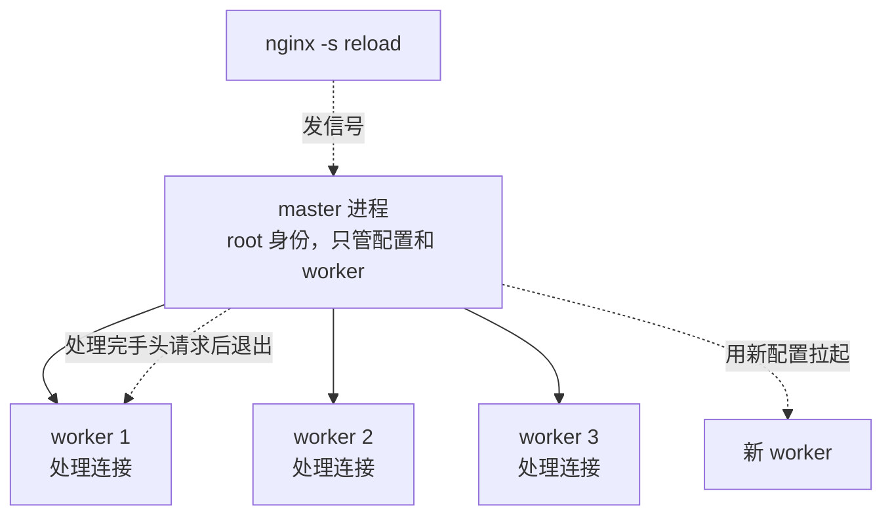
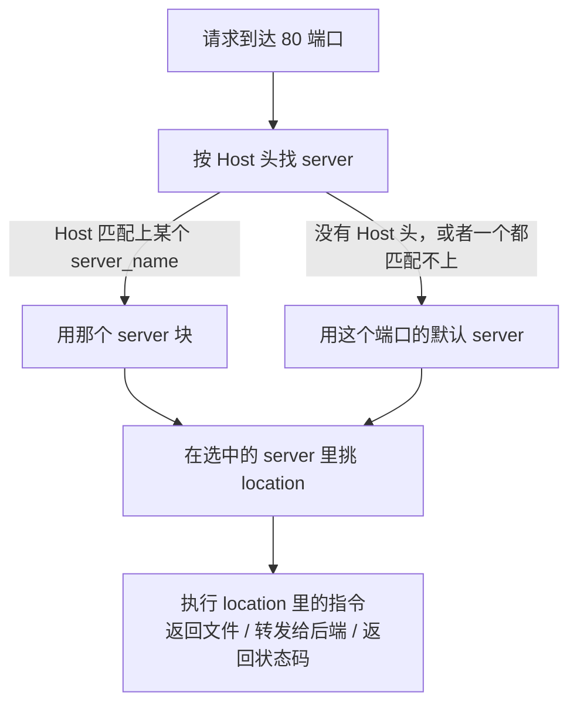

nginx 的配置文件看起来像一门小语言：一堆花括号嵌套，指令名字都很直白，照着网上抄一段通常也能跑起来。麻烦的是抄来的配置一改就出问题——多加一个斜杠行为完全变了，多写一个 `location` 块请求就打到别处去了。这些不是玄学，是 nginx 有一套明确的匹配规则，只是很多教程没讲。

本文所有指令行为都对照 [nginx 官方文档](https://nginx.org/en/docs/)核对过。当前开源版本是 mainline 1.31.4、stable 1.30.4，下面的配置在这两条线上都适用。

<!-- more -->

## nginx 是什么：一个 master 带一群 worker

nginx 是一个 HTTP 服务器兼反向代理。它跟传统 Web 服务器最大的区别在进程模型：不是"一个连接开一个线程"，而是少量 worker 进程，每个 worker 用事件驱动的方式同时处理成千上万个连接。

启动之后进程长这样：

```bash
ps -ef | grep nginx
# root      1234     1  nginx: master process /usr/sbin/nginx
# www-data  1235  1234  nginx: worker process
# www-data  1236  1234  nginx: worker process
```

- **master 进程**：以 root 身份运行，负责读配置、绑定端口（绑 80/443 这种低端口需要特权）、管理 worker 的生死。它不处理任何请求。
- **worker 进程**：以低权限用户运行，真正处理请求。数量由 `worker_processes` 决定，一般设成 `auto`，即等于 CPU 核数。

这个分工直接决定了 `nginx -s reload` 为什么能做到不断连接：master 收到重载信号后，用新配置拉起一批新 worker，同时通知老 worker "别接新连接了，把手上的处理完就退出"。所以重载期间已经建立的连接不会被打断。



## 配置文件的层级：块套块，指令会继承

主配置文件通常在 `/etc/nginx/nginx.conf`。它的结构是几层嵌套的块（官方叫 context），从外到内是 main、events、http、server、location：

```nginx
# 最外层叫 main context，不在任何花括号里
user  www-data;              # worker 进程以哪个用户身份运行
worker_processes  auto;      # worker 数量，auto 表示取 CPU 核数
error_log  /var/log/nginx/error.log warn;
#          错误日志路径             最低记录级别（debug/info/notice/warn/error/crit）

events {
    worker_connections  1024;   # 单个 worker 最多同时持有多少连接
    # 理论最大并发连接数 = worker_processes × worker_connections
}

http {
    include       /etc/nginx/mime.types;    # 把另一个文件的内容原地展开进来
    #                                         mime.types 是文件后缀到 Content-Type 的对照表
    default_type  application/octet-stream; # 匹配不到后缀时用的 Content-Type

    sendfile        on;      # 用系统调用 sendfile 直接把文件从磁盘送到网卡，不经过用户态内存
    keepalive_timeout  65;   # 一个连接处理完请求后，保持多少秒等待复用

    access_log  /var/log/nginx/access.log;

    include /etc/nginx/conf.d/*.conf;    # 把每个站点的配置拆成单独文件，是通行做法

    server {                             # 一个 server 块 = 一个虚拟主机
        listen       80;
        server_name  example.com;

        location / {                     # location 块按 URI 路径分流
            root /var/www/html;
        }
    }
}
```

有两条规则贯穿整个配置文件：

1. **指令有它能出现的位置**。`worker_connections` 只能写在 `events` 里，`location` 只能写在 `server` 或另一个 `location` 里。官方文档每个指令都标了 Context，写之前查一下能省很多事。
2. **内层没写的指令，从外层继承**。`http` 里写了 `sendfile on`，所有 `server` 和 `location` 都继承这个值；某个 `location` 里再写 `sendfile off`，只覆盖它自己那一块。

## 一个请求进来之后，nginx 怎么找到对应的配置

处理流程分成两步，先选 server，再在这个 server 里选 location。



用一个具体例子走一遍这个流程。假设配置里有这两个 `server` 块，都监听 80 端口：

```nginx
server {
    listen      80;
    server_name blog.example.com;
    location / {
        root /var/www/blog;
    }
}

server {
    listen      80;
    server_name shop.example.com;
    location / {
        root /var/www/shop;
    }
}
```

现在有个请求打进来，浏览器访问的是 `http://shop.example.com/index.html`。nginx 处理这个请求分两步走：

1. **先选 server**：请求里带着 `Host: shop.example.com` 这个头，nginx 拿它去跟每个 `server` 块的 `server_name` 比对。第一个块的 `server_name` 是 `blog.example.com`，对不上；第二个块是 `shop.example.com`，对上了。于是这个请求归第二个 `server` 块管。
2. **再选 location**：进入这个 `server` 块之后，nginx 看它里面有哪些 `location`。这里只有一个 `location /`，请求路径 `/index.html` 自然匹配它。

最终结果：nginx 去 `/var/www/shop` 这个目录下找 `index.html` 返回给浏览器。

如果换一个请求，`Host` 头写的是 `admin.example.com`——这两个 `server` 块都没有声明这个域名，谁都匹配不上。这种情况下请求会被扔给**这个端口的默认 server**，也就是配置里 80 端口对应的第一个 `server` 块（这里是 `blog.example.com` 那个），除非专门指定了别的默认块。

**默认 server 是监听端口的属性，不是域名的属性**。同一个端口上如果没有任何 `server` 块显式写了 `default_server`，nginx 就把配置里该端口的第一个 `server` 块当默认。

```nginx
server {
    listen      80 default_server;   # 显式声明：80 端口上匹配不到域名的请求都进这里
    server_name _;                   # 下划线只是个不可能匹配到真实域名的占位写法，没有特殊含义
    return 444;                      # 444 是 nginx 自定义的状态码，表示直接断开连接不回响应
}

server {
    listen      80;
    server_name example.com www.example.com;
    # ...
}
```

线上环境值得专门写这么一个默认 server 兜底。否则别人把域名解析到你的 IP，请求会落进你的第一个 server 块，等于白蹭你的站点。

## location 匹配优先级：先比前缀，再比正则

这是 nginx 配置里最容易出错的地方，也是必须记住的一套规则。`location` 有四种写法：

```nginx
location = /exact  { }   # = 精确匹配：URI 必须完全等于 /exact
location ^~ /img/  { }   # ^~ 前缀匹配，且命中后不再检查正则
location ~  \.php$ { }   # ~ 正则匹配，区分大小写
location ~* \.jpg$ { }   # ~* 正则匹配，不区分大小写
location /prefix   { }   # 没有修饰符：普通前缀匹配
```

nginx 的匹配顺序是这样的：

1. 先在所有**前缀 location**（没修饰符的、`^~` 的、`=` 的）里找。`=` 精确命中就直接用它，搜索结束。
2. 否则记住**匹配长度最长**的那个前缀 location（注意是最长，不是配置里写在最前面的）。
3. 如果记住的那个前缀带 `^~`，直接用它，**跳过正则检查**。
4. 否则**按配置文件里的书写顺序**逐个试正则，第一个命中的正则 location 生效，后面的不再看。
5. 所有正则都不命中，才回过头用第 2 步记住的那个前缀 location。

关键点有两个：**前缀 location 之间比的是长度，跟书写顺序无关；正则 location 之间比的是书写顺序，跟长度无关**。

官方文档的例子最能说明问题：

```nginx
location = / {
    [ 配置 A ]
}
location / {
    [ 配置 B ]
}
location /documents/ {
    [ 配置 C ]
}
location ^~ /images/ {
    [ 配置 D ]
}
location ~* \.(gif|jpg|jpeg)$ {
    [ 配置 E ]
}
```

各个请求分别命中哪个：

| 请求 URI | 命中 | 为什么是它，不是别的 |
| --- | --- | --- |
| `/` | A | A 是精确匹配，一旦对上直接用，连别的 location 都不用比了 |
| `/index.html` | B | 前缀里只有 `/` 对得上，而且没有正则能匹配 `.html` 结尾，所以停在 B |
| `/documents/document.html` | C | 前缀里 `/documents/` 比 `/` 更长，优先用长的；正则里也没有能匹配它的，所以停在 C |
| `/images/1.gif` | D | 前缀里最长的是 `/images/`，而且它带 `^~`——带了这个记号就不再看正则，E 直接被跳过 |
| `/documents/1.jpg` | E | 前缀里最长的是 `/documents/`，但它不带 `^~`，所以还要接着比正则，正则命中了 E |

最后两行放一起最能看出 `^~` 的作用：同样是一张 jpg 图片，放在 `/images/` 下命中的是 D，放在 `/documents/` 下命中的却是 E。区别就在于 `/images/` 这个前缀带了 `^~`——**带上它，等于告诉 nginx“这个目录下的东西认前缀就行，不用再去比正则”**。静态资源目录经常这么写，就是为了不被后面那些用来处理图片、脚本的正则规则半路截胡。

## proxy_pass 后面带不带路径，行为完全不同

反向代理是 nginx 用得最多的功能，而 `proxy_pass` 的这个差异是最常见的翻车点。

规则只有一句：**代理地址后面带了 URI（哪怕只是一个斜杠），nginx 就会把 location 匹配掉的那一段替换成这个 URI；不带 URI，则原样转发完整路径**。

假设请求是 `/api/users/1`：

```nginx
# 写法一：不带 URI —— 原样转发
location /api/ {
    proxy_pass http://127.0.0.1:8080;
}
# 后端收到的路径：/api/users/1

# 写法二：带一个斜杠 —— 把 /api/ 替换成 /
location /api/ {
    proxy_pass http://127.0.0.1:8080/;
}
# 后端收到的路径：/users/1

# 写法三：带具体路径 —— 把 /api/ 替换成 /v1/
location /api/ {
    proxy_pass http://127.0.0.1:8080/v1/;
}
# 后端收到的路径：/v1/users/1
```

写法一和写法二只差一个斜杠，后端拿到的路径就差了一个 `/api` 前缀。后端框架如果按 `/users/1` 注册路由，用写法一就会 404；后端如果本身就带 `/api` 前缀，用写法二又会 404。

这里还有一条相关的规则：**前缀 location 以斜杠结尾、且里面用了 `proxy_pass`，那么访问不带尾斜杠的地址时，nginx 会返回 301 重定向到带斜杠的版本**。也就是说上面的配置里，请求 `/api` 会被 301 到 `/api/`。不想要这个重定向，得单独加一个精确匹配的 location：

```nginx
location /api/ {
    proxy_pass http://127.0.0.1:8080/;
}
location = /api {
    proxy_pass http://127.0.0.1:8080/;   # 精确匹配 /api，不触发那个 301
}
```

还有一点要注意：**location 用正则写的时候，`proxy_pass` 不能带 URI**。因为"被匹配掉的那一段"在正则场景下没法确定，nginx 会直接在启动时报配置错误。

### 一份能用的反向代理配置

只写 `proxy_pass` 的话，后端拿不到真实客户端信息，得把几个头补上：

```nginx
upstream backend {
    # upstream 定义一组后端，多台时 nginx 默认按轮询分发
    server 127.0.0.1:8080;
    server 127.0.0.1:8081;
    keepalive 32;    # 保持 32 条到后端的长连接复用，省掉反复握手
}

server {
    listen 80;
    server_name api.example.com;

    location / {
        proxy_pass http://backend;

        proxy_set_header Host              $host;
        #                                  $host 是请求里的域名，不带这行后端收到的 Host 是 upstream 的名字
        proxy_set_header X-Real-IP         $remote_addr;
        #                                  $remote_addr 是直连 nginx 的那一端的 IP
        proxy_set_header X-Forwarded-For   $proxy_add_x_forwarded_for;
        #                                  这个变量会在已有的 X-Forwarded-For 后面追加 $remote_addr
        proxy_set_header X-Forwarded-Proto $scheme;
        #                                  $scheme 是 http 或 https，后端靠它判断原始请求是不是加密的

        proxy_http_version 1.1;            # 默认是 1.0，长连接和 WebSocket 都需要 1.1
        proxy_set_header Connection "";    # 清掉 Connection 头，配合上面的 keepalive 复用连接

        proxy_connect_timeout 5s;    # 与后端建连的超时
        proxy_read_timeout    60s;   # 两次读到后端数据之间的最长间隔，不是整个请求的总时长
    }
}
```

代理 WebSocket 需要额外两个头，因为 WebSocket 靠 HTTP 的 Upgrade 机制握手：

```nginx
location /ws/ {
    proxy_pass http://backend;
    proxy_http_version 1.1;
    proxy_set_header Upgrade    $http_upgrade;   # 把客户端的 Upgrade 头透传给后端
    proxy_set_header Connection "upgrade";       # 明确告诉后端这是一次协议升级
    proxy_read_timeout 3600s;                    # WebSocket 长时间不发数据也别断
}
```

## root 和 alias：一个是拼接，一个是替换

这两个指令都是指定文件在磁盘上的位置，区别在于怎么和请求路径组合。

**root 是把完整的请求 URI 拼在后面**：

```nginx
location /i/ {
    root /data/w3;
}
# 请求 /i/top.gif  →  磁盘路径 /data/w3/i/top.gif
#                              ^^^^^^^^  ^^^^^^^^^^
#                              root 的值  完整的请求 URI
```

**alias 是把 location 匹配掉的那一段替换成它的值**：

```nginx
location /i/ {
    alias /data/w3/images/;
}
# 请求 /i/top.gif  →  磁盘路径 /data/w3/images/top.gif
#                              ^^^^^^^^^^^^^^^^  ^^^^^^^
#                              alias 的值         URI 里 /i/ 之后的部分
```

判断该用哪个的方法：磁盘目录结构和 URL 路径结构一致，用 `root`；两者对不上、需要做一次路径改写，用 `alias`。官方文档也建议，如果 location 的路径正好是目录路径的最后一段（比如 `location /images/` 配 `/data/w3/images/`），改用 `root /data/w3` 更清晰。

用 `alias` 有个约定要遵守：**location 以斜杠结尾，alias 的值也要以斜杠结尾**，两边不一致会拼出意料之外的路径。

### 单页应用的经典配置

前端打包出来的 SPA，路由是前端接管的，刷新任何子路径都得返回同一个 `index.html`：

```nginx
location / {
    root /var/www/dist;
    try_files $uri $uri/ /index.html;
    # try_files 按顺序尝试，第一个存在的就返回：
    #   $uri    当成文件找，比如 /assets/app.js
    #   $uri/   当成目录找，找目录下的 index 文件
    #   最后一个参数是兜底，前面都找不到就内部跳转到 /index.html
    # 注意：兜底参数不做"存在性检查"，直接交给对应的处理逻辑
}
```

## 静态资源、压缩和缓存

```nginx
http {
    gzip on;
    gzip_types text/plain text/css application/json application/javascript text/xml;
    #          要压缩哪些 Content-Type。text/html 是默认就压的，不用写，写了反而会有告警
    gzip_min_length 1024;   # 小于 1KB 的不压，压缩开销大于收益
    gzip_comp_level 5;      # 压缩级别 1-9，越大越小也越费 CPU，5 是常见的平衡点
    gzip_vary on;           # 加上 Vary: Accept-Encoding 响应头，让缓存服务器区分压缩与非压缩版本
}

server {
    location ^~ /assets/ {
        # 用 ^~ 保证这个目录下的请求不会被后面的正则 location 抢走
        root /var/www/dist;

        expires 1y;
        # expires 同时设置 Expires 和 Cache-Control: max-age 两个响应头
        # 打包工具给文件名加了内容哈希的话，可以放心设成一年

        add_header Cache-Control "public, immutable";
        # immutable 告诉浏览器这个文件永远不会变，用户刷新页面时都不用来问一次
    }

    location = /index.html {
        root /var/www/dist;
        add_header Cache-Control "no-cache";
        # 入口 HTML 绝对不能长缓存，否则发了新版本用户还是拿到旧的资源引用
        # no-cache 不是"不缓存"，是"每次用之前都要回服务器验证一下有没有更新"
    }
}
```

## HTTPS 配置

证书拿到之后，配置本身很简单：

```nginx
server {
    listen 443 ssl;
    http2  on;              # 1.25.1 起 HTTP/2 用独立的 http2 指令开，老版本写成 listen 443 ssl http2
    server_name example.com;

    ssl_certificate     /etc/nginx/ssl/example.com.crt;
    #                   证书文件，要求是"站点证书 + 中间证书"拼接成的完整链
    ssl_certificate_key /etc/nginx/ssl/example.com.key;
    #                   私钥文件，权限要收紧到只有 root 能读

    ssl_protocols       TLSv1.2 TLSv1.3;   # 只留这两个，更老的版本已经不安全
    ssl_session_cache   shared:SSL:10m;    # 会话缓存，让重复访问的客户端跳过完整握手
    #                   shared 表示所有 worker 共享，SSL 是缓存名，10m 是大小
    ssl_session_timeout 1d;

    location / {
        proxy_pass http://backend;
        proxy_set_header X-Forwarded-Proto $scheme;
    }
}

server {
    listen 80;
    server_name example.com;
    return 301 https://$host$request_uri;
    # 把 HTTP 全量重定向到 HTTPS
    # $request_uri 是包含查询参数的原始路径，用它才不会把 ?id=1 这类参数弄丢
}
```

证书链拼不完整是个常见问题：浏览器通常自带中间证书所以看着正常，但 curl 和很多服务端 HTTP 客户端会直接报证书校验失败。`ssl_certificate` 指向的文件必须是站点证书在前、中间证书在后拼起来的那一个。

## 日常操作的几条命令

```bash
nginx -t
#      -t：只检查配置文件语法，不启动服务
#          改完配置一定先跑这个，语法错了直接 reload 会让 nginx 起不来

nginx -T
#      -T：在 -t 的基础上，把所有 include 展开后的完整配置打印出来
#          排查"到底哪个文件里的哪条指令生效了"时非常有用

nginx -s reload
#      -s：向 master 进程发信号
#          reload  重新读配置，用新配置起新 worker，老 worker 处理完手头的请求再退出
#          quit    优雅停止，等所有请求处理完
#          stop    立刻停止，不管手头的请求
#          reopen  重新打开日志文件，日志切割脚本轮转完文件后要调它
```

改配置的固定动作是 `nginx -t && nginx -s reload`，用 `&&` 串起来，语法不过就不会执行重载。

日志方面，默认的 `combined` 格式不带响应时间，排查慢请求时基本没用，建议自定义一个：

```nginx
log_format main '$remote_addr - $remote_user [$time_local] "$request" '
                '$status $body_bytes_sent "$http_referer" "$http_user_agent" '
                'rt=$request_time uct=$upstream_connect_time urt=$upstream_response_time';
                # $request_time            nginx 收到请求第一个字节到发完响应的总耗时
                # $upstream_connect_time   与后端建立连接花的时间
                # $upstream_response_time  后端处理并返回完整响应花的时间
                # 三个数一起看就能分清慢在网络、慢在后端，还是慢在 nginx 自己

access_log /var/log/nginx/access.log main;
#                                    最后这个参数指定用上面定义的哪个 log_format
```

`$request_time` 明显大于 `$upstream_response_time` 时，说明时间花在了 nginx 和客户端之间——通常是客户端网络慢，或者响应体太大传输耗时。排查线上问题时这个区分能省掉大量猜测。想进一步看连接层面的状态，可以配合 [ss 和 lsof](/ss-lsof深入-TCP连接状态与已删除文件占磁盘) 一起用。
