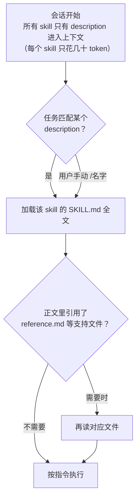

同一段提示词，你在 Claude Code 里粘贴第三遍的时候，就该把它写成 skill 了。Skill 是一个装着指令的文件夹，Claude 在任务匹配时自动加载，你也可以用 `/名字` 手动触发——写一次，以后每次都不用再解释。

这是 Claude 系列的第三篇：[第一篇](/Claude全面教程-模型概念与API实战)讲概念，[第二篇](/ClaudeCode实战教程-安装CLAUDEmd-hooks-subagent)讲 Claude Code 的整套配置，这篇专攻 skill——什么时候写、规范格式长什么样、description 怎么写才能被正确触发，最后用一个"发版说明生成"的真实场景从 v1 迭代到 v3。所有格式和字段核对自[官方文档](https://code.claude.com/docs/en/skills)，截至 2026 年 7 月 8 日有效。


<!-- more -->

## 什么时候该写一个 skill

三个信号，中一个就值得动手：

1. **同一段指令你粘贴过不止一次**——排查线上问题的固定套路、生成周报的格式要求、发版的检查清单
2. **CLAUDE.md 里某一段越长越像"流程"而不是"事实"**——CLAUDE.md 适合放"构建命令是 npm run build"这种事实；"发版时先跑测试再更新 CHANGELOG 再打 tag"这种多步骤流程，搬去 skill
3. **一段专业知识只在特定任务时才需要**——比如 Excel 操作技巧、某个内部系统的 API 用法，放 CLAUDE.md 每次会话都白白占上下文，做成 skill 用到才加载

和相邻机制的分工一句话说清：**CLAUDE.md 放"每次都要知道的事实"，skill 放"特定任务的做法"，subagent 是"独立上下文里干活的分身"**（skill 是知识，subagent 是工人——工人可以带着知识干活，两者不冲突）。

一个容易过时的认知要先纠正：**自定义 slash commands 已经并入 skills**。`.claude/commands/deploy.md` 和 `.claude/skills/deploy/SKILL.md` 都会生成 `/deploy` 命令、工作方式相同；老的 commands 文件继续可用，但官方推荐 skills——它多了三样东西：支持文件目录、控制"谁能触发"的 frontmatter、被 Claude 自动加载的能力。

## 规范格式解剖

一个 skill 就是一个目录，`SKILL.md` 是唯一必需的文件：

```text
release-notes/               # 目录名 = 命令名（/release-notes 就来自这里）
├── SKILL.md                 # 主指令（必需）
├── reference.md             # 详细规范（可选，用到才加载）
├── examples/
│   └── sample.md            # 期望输出示例（可选）
└── scripts/
    └── collect.sh           # 可执行脚本（可选，被执行而不是被读入）
```

放哪取决于给谁用：

| 位置 | 生效范围 |
|---|---|
| `~/.claude/skills/<名字>/SKILL.md` | 你的所有项目 |
| `.claude/skills/<名字>/SKILL.md` | 当前项目，进版本库团队共享 |

注意一个细节：**命令名来自目录名**，frontmatter 里的 `name` 字段只是列表里的显示名。想让命令叫 `/release-notes`，目录就得叫 `release-notes`。

`SKILL.md` 本身分两部分：YAML frontmatter（配置）+ Markdown 正文（指令）：

```markdown
---
name: release-notes
description: 从 git 提交记录生成发版说明。当用户要求写 release notes、发版说明或版本更新日志时使用。
---

（这里是正文：Claude 被触发后按这里的指令行事）
```

它的运行机制是**渐进式加载**——这是 skill 最核心的设计，决定了后面所有写法建议：



三层各司其职：description 常驻上下文负责"被找到"，SKILL.md 正文触发才加载负责"怎么做"，支持文件按需读取负责"细节规范"。写 skill 的所有技巧，本质上都是把内容放进正确的层。

## description 是灵魂：只写"何时用"，不写"怎么做"

Claude 靠 description 决定要不要加载你的 skill——写不好，要么该触发时不触发，要么不该触发时乱触发。两条规则：

**规则一：写清触发条件，覆盖用户可能说出的词。** Claude 匹配的是用户的原话，把同义词写进去：

```yaml
# ❌ 差：太抽象，用户说"帮我写个发版说明"时匹配不上
description: 处理版本发布相关事务

# ✅ 好：具体动作 + 用户可能说的各种说法
description: 从 git 提交记录生成发版说明。当用户要求写 release notes、发版说明、版本更新日志或 changelog 时使用。
```

**规则二：只描述"何时用"，不要把流程步骤摘要进去。** 这条反直觉但很重要：如果 description 里写了"先收集提交、再分类、再格式化"，Claude 可能**照着这句摘要直接干活，跳过正文里的完整指令**——你在正文里精心写的细节全部作废。description 是门牌，不是说明书：

```yaml
# ❌ 差：摘要了流程，Claude 可能抄近路不读正文
description: 生成发版说明——收集 git 提交、按类型分类、按模板格式化输出

# ✅ 好：只有触发条件
description: 从 git 提交记录生成发版说明。当用户要求写 release notes 或版本更新日志时使用。
```

## 实战：发版说明生成器，从 v1 到 v3

场景：每次发版你都要整理"这个版本改了什么"——翻 git log、按新功能/修复/破坏性变更分类、写成固定格式发给团队。这个流程每月重复几次，格式要求还总有人记错，是典型的 skill 素材。

### v1：最简可用版

先写最小版本跑起来。创建 `.claude/skills/release-notes/SKILL.md`：

```markdown
---
description: 从 git 提交记录生成发版说明。当用户要求写 release notes、发版说明或版本更新日志时使用。
---

生成发版说明：

1. 运行 `git log --oneline <上一个tag>..HEAD` 收集本次发版的提交
   （用 `git describe --tags --abbrev=0` 找上一个 tag）
2. 把提交按三类分组：新功能（feat）、修复（fix）、破坏性变更（含 BREAKING）
3. 用中文输出，每条一行，写"用户能感知的变化"而不是复制提交信息
```

保存即生效（skill 目录有文件监视，改动实时加载；只有"首次创建顶层 skills 目录"需要重启会话）。测试两种触发：

```text
> 帮我写一下这个版本的发版说明        ← 自动触发：说法匹配 description
> /release-notes                    ← 手动触发：直接点名
```

### v2：动态上下文注入，省掉一轮工具调用

v1 里 Claude 要自己跑 git 命令拿数据。skill 支持一个更优雅的写法——`` !`命令` ``：**在 Claude 看到 skill 内容之前**，Claude Code 先执行这行命令、把输出原地替换进来。Claude 拿到的直接是带着数据的指令：

```markdown
---
description: 从 git 提交记录生成发版说明。当用户要求写 release notes、发版说明或版本更新日志时使用。
---

## 本次发版的提交记录

!`git log --oneline $(git describe --tags --abbrev=0)..HEAD`

## 指令

把上面的提交按三类分组：新功能（feat）、修复（fix）、破坏性变更（含 BREAKING）。
用中文输出，每条写"用户能感知的变化"而不是复制提交信息。
如果提交列表为空，直接说"上个 tag 之后没有新提交"。
```

注意最后一行——**给边界情况一个明确出口**（空列表怎么办），否则模型可能在没数据时开始编造。

### v3：格式规范拆进支持文件

团队的发版说明有详细格式要求（标题格式、emoji 约定、破坏性变更必须带迁移指引……），全塞进 SKILL.md 会让它臃肿。按渐进加载的思路拆出去：

`.claude/skills/release-notes/reference.md`：

```markdown
# 发版说明格式规范

## 标题
`## vX.Y.Z (YYYY-MM-DD)`，版本号从 package.json 读取

## 分组顺序与标记
1. 🚨 破坏性变更（有才写，必须附迁移指引）
2. ✨ 新功能
3. 🐛 修复

## 每条格式
- 动词开头，不超过一行："支持批量导出用户数据"
- 结尾括号标 PR 号：（#123）
```

SKILL.md 里加一行引用，告诉 Claude 这个文件是什么、什么时候读：

```markdown
## 指令

把上面的提交分类整理成发版说明。
**输出前必须先读取本目录的 [reference.md](reference.md)，严格按其中的格式规范输出。**
```

最终目录：

```text
.claude/skills/release-notes/
├── SKILL.md        # 触发条件 + 数据注入 + 主流程（保持精简）
└── reference.md    # 格式细节（触发后按需加载）
```

这就是从 0 到 1 的完整路径：**v1 验证触发和主流程 → v2 用动态注入消灭重复劳动 → v3 把厚重规范拆到支持文件**。官方建议 SKILL.md 控制在 500 行内，超了就继续往支持文件里拆。

## 进阶字段速查

frontmatter 全部字段是可选的，按需求场景挑：

| 需求 | 字段写法 |
|---|---|
| 只许手动 `/名字` 触发，不让 Claude 自作主张（适合部署这类危险操作） | `disable-model-invocation: true` |
| 只让 Claude 自动用，不出现在 `/` 菜单（背景知识类） | `user-invocable: false` |
| skill 激活期间某些工具免确认 | `allowed-tools: Read Grep Bash(git log *)` |
| 在独立子上下文里跑，不污染主对话 | `context: fork`（可配 `agent` 指定 subagent 类型） |
| 只在碰到匹配文件时才可被自动加载 | `paths: ["src/api/**/*.ts"]` |
| 接收参数 | 正文用 `$ARGUMENTS`（全部）、`$0` `$1`（按位置）；`argument-hint: [版本号]` 提供输入提示 |
| 引用 skill 自己目录下的脚本 | `${CLAUDE_SKILL_DIR}/scripts/collect.sh` |

举个参数的例子：`/release-notes v2.3.0` 触发时，正文里的 `$0` 会被替换成 `v2.3.0`。

全部字段和取值以[官方 frontmatter 参考](https://code.claude.com/docs/en/skills)为准——查配置项的方法，[上一篇的"配置项的可选值去哪查"](/ClaudeCode实战教程-安装CLAUDEmd-hooks-subagent)写过，这里不重复。

## 写完怎么验证：像测代码一样测 skill

skill 是给模型看的文档，"我觉得写清楚了"不算数——得看模型的实际行为。三个测试，开个新会话逐个跑：

1. **触发测试**：用你没在 description 里写过的自然说法提需求（"整理下这次更新的内容"），看它会不会自动加载 skill。不触发 → description 的关键词覆盖不够。
2. **误触发测试**：提一个相邻但不该触发的需求（"看看最近的提交记录"），看它会不会错误加载。误触发 → description 写得太宽。
3. **执行测试**：触发后看输出是否符合 reference.md 的规范。不符合 → 检查正文有没有明确要求"先读 reference.md"，指令是否具体到可验证。

更进一步的思路借自测试驱动开发：**写 skill 之前，先在没有 skill 的情况下让 Claude 做一遍这个任务，记下它哪里做得不对**——你的 skill 只需要针对性地修这些点，而不是把所有想到的都写上。写得越少，遵守得越稳。

最后是几个常见反模式，都来自真实踩坑：

- **description 摘要了工作流程** → 模型抄近路，正文作废（前文讲过）
- **把一次性的解决过程写成 skill**（"上次我是这么修的：第一步……"）→ skill 是可复用的做法，不是工作日志
- **一个 skill 塞多个不相关任务** → 拆成多个，每个 skill 一件事，description 才写得准
- **规范细节全堆在 SKILL.md** → 拆到支持文件，正文只留主流程和"何时读哪个文件"

## 下一步

- 给 skill 配上团队共享：提交 `.claude/skills/` 进版本库，队友拉下来即用
- 系列前篇：[Claude 全面教程（概念）](/Claude全面教程-模型概念与API实战)、[Claude Code 实战教程（配置）](/ClaudeCode实战教程-安装CLAUDEmd-hooks-subagent)
- 官方文档：[Skills 完整参考](https://code.claude.com/docs/en/skills)，跨工具的开放标准见 [agentskills.io](https://agentskills.io)
