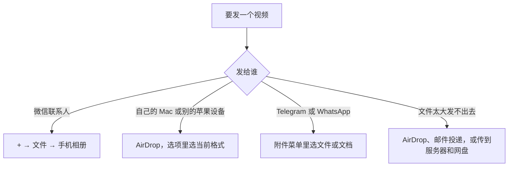

从相册里直接选视频发出去，聊天 App 通常会先把它重新压缩一遍，对方下载下来就觉得画质变差了。要保持原画质，各个 App 的做法核心是同一个：让 App 把视频当成文件来发，而不是当成视频来发。具体怎么点，每个 App 不一样，下面按场景讲。

资料核对时间是 2026 年 10 月。微信和 Apple 的做法对照了官方帮助页；Telegram 和 WhatsApp 的大小数字来自官方博客，操作路径没有对照官方帮助页逐步核实，文中已经标注，建议以官方为准。

<!-- more -->

先看一眼该选哪种做法：



## 为什么直接发会变糊：聊天 App 把视频和文件分开处理

在相册里选“视频”发送，聊天 App 为了省流量、让对方更快看到，通常会先把视频重新编码，分辨率和码率往下降，文件才会变小。把同一个视频当“文件”发，App 只负责搬运，不碰里面的内容。

微信官方帮助页就是这样区分的：从“文件”里发送的图片和视频不会被压缩。下面每个 App 的做法，本质上都是在找“当文件发”的那个入口。

## 微信：从「文件」里选手机相册

1. 打开聊天，点输入框旁边的【+】，选【文件】。
2. 点上方的【聊天中的文件】，选【手机相册】。
3. 勾选要发的图片或视频，点【发送】。

这几步来自腾讯客服的官方帮助页：[如何使用文件发送原始图片视频？](https://kf.qq.com/touch/wxappfaq/201004vQ7bIZ201004fmYjiU.html?platform=15)。页面里写明，从文件中发送的图片视频不会被压缩，而且会带上拍摄信息。

实测有一个限制：通过「文件」发视频，视频时长不能超过 60 分钟，超过的话会弹出“无法发送超过 60 分钟的视频”的提示，发不出去。官方帮助页没有写这条。超过 60 分钟的视频需要换别的方式，见后面的“视频太大发不出去怎么办”。

另外有两点官方没有说清楚，具体效果以你手机上的实际表现为准：

1. 文件大小的现行上限：官方帮助页没有给出数值。腾讯客服里“文件传输助手”那一页写的是 10M，明显是旧页面，不能参考。发的视频太大时，以发送时 App 的提示为准。
2. 相册选择界面里的“原图”勾选，对视频到底起什么作用，官方帮助页没有说明，所以不要依赖它，走“文件”这条路更稳。

## iPhone 发给 Mac 或其他苹果设备：用 AirDrop

Apple 官方把 AirDrop 称为给附近的 iPhone、iPad、Mac、Apple Vision Pro 发大视频“最简单”的方式，见 [Share long videos on iPhone](https://support.apple.com/guide/iphone/share-long-videos-iph1c81f302d/ios)。

1. 双方都在控制中心里打开 Wi-Fi 和蓝牙。
2. 对方如果不在你的通讯录里，需要让对方临时放开接收：iPhone 或 iPad 上，设置 → 通用 → 隔空投送 → 所有人 10 分钟；Mac 上，系统设置 → 通用 → 隔空投送与接力，把隔空投送设成所有人。
3. 在照片 App 里打开视频，点分享按钮，再点【选项】，按下面两项设置。
4. 点 AirDrop，选对方的设备。对方会收到接受或拒绝的提示。

【选项】里和画质有关的是两项：

1. 格式：有“自动”、“当前”、“最兼容”三档。官方的说法是：自动会按目的地选最合适的格式；当前可以避免格式转换；最兼容则可能把文件转成 JPEG 或 MOV。想让视频原样发出去，选“当前”。
2. 所有照片数据：打开后，分享的是原始文件，连同编辑历史和元数据（位置、说明等），对方能看到并修改当前版本。这一项仅 AirDrop 支持，通过邮件、信息发送时没有。

这两项来自 Apple 的官方指南 [Share photos and videos on iPhone](https://support.apple.com/guide/iphone/iphf28f17237/ios)，引用的是 iOS 27 版本。不同 iOS 版本里按钮的文字可能略有差别，以手机上看到的为准。

## Mac 上看到的是不是原片：看 iCloud 照片的存储设置

如果两台设备都开着 iCloud 照片，不用 AirDrop，视频也会同步到 Mac 的照片 App。但在 Mac 上看到的，不一定是原片。

Apple 官方的说法是：iCloud 照片始终会上传并保存原始的全分辨率内容。Mac 上如果选了“优化 Mac 储存空间”，储存空间紧张时，Mac 只会存缩小版的副本，原片留在 iCloud 里。想把原片放到 Mac 上，在照片 App 里选 照片 → 设置 → iCloud，再选“下载原片到此 Mac”。详见 [Optimize storage in Photos on Mac](https://support.apple.com/guide/photos/optimize-storage-in-photos-on-mac-phta9b4673b4/mac)。

没开 iCloud 照片，或者 iCloud 空间满了的话，官方建议用数据线：iPhone 连上 Mac，打开照片 App，在导入界面里选视频，见 [Transfer photos from your iPhone or iPad](https://support.apple.com/en-us/120267)。

## Telegram 与 WhatsApp：附件菜单里选「文件」或「文档」

下面的大小数字来自这两个 App 的官方博客，操作路径来自多数教程的描述，没有对照官方帮助页逐步核实。界面可能随版本变化，建议先拿一个小视频试一次。

Telegram：

1. 在聊天里点回形针附件按钮。
2. 选“文件”（File），不要选相册里的图片和视频。
3. 选中视频发送。

官方博客写明，可以发送任意类型的文件，每个最大 2 GB，开通 Premium 后是 4 GB，见 [Profile Videos, 2 GB File Sharing…](https://telegram.org/blog/profile-videos-people-nearby-and-more) 和 [700 Million Users and Telegram Premium](https://telegram.org/blog/700-million-and-premium)。官方博客还提到，普通照片会被优化压缩，以便即时送达、节省流量，见 [HD Photos 那篇更新](https://telegram.org/blog/direct-to-channel-trim-voice-and-more)。

WhatsApp：

1. 在聊天里点附件按钮。
2. 选“文档”（Document），再选视频文件。

WhatsApp 官方博客在 2022 年宣布，文件分享的上限提高到 2 GB，见 [Reactions, 2GB File Sharing, 512 Groups](https://blog.whatsapp.com/reactions-2gb-file-sharing-512-groups)。但官方帮助页对手机端上限的写法并不一致，实际上限以发送时 App 的提示为准。“以文档形式发送不会重新压缩视频”这一点来自多数教程的说法，官方资料里没有找到明确的说明。

## 视频太大发不出去怎么办

Apple 官方给长视频的办法有 AirDrop、iCloud 和邮件投递（Mail Drop）三种。AirDrop 前面讲过了；iCloud 的做法官方指南里没有写步骤，这里不展开。邮件投递的做法是：在照片 App 里点视频，点分享，选邮件，填好收件人发送，收件人有 30 天的时间下载附件。

官方还有一条提醒：邮件、信息这类渠道的附件大小上限，由你的服务提供商决定。

如果对方是技术同事，或者你想把视频传到服务器、另一台电脑上，可以用 scp 或 rsync，见 <a href="/SSH免密登录与scp实战-密钥配置与传文件#scp：基于-SSH-传文件" target="_blank" rel="noopener">SSH 免密登录与 scp 实战</a>。把视频传到网盘再发链接也是常见做法，多数网盘下载到的是上传时的原文件，具体以所用服务为准。

## 怎么确认对方收到的是原画质

不同渠道的行为会随版本变化，最可靠的办法是自己比一下收到的文件和原文件。看三样：分辨率、码率、文件大小。更直接的是比文件指纹（哈希）：内容一个字节都没动，哈希就完全相同。

在 Mac 上，把原视频和收到的视频分别跑下面三条命令。`ffprobe` 来自 ffmpeg，没有的话先 `brew install ffmpeg`。

```bash
mdls -name kMDItemPixelWidth -name kMDItemPixelHeight -name kMDItemDurationSeconds -name kMDItemFSSize video.mp4
#    -name：只显示指定的元数据项，依次是宽、高、时长（秒）、文件大小（字节）
```

```bash
ffprobe -v error -select_streams v:0 -show_entries stream=codec_name,width,height,bit_rate -of default=nw=1 video.mp4
#       -v error：只输出报错，不刷屏
#       -select_streams v:0：只看第一条视频流
#       -show_entries：要显示的字段：编码、宽、高、码率（单位 bit/s）
#       -of default=nw=1：用简单的 key=value 格式输出，nw=1 表示不打印分段标记
```

```bash
shasum -a 256 video.mp4
#      -a 256：用 SHA-256 算法算出文件的指纹
```

拿一个视频实测了一遍。原视频的结果是：

```
kMDItemDurationSeconds = 1091.05
kMDItemFSSize          = 66297207
kMDItemPixelHeight     = 1440
kMDItemPixelWidth      = 2560

codec_name=h264
width=2560
height=1440
bit_rate=350314

3fda3627bdde75aa52303fd1ea968ff776cf80533f589c35b964474b517d6783
```

这是一个屏幕录像，数值只用来演示怎么读，不代表手机视频的典型值。

原样复制一份，再算一次哈希，结果完全一样：`3fda3627…d6783`。这就是“一个字节都没动”的样子。

再用 ffmpeg 把前 20 秒重新压缩一遍，模拟聊天 App 的转码。注意这是用 ffmpeg 做的模拟，不是某个 App 的真实行为。结果是：

```
codec_name=h264
width=2560
height=1440
bit_rate=53803

7544c91de01c15ef8ef2b840c49c42a8b74ba1454481549b6fbce8fc0f043cf7
```

分辨率没变，码率从 350314 掉到 53803，哈希也变了。所以看结果时要注意两点：

1. 分辨率相同不代表没压缩，码率才是更直接的信号。码率明显下降，说明画面被重新编码过。
2. 哈希不同只能说明文件不再是原文件，不一定画质变差。比如 AirDrop 里选了“最兼容”，格式被转换，哈希就会变。判断画质，还是要看分辨率和码率。
