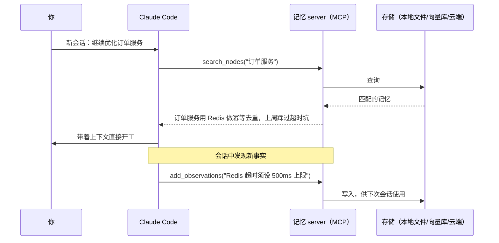

用 Claude Code 一段时间后，你大概率遇到过这个循环：昨天的会话里它已经摸清了项目架构、知道哪个模块有坑、记住了你的编码偏好，今天新开一个会话——全忘了。你只能把项目背景再讲一遍，或者眼睁睁看它把昨天踩过的坑再踩一次。

CLAUDE.md 能缓解一部分，但它本质上是一份静态规则文件，解决的是「规矩」问题，解决不了「积累」问题。真正的解法是给 Claude Code 接一个外部记忆系统：它自己把重要的事实存进去，下次会话自己检索出来。记忆数据可以是你完全自己保管的本地文件，也可以放云端跨设备同步。

<!-- more -->

这是 Claude 系列的第五篇。如果你还不知道 MCP 是什么，建议先看[自建一个 MCP Server 接入 Claude](/自建MCP-server接入Claude)——本文的所有方案都构建在 MCP 之上。

## Claude Code 自带的记忆，只能记住「规则」

先盘点原生能力的边界，免得重复造轮子。Claude Code 内置三个记忆入口：

- **CLAUDE.md**：项目根目录或 `~/.claude/` 下的规则文件，每次会话自动加载，适合放编码规范、构建命令这类固定约定
- **`#` 快捷记忆**：对话中输入以 `#` 开头的消息，Claude Code 会问你要写进哪个 CLAUDE.md，适合随手沉淀一条规则
- **`/memory` 命令**：直接打开记忆文件编辑

这套机制有三个绕不过去的局限：

1. **不会自己积累**。会话中发现的架构细节、踩坑记录，除非你手动 `#` 一下，否则会话结束就丢了。
2. **全量加载**。CLAUDE.md 的每一行都会进入每次会话的 context，记得越多，每次对话的开销越大，无关内容还会稀释注意力。
3. **不可检索**。它是一整块文本，没法按「当前任务相关性」只取需要的部分。

外部记忆系统正好补上这三块：自动写入、按需检索、只把相关记忆注入 context。

## 外部记忆系统的工作原理：MCP tools + 使用协议

所谓「记忆系统」，拆开看就是两件事：

1. **一个 MCP server**，暴露一组读写记忆的 tools（存储后端可以是本地文件、向量数据库或云端服务）
2. **一份使用协议**，写在 CLAUDE.md 里，告诉 Claude 什么时候该查记忆、什么时候该存记忆

很多人接完 MCP server 发现「Claude 根本不主动用」，缺的就是第二件事——MCP 只提供工具，不提供触发时机。两件事都做完，工作流是这样的：



下面按「部署成本从低到高、数据控制权从本地到云端」介绍三条路线。

## [方案一：官方 memory server](https://github.com/modelcontextprotocol/servers/tree/main/src/memory)：五分钟拥有本地知识图谱

`@modelcontextprotocol/server-memory` 是 MCP 官方维护的参考实现，把记忆存成本地的一个 JSONL 文件——数据完全自己保管，想备份就丢进 git，想销毁就删文件。零外部依赖，最适合第一次接记忆系统。

一条命令注册到当前项目：

```bash
claude mcp add --scope project memory \
  -e MEMORY_FILE_PATH=./.claude/memory.jsonl \
  -- npx -y @modelcontextprotocol/server-memory
#   --scope project：配置写入项目根目录的 .mcp.json，随仓库共享给团队
#   -e：environment，给 server 进程注入环境变量
#     MEMORY_FILE_PATH 是记忆文件路径；不指定会存到 npx 缓存目录，包升级后就丢了，务必显式指定
#   --：分隔符，后面是启动 server 的完整命令
```

注册后运行 `claude mcp list` 确认状态为 ✓ connected，或在会话里输入 `/mcp` 查看。

### 它的记忆长什么样：实体、关系、观察

这个 server 的数据模型是知识图谱，三种元素：

- **entity（实体）**：记忆的主体，比如「订单服务」「Redis」
- **relation（关系）**：实体之间的连接，比如「订单服务 → 依赖 → Redis」
- **observation（观察）**：挂在实体上的具体事实，比如「Redis 只用 db0」

对应到 `memory.jsonl` 里就是一行一条记录：

```json
{"type":"entity","name":"订单服务","entityType":"service","observations":["Go 1.24 编写","用 Redis 做幂等去重"]}
{"type":"relation","from":"订单服务","to":"Redis","relationType":"依赖"}
```

server 暴露 9 个 tools：`create_entities`、`create_relations`、`add_observations` 负责写入，`search_nodes`、`open_nodes`、`read_graph` 负责检索，另有三个 delete 类工具做清理。你不需要手动调用它们——写好下一节的协议后，Claude 会自己调。

### 实测：跨会话记住一条约定

在会话 A 里说：

> 记住：这个项目的 Redis 只用 db0，禁止依赖 keyspace notification。

Claude 会调用 `create_entities` 把这条约定写进图谱（如果它只是口头答应没调工具，明确说「存进 memory」，或者先写好下一节的协议）。关掉会话，新开会话 B，问「我们项目 Redis 有什么使用限制？」——它先 `search_nodes("Redis")`，然后答出 db0 和 keyspace notification 两条限制。记忆文件就在 `.claude/memory.jsonl`，可以随时打开人工检查或修正。

还有一个顺手的决定要做：这个文件要不要提交进 git。提交，它就成了团队共享记忆，同事 clone 下来直接继承；不提交，就把 `.claude/memory.jsonl` 加进 `.gitignore`，记忆保持个人私有。两种都合理，但要主动选，别让它意外进了仓库。

## 关键一步：在 CLAUDE.md 里写「记忆协议」

不管选哪个方案，这一步都不能省。在项目的 CLAUDE.md 里加一段：

```markdown
## 记忆协议

会话开始处理任务前：
1. 先用 memory 的 search_nodes 检索与当前任务相关的记忆
2. 用到了记忆就明确说「根据记忆：……」，方便我发现过期记忆并纠正

工作过程中，遇到以下信息立即写入记忆：
- 架构决策及其原因
- 踩过的坑和最终的修复方式
- 我明确说「记住」的内容

以下内容不要存：
- 代码本身能看出来的东西（目录结构、函数签名、依赖列表）
- 密钥、token、内部域名等敏感信息
```

「不要存什么」和「要存什么」同样重要：代码能看出来的东西存进记忆只会制造过期副本，而敏感信息一旦进了记忆文件，就多了一个泄露面。

## [方案二：mem0 云端](https://mem0.ai)：托管记忆，跨设备同步

[mem0](https://mem0.ai) 是社区里使用最广的 LLM 记忆层之一，云端版本的优势是**语义检索**和**零运维**：记忆经过向量化，「Redis 使用限制」能检索到「缓存约定」这类字面不同但含义相关的记忆；公司电脑存的记忆，家里的电脑直接可用。

官方推荐通过 Claude Code 的 plugin 市场安装：

```bash
# 在 Claude Code 会话内执行
/plugin marketplace add mem0ai/mem0
/plugin install mem0@mem0-plugins
```

然后到 [mem0 控制台](https://app.mem0.ai) 拿 API key，写进 shell 配置：

```bash
export MEM0_API_KEY="m0-你的key"
#   mem0 的 API 密钥，plugin 和 MCP server 都从这个环境变量读取
```

装完在会话里跑 `/mem0:onboard` 验证连接。plugin 版比纯 MCP 版多一层价值：自带 hooks，会在会话结束等时机**自动捕获**值得记住的内容，不完全依赖 CLAUDE.md 协议驱动。它提供 `add_memory`、`search_memories`、`get_memories`、`update_memory`、`delete_memory` 等 9 个 tools。

mem0 有免费额度，超出后按量付费，具体以[官网定价](https://mem0.ai/pricing)为准。代价也明确：**记忆内容存在别人的服务器上**。如果你的记忆里会出现内部系统名称、架构细节，先确认这符合公司的数据政策。

## [方案三：mem0 自托管 server](https://docs.mem0.ai/open-source/overview)：语义检索，记忆落在自己的机器上

想要 mem0 的语义检索，又要求记忆数据留在自己手里，用 mem0 开源的自托管 server：docker 起一套本地服务，包含 REST API（localhost:8888）、Web 管理面板（localhost:3000）和内置的 PostgreSQL + pgvector 向量存储，面板上能浏览每一条记忆、查请求日志、管理 API key。

> 网上不少教程还在推荐 mem0 的另一个自托管项目 OpenMemory，它已经被官方标记为 sunset（停止维护），仓库 README 明确指引迁移到这套自托管 server，别照旧教程部署了。

```bash
git clone https://github.com/mem0ai/mem0.git
cd mem0/server
make up
#   docker compose 启动全部组件，随后访问 http://localhost:3000 走初始化向导
#   .env 里至少要配：一个 LLM key（OPENAI_API_KEY / ANTHROPIC_API_KEY / GOOGLE_API_KEY 三选一）
#   和 JWT_SECRET（用 openssl rand -base64 48 生成），细节以官方 setup 文档为准
```

两个要点决定它适不适合你：

1. **它没有现成的 MCP 端点**，对外只有 REST API。接进 Claude Code 有两条路：找社区的 mem0 MCP 桥接项目，或者照[上一篇](/自建MCP-server接入Claude)的做法自己写一个薄 MCP server，把 add / search 两个接口包成 tools——这正是自建 MCP server 最典型的应用场景。
2. **记忆存储在本地，但 LLM 和 embedding 调用默认走 OpenAI / Gemini 等外部接口**，记忆原文仍会出网。官方 server 目前的模型选项不含本地模型，要彻底不出网得走社区方案（如基于 Ollama 的桥接项目），部署复杂度再上一个台阶。

## 本地自管还是云端托管：三种记忆方案对比

| 维度 | 官方 memory server | mem0 云端 | mem0 自托管 |
|---|---|---|---|
| 部署成本 | 一条命令 | 一条命令 + API key | docker compose + 桥接 MCP |
| 检索方式 | 图谱关键词匹配 | 向量语义检索 | 向量语义检索 |
| 数据存放 | 本地 JSONL，完全自管 | mem0 云端 | 本机（embedding 默认出网） |
| 跨设备 | 手动同步（git 即可） | 自动 | 自己架服务 |
| 适合谁 | 个人项目，第一次上记忆 | 多设备工作，接受托管 | 团队内部，有数据合规要求 |

我的建议是从官方 memory server 起步：成本几乎为零，记忆文件肉眼可读，先用两周验证「记忆协议」这套工作流是否适合你，再决定要不要升级到语义检索。记忆系统的瓶颈通常不在检索算法，而在「存了什么」：如果记忆协议写得好，关键词匹配对个人项目已经够用；反过来，没有协议约束存储质量，换上向量检索也只是帮你更快地翻出一堆没价值的记忆。

## 更进一步：hooks 强制检索、自建记忆 server

- 记忆协议本质上是一种 prompt 工程，配合 [Claude Code 的 hooks](/ClaudeCode实战教程-安装CLAUDEmd-hooks-subagent) 可以做得更硬：用 SessionStart hook 强制在会话开始注入检索结果，不依赖 Claude 自觉
- 官方 memory server 只是参考实现，读完[自建 MCP Server](/自建MCP-server接入Claude) 你完全可以针对团队需求写一个自己的记忆 server——比如把存储后端换成团队已有的 PostgreSQL
- 想给记忆系统加「定期整理」能力（合并重复、清理过期），可以封装成一个 [Claude Skill](/从0到1写一个Claude-Skill-规范写法与实战)
