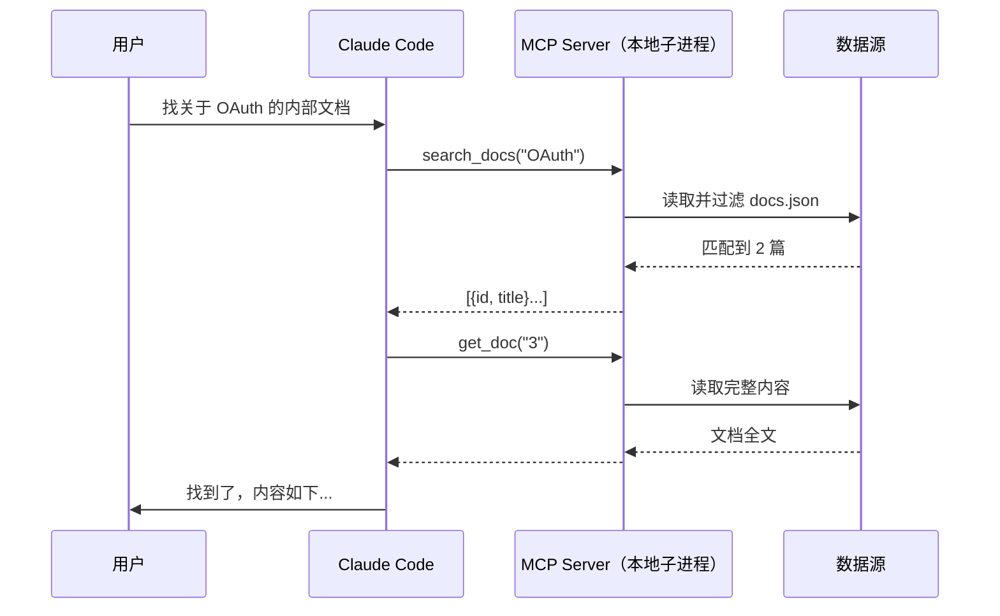

你在公司内网有一个文档系统，Claude 不知道它的存在；你有一个只允许内部访问的 API，也没法直接让 Claude 调用。MCP（Model Context Protocol）解决的就是这个问题——它让你把自己的工具、数据、流程封装成标准接口，Claude 按规范调用，权限边界完全由你说了算。

这是 Claude 系列的第四篇：[第一篇](/Claude全面教程-模型概念与API实战)讲 Claude 的核心概念，[第二篇](/ClaudeCode实战教程-安装CLAUDEmd-hooks-subagent)讲 Claude Code 的整套配置，[第三篇](/从0到1写一个Claude-Skill-规范写法与实战)讲如何写 skill。这篇专攻 MCP server。所有 API 和命令核对自官方文档，截至 2026 年 7 月 8 日有效。

<!-- more -->

## MCP 是什么：给 Claude 装上可插拔工具

先讲一个对比。Claude Code 内置了读文件、跑 bash、搜索代码这几种能力。如果你的需求超出这个范围——查询内部数据库、调用需要认证的私有 API、访问公司内网系统——Claude 就做不到了。

传统的解法是在 CLAUDE.md 里写"你可以通过运行 `curl http://internal-api/...` 来查询……"，然后祈祷 Claude 记得用对参数。这很脆弱：参数拼错、认证信息暴露、没有类型约束。

MCP 给了另一条路：你把这些操作封装成**工具函数**，按标准格式告诉 Claude 每个函数的名字、参数定义、能做什么。Claude 需要时按规范调用，你在服务端控制执行逻辑和权限。整个调用链是这样的：



和 bash tool 的本质区别是：**你写的 MCP server 决定了 Claude 能做什么，而不是 Claude 随意执行任何 bash 命令**。暴露什么、拦什么、怎么执行，全在你手里。

## 三种能力：Tools、Resources、Prompts

MCP server 可以向客户端（Claude）提供三类东西：

**Tools（工具）**是让 Claude 主动调用的函数，可以有副作用——查数据库、写文件、发 API 请求都算。Claude 看到你注册的工具名和描述，自己判断什么时候调用。这是最常用的能力，九成的 MCP server 只需要 Tools。

**Resources（资源）**是只读数据源。你可以把一个目录、一组文档、一段配置暴露为资源，Claude 读取时像读文件一样操作。适合"把整个文档目录变成 Claude 的知识库"这类场景，不需要搜索逻辑，直接按路径读取。

**Prompts（提示模板）**是 MCP server 侧定义的预设对话模板，Claude 可以在 `/` 菜单里直接触发。类似 Claude Code 的 skill，但模板逻辑在 server 端维护。起步阶段不必用，有需要时看[官方文档的 Prompts 章节](https://modelcontextprotocol.io/docs/learn/server-concepts#prompts)。

日常开发只需要记住：**写 Tools，其他按需**。

## 五分钟跑一个最小 MCP server（TypeScript）

**前置要求**：Node.js 18+（`node --version` 确认），npm。

从最小版本开始：只有一个 `echo` 工具，把整条路径跑通再扩展。

### 初始化项目

```bash
mkdir my-mcp-server && cd my-mcp-server

npm init -y

# 安装 MCP SDK（TypeScript 官方 SDK）和 Zod（参数类型校验）
# zod@3：官方文档推荐版本；如用 Zod 4（最新），SDK 1.x 两者均兼容
npm install @modelcontextprotocol/sdk zod@3

# 安装 TypeScript 工具链
npm install -D @types/node typescript
```

修改 `package.json`，加上模块类型和构建脚本：

```json
{
  "type": "module",
  "scripts": {
    "build": "tsc"
  }
}
```

在项目根目录创建 `tsconfig.json`：

```json
{
  "compilerOptions": {
    "target": "ES2022",
    "module": "Node16",
    "moduleResolution": "Node16",
    "outDir": "./build",
    "rootDir": "./src",
    "strict": true,
    "esModuleInterop": true,
    "skipLibCheck": true
  },
  "include": ["src/**/*"],
  "exclude": ["node_modules"]
}
```

### 写第一个 tool

创建 `src/index.ts`：

```typescript
import { McpServer } from "@modelcontextprotocol/sdk/server/mcp.js";
import { StdioServerTransport } from "@modelcontextprotocol/sdk/server/stdio.js";
import { z } from "zod";

const server = new McpServer({
  name: "my-first-mcp",
  version: "1.0.0",
});

server.registerTool(
  "echo",
  {
    description: "将输入的文字原样返回，用于测试 MCP server 是否正常工作",
    inputSchema: {
      message: z.string().describe("要回显的内容"),
    },
  },
  async ({ message }) => {
    return {
      content: [{ type: "text", text: `Echo: ${message}` }],
    };
  }
);

// ⚠️ stdio 模式下绝不能用 console.log()——它会污染 JSON-RPC 通道
// 调试信息必须写到 stderr：console.error("server started")
const transport = new StdioServerTransport();
await server.connect(transport);
```

`server.registerTool` 三个参数：工具名、配置（description + inputSchema）、处理函数。`inputSchema` 里每个字段是一个 Zod schema——Claude 看到的参数说明来自 `.describe()`，类型校验由 Zod 保证。

### 构建并测试

```bash
npm run build
#        tsc 把 src/index.ts 编译到 build/index.js

node build/index.js
# 什么都不会打印——server 在等待来自 stdin 的 JSON-RPC 消息
# Ctrl+C 退出
```

## 接入 Claude Code：注册、验证、三种 scope

### 注册 MCP server

在终端（不是在 claude 会话里）运行：

```bash
claude mcp add my-first-mcp -- node /绝对路径/my-mcp-server/build/index.js
#              ↑ server 名字    ↑ -- 后面是 Claude Code 用来启动 server 的命令
```

注意几个细节：
- **必须用绝对路径**：Claude Code 以不同工作目录启动 server，相对路径会找不到文件
- **`--` 分隔符**：它之后的所有内容都是启动命令，不是 `claude mcp add` 自己的参数
- 没有 `--transport` 标志，因为 stdio 是本地进程的默认传输方式

如果 server 需要环境变量（如 API key、文件路径），在命令末尾加 `--env`：

```bash
claude mcp add my-first-mcp \
  --env DOCS_PATH=/Users/me/docs/docs.json \
  -- node /绝对路径/build/index.js
```

### 验证连接

```bash
claude mcp list
# ✓ Connected  my-first-mcp
```

状态含义：

| 状态 | 含义 |
|---|---|
| `✓ Connected` | 已连接，工具可用 |
| `✗ Failed to connect` | server 没跑起来，检查路径和命令 |
| `! Connected · tools fetch failed` | 连上了但工具列表获取失败，运行 `claude mcp get <名字>` 看错误 |

会话内用 `/mcp` 命令管理和检查已注册的 server。

### 三种 scope

```bash
# local（默认）：只对你、只在当前项目生效
claude mcp add my-server -- node /path/build/index.js

# user：对你、在所有项目生效
claude mcp add --scope user my-server -- node /path/build/index.js

# project：写入 .mcp.json，进版本库，团队共享
claude mcp add --scope project my-server -- node /path/build/index.js
```

团队使用推荐 project scope——`.mcp.json` 提交到仓库，队友拉下来后 Claude Code 自动提示审批，批准即可用。`.mcp.json` 格式：

```json
{
  "mcpServers": {
    "my-server": {
      "type": "stdio",
      "command": "node",
      "args": ["/绝对路径/build/index.js"],
      "env": {
        "DOCS_PATH": "/path/to/docs.json"
      }
    }
  }
}
```

## 完整实战：内部文档搜索 MCP server

场景：团队有一份 JSON 格式的内部文档库，想让 Claude 能搜索和读取，但不暴露整个文件系统给 Claude，也不需要部署额外服务。

### 数据格式

创建 `docs.json`：

```json
[
  {
    "id": "1",
    "title": "项目 API 规范 v2",
    "content": "所有接口必须经过认证，使用 Bearer token。分页参数统一为 page 和 per_page...",
    "tags": ["api", "规范", "认证"]
  },
  {
    "id": "2",
    "title": "本地开发环境搭建",
    "content": "前置条件：Node.js 18+、Docker 20+。克隆仓库后运行 npm install...",
    "tags": ["开发环境", "onboarding"]
  },
  {
    "id": "3",
    "title": "OAuth 认证接入指南",
    "content": "本系统使用 OAuth 2.0 授权码流程。客户端 ID 和 secret 从运维获取...",
    "tags": ["oauth", "认证", "安全"]
  }
]
```

### 完整 server 代码

```typescript
import { McpServer } from "@modelcontextprotocol/sdk/server/mcp.js";
import { StdioServerTransport } from "@modelcontextprotocol/sdk/server/stdio.js";
import { z } from "zod";
import { readFileSync } from "fs";

interface Doc {
  id: string;
  title: string;
  content: string;
  tags: string[];
}

const server = new McpServer({
  name: "内部文档搜索",
  version: "1.0.0",
});

function loadDocs(): Doc[] {
  const path = process.env.DOCS_PATH ?? "./docs.json";
  //                   ↑ 从环境变量读路径，方便不同项目复用同一个 server
  try {
    return JSON.parse(readFileSync(path, "utf-8")) as Doc[];
  } catch {
    console.error(`无法读取文档文件：${path}`);
    //                                 ↑ stdio 模式下只能用 console.error，不能用 console.log
    return [];
  }
}

server.registerTool(
  "search_docs",
  {
    description:
      "搜索内部文档库。当用户询问内部规范、开发指南、接口文档等问题时使用，返回匹配的文档列表和 ID。",
    inputSchema: {
      query: z.string().describe("搜索关键词，支持中英文"),
    },
  },
  async ({ query }) => {
    const docs = loadDocs();
    const q = query.toLowerCase();

    const matches = docs.filter(
      (doc) =>
        doc.title.toLowerCase().includes(q) ||
        doc.content.toLowerCase().includes(q) ||
        doc.tags.some((tag) => tag.toLowerCase().includes(q))
    );

    if (matches.length === 0) {
      return { content: [{ type: "text", text: "没有找到相关文档。" }] };
    }

    const result = matches
      .map((d) => `[${d.id}] ${d.title}（标签：${d.tags.join(", ")}）`)
      .join("\n");

    return { content: [{ type: "text", text: result }] };
  }
);

server.registerTool(
  "get_doc",
  {
    description: "获取指定 ID 的文档完整内容。在 search_docs 返回列表后，用这个工具读取具体文档。",
    inputSchema: {
      id: z.string().describe("文档 ID，从 search_docs 的返回结果里获取"),
    },
  },
  async ({ id }) => {
    const docs = loadDocs();
    const doc = docs.find((d) => d.id === id);

    if (!doc) {
      return {
        content: [{ type: "text", text: `未找到 ID 为 ${id} 的文档。` }],
      };
    }

    return {
      content: [
        {
          type: "text",
          text: `# ${doc.title}\n\n标签：${doc.tags.join(", ")}\n\n${doc.content}`,
        },
      ],
    };
  }
);

const transport = new StdioServerTransport();
await server.connect(transport);
```

构建并注册：

```bash
npm run build

claude mcp add \
  --scope user \
  --env DOCS_PATH=/Users/me/team/docs.json \
  team-docs -- node /Users/me/my-mcp-server/build/index.js
#  ↑ server 名字   ↑ scope user：所有项目都能用这个文档搜索功能
```

测试效果——在 Claude Code 里直接说：

```text
> 帮我找一下关于认证的内部文档

Claude 会调用 search_docs("认证") → 返回 2 篇 → 再调用 get_doc("3") → 读全文
```

Claude 的工具调用会标注 server 名字，你能清楚看到它用了哪个工具。

### 一个工程细节：为什么要读两次

`search_docs` 只返回文档列表（ID + 标题），`get_doc` 才返回全文。这是刻意的设计：搜索时返回所有文档全文会消耗大量 token，先让 Claude 看摘要、再按需读全文，能节省 50% 以上的上下文开销。这也是 MCP 的设计哲学：**工具返回的信息量由你控制**，不是越多越好。

## Resources 和 Prompts：什么时候需要

**Resources** 适合"暴露一个数据集，让客户端决定读哪些"的场景。比如你有 100 篇文档，不想每次都搜索，希望 Claude 能像翻文件夹一样按需读取——这时候把文档目录注册为 resources 比写 search tool 更合适。注册方式和 `registerTool` 类似，McpServer 提供了对应的 resource 注册方法，详见 [TypeScript SDK server guide](https://modelcontextprotocol.io/docs/learn/server-concepts#resources)。

**Prompts** 适合"封装一个固定的多轮对话模板"的场景，比如"代码审查请求"或"事故复盘模板"。起步可以先不用，等业务稳定了再考虑。详见 [Prompts 文档](https://modelcontextprotocol.io/docs/learn/server-concepts#prompts)。

## 四个高频踩坑：stdio 日志、绝对路径、启动超时、配置不刷新

**stdio 里用了 `console.log()`**：这是最常见的问题。stdio 传输层把 stdout 当 JSON-RPC 消息通道，`console.log()` 输出的文字会破坏协议，Claude 会看到解析错误。调试信息必须用 `console.error()`（写到 stderr）：

```typescript
// ❌ 会破坏 stdio 通道
console.log("received request");

// ✅ stderr 安全
console.error("received request");
```

**路径用了相对路径**：Claude Code 在不同工作目录启动 server，相对路径会失效。`DOCS_PATH` 这类配置用环境变量传，路径写绝对路径。

**首次 npx 包太慢导致超时**：默认启动超时 30 秒。如果用 `npx` 启动 server（类似 Playwright MCP），首次下载包可能超时。设置 `MCP_TIMEOUT` 环境变量延长限制：

```bash
MCP_TIMEOUT=60000 claude
#            ↑ 单位毫秒，60 秒
```

**改了 `.mcp.json` 没生效**：Claude Code 在会话启动时读配置，改完文件后退出再重开会话。

## 下一步

- 连接真实的内部系统：在 server 里调用内网 API、查 SQLite、读 PostgreSQL——逻辑都在你掌控的 server 里
- 官方维护的参考 server 仓库（filesystem、git、database 等）：[github.com/modelcontextprotocol/servers](https://github.com/modelcontextprotocol/servers)
- Python 版 SDK（`mcp[cli]` + FastMCP）：适合 Python 技术栈，装饰器语法比 TypeScript 更简洁
- MCP 协议的完整规范：[modelcontextprotocol.io](https://modelcontextprotocol.io)
- 系列前三篇：[Claude 全面教程](/Claude全面教程-模型概念与API实战)、[Claude Code 实战教程](/ClaudeCode实战教程-安装CLAUDEmd-hooks-subagent)、[从 0 到 1 写一个 Skill](/从0到1写一个Claude-Skill-规范写法与实战)
